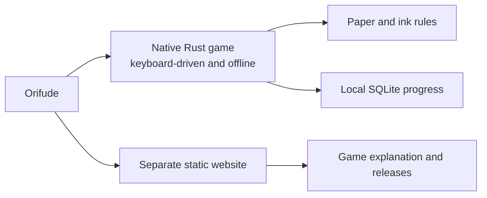
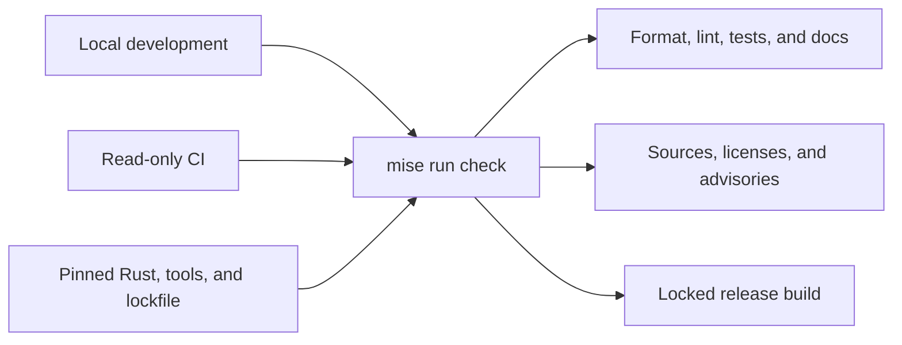
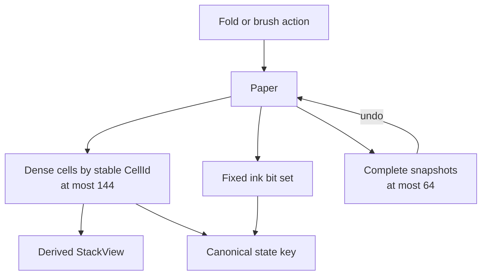
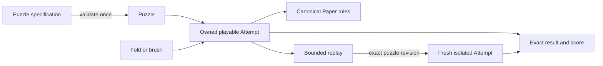
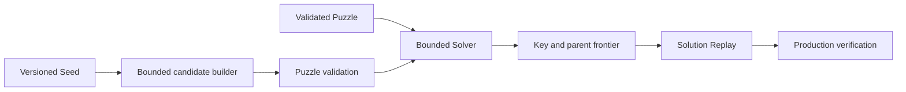

# Orifude notebook

This is the friendly technical map of Orifude. It explains what is already in
the repository, why it took this shape, how it was checked, and where to read
the real thing.

[`PROJECT.md`](PROJECT.md) still owns the product rules, limits, architecture,
and work queue. [`CHANGELOG.md`](CHANGELOG.md) is the release-facing summary.
This notebook sits between them. It keeps useful project memory without turning
into another checklist.

## How to use this notebook

- Read the linked source when a detail matters. This file is a map, not a copy
  of the code.
- Add a note when work changes behavior, a boundary, a decision, a measurement,
  or the way we verify something.
- Add the smallest useful graph when it makes ownership, flow, state changes,
  or dependencies easier to understand. A simple fact does not need one.
- Keep it honest. Record untested platforms and rejected ideas too.
- Keep it easy to read. A notebook should help, not ask for its own manual.

## The repository at a glance

| Area | Where to look |
| --- | --- |
| Product rules and current work | [`PROJECT.md`](PROJECT.md) |
| Contributor rules | [`AGENTS.md`](AGENTS.md) |
| Player and contributor introduction | [`README.md`](README.md) |
| Release-facing history | [`CHANGELOG.md`](CHANGELOG.md) |
| Toolchain | [Rust](rust-toolchain.toml), [package](Cargo.toml), [lock](Cargo.lock) |
| Local commands | [`mise.toml`](mise.toml), [`mise.lock`](mise.lock) |
| Ordinary CI | [`.github/workflows/ci.yml`](.github/workflows/ci.yml) |
| Process and command line | [entry](src/main.rs), [CLI](src/cli.rs), [errors](src/error.rs) |
| Paper and game rules | [`src/domain`](src/domain) |
| Plain-text exercise | [`examples/paper.rs`](examples/paper.rs) |
| Representation measurements | [paper](examples/paper_measure.rs), [solver](examples/solver_measure.rs) |
| Bounded action fuzzing | [`examples/domain_actions_fuzz.rs`](examples/domain_actions_fuzz.rs) |
| Search and generation | [solver](src/solver), [generator](src/generator) |
| Behavior tests | [CLI](tests/cli.rs), [paper](tests/paper.rs), [engine](tests/engine.rs), [solver](tests/solver.rs), [generator](tests/generator.rs) |

## Product contract

Build-plan source: [product contract](PROJECT.md#phase-0-product-contract).

The project settled the rules before growing the application. That was the
right order. A late change to fold meaning would ripple through puzzles,
replays, the solver, saved progress, and the TUI.

The split is deliberate. Playing never depends on the website or a network
service.

What was decided:

- Orifude is a native Rust terminal game played with the keyboard. It works
  offline and will keep progress in local SQLite storage.
- The player folds paper, places ink through every layer under a dot or line
  brush, unfolds the paper, and tries to match the target exactly.
- Undo and reset are normal tools. There is no timer, account, telemetry,
  leaderboard, streak pressure, advertisement, or required network call.
- The native game and the static Astro website remain separate projects. The
  website explains the game and releases. It never becomes a browser game.
- Orifude is a coined name inspired by folding and brushwork. The supplied
  squirrel, paper, branch, berry, and brush artwork is the identity source.
- `shrek` is the permanent default branch. It currently accepts direct pushes,
  then ordinary CI reports whether the pushed commit passes.
- The product has explicit limits for paper size, actions, history, solver
  work, storage, packs, terminal events, and release artifacts. Raising a limit
  needs a resource estimate and tests.
- Operational failures such as bad input, I/O errors, cancellation, and full
  storage must be recoverable. Panics are reserved for broken internal
  invariants.

The detailed contracts live in the
[canonical game rules](PROJECT.md#canonical-game-rules),
[architecture](PROJECT.md#architecture),
[explicit limits](PROJECT.md#explicit-v1-bounds),
[security model](PROJECT.md#security-model),
[test strategy](PROJECT.md#test-strategy), and
[distribution contract](PROJECT.md#distribution-contract).

The puzzle-game reboot began in
[`0e3f08c`](https://github.com/nuggocto/orifude/commit/0e3f08c272eb99e28c804d265fe8b28ff745157e).
The older letter-exchange application remains in Git history, but it is a
retired product with no upgrade or data-migration path into this game.

## Rust repository foundation

Build-plan source: [repository foundation](PROJECT.md#phase-1-repository-foundation).

The repository has one small, reproducible Rust application base. It is meant
to fail clearly before domain code, storage, and terminal work make failures
more expensive.

Local work and CI enter through the same bounded check. The pinned inputs keep
that check reproducible.

What was built:

- [`rust-toolchain.toml`](rust-toolchain.toml) pins Rust 1.98.0 with the minimal
  rustup profile, Clippy, and rustfmt. [`Cargo.toml`](Cargo.toml) records Rust
  1.98 as the minimum compiler and uses edition 2024 with resolver 3.
- The crate denies unsafe code. Development, test, and release builds keep
  overflow checks enabled. Release panics unwind so the later terminal owner
  can restore terminal state during handled failures.
- [`Cargo.lock`](Cargo.lock) is committed because Orifude ships an application,
  not a reusable library. Locked builds make local work and CI resolve the same
  dependency graph.
- The package currently has no runtime dependency. The command line is small
  enough that a hand-written parser is easier to audit than a parser framework.
- [`src/cli.rs`](src/cli.rs) handles the default message, help, version, and
  invalid usage. It inspects at most two arguments and never reflects unknown
  argument bytes into terminal output.
- Exit codes are stable: success is 0, operational failure is 1, and invalid
  usage is 2. Output failures retain their I/O cause instead of becoming a
  vague top-level message.
- [`src/main.rs`](src/main.rs) prints at most eight linked error causes. That
  prevents a strange error chain from turning reporting into unbounded work.
- [`mise.toml`](mise.toml) is the one command menu for formatting, linting,
  tests, doctests, release builds, dependency policy, the paper exercise,
  measurements, and domain fuzzing.
- [`deny.toml`](deny.toml) rejects unknown dependency sources, wildcard
  dependencies, duplicate versions, unreviewed licenses, and known advisories.
- [Ordinary CI](.github/workflows/ci.yml) runs `mise run check` on Linux for
  pull requests and pushes to `shrek`. It has read-only repository permission,
  no publication credentials, a 15-minute timeout, pinned actions, and no
  cross-run executable cache.
- [`.gitattributes`](.gitattributes) fixes text and line-ending behavior across
  supported platforms.

Why these choices:

- One package is enough right now. A workspace would add navigation and build
  cost before there is a real ownership boundary to justify it.
- No build cache was added because the first hosted check took about 15 seconds.
  Ten seconds were tool installation and roughly 1.5 seconds were repository
  checks. Cache invalidation would cost more attention than it saves today.
- Dependency policy runs before compilation. A bad source or license should
  stop early, before the machine spends time building it.
- CI checks direct pushes after they land because that matches the live branch
  settings. The notebook records reality, not the branch policy we might wish
  we had on a sleepy afternoon.

The main foundation commits are
[`09e4291`](https://github.com/nuggocto/orifude/commit/09e4291a95efd9fef5b0e08364a62a2d367df945),
[`cdc2b22`](https://github.com/nuggocto/orifude/commit/cdc2b22f095523c1b58d26c0bec35606cec5769c),
and
[`9046529`](https://github.com/nuggocto/orifude/commit/9046529daf3277f46197c45a13e433c7d2963e5d).

## Paper model and rule exercise

Build-plan source:
[paper model and rule prototype](PROJECT.md#phase-2-paper-model-and-rule-prototype).

The paper model proves the fold algebra before a TUI tries to make it pretty.
The core idea is simple: every physical cell keeps one stable identity even
when its position, layer, face, and orientation change.

`Paper` is the only mutable source of truth. Stack views and state keys are
derived, while undo restores an earlier complete state.

What was built in [`src/domain/paper.rs`](src/domain/paper.rs):

- Boards are between 4 by 4 and 12 by 12 cells, with at most 144 physical cells.
- Small newtypes keep cell IDs, rows, columns, dimensions, layers, fold counts,
  stroke counts, and action counts inside their declared ranges.
- The canonical paper is one dense vector indexed by stable row-major
  `CellId`. Ink is a fixed three-word bit set indexed by the same ID.
- A caller-owned [`StackView`](src/domain/paper.rs) derives one bottom-to-top
  stack without keeping a second coordinate map in sync.
- Folds reflect coordinates across a cell boundary, flip the visible face,
  update orientation, and reverse every moving stack before placing it above
  stationary layers.
- A moved stack may land on an empty destination inside the original board.
  Cells may never leave that bounded working area.
- Dot ink passes through every layer at one occupied position. Target
  comparison reports missing and extra physical cells separately.
- Undo stores complete canonical snapshots. Failed actions leave the previous
  state untouched.
- Release-active assertions check cell conservation, unique identity,
  in-bounds coordinates, action-count agreement, and complete zero-based layer
  order. These are programmer-error checks, not input validation.

Why dense storage won:

- Folding, snapshotting, hashing, and future solver expansion touch most or all
  physical cells. Those are the common operations.
- The measured coordinate-to-stack `BTreeMap` made one stack lookup faster, at
  about 5 ns instead of roughly 111 ns on the recorded machine. It made a
  maximum snapshot clone about 190 times slower and clone-plus-two-fold work
  about 6 times slower. It also split one board across up to 144 small
  allocations.
- A maximum dense cell payload is 720 bytes. A snapshot's named payloads total
  779 bytes on the recorded Linux target. Sixty-four snapshot and action
  entries total 50,176 bytes before allocator bookkeeping. Complete snapshots
  fit comfortably, so action deltas would add restoration bugs without solving
  a memory problem.
- Rust does not promise the same layout on every target. The numbers guide this
  representation choice; they are not a portable ABI promise.

The checked-in measurement and rejected alternative live in
[`examples/paper_measure.rs`](examples/paper_measure.rs). The focused public-API
tests live in [`tests/paper.rs`](tests/paper.rs).

The plain-text exercise in [`examples/paper.rs`](examples/paper.rs) has six
one-fold and two-fold examples. Its model-driven walkthrough shows the crease,
bottom-to-top layer order, ink passing through a stack, and the current numeric
answer format. Menu and prediction input stop at 16 bytes, and one run stops
after 12 menu attempts. Oversized input ends the session instead of leaving a
tail that could become a later command.

The fold-destination and branch-policy clarification landed in
[`aaa348c`](https://github.com/nuggocto/orifude/commit/aaa348c3f13f8f7032d3a10e7925cf8157dc8323).
The model and measurement landed in
[`9419443`](https://github.com/nuggocto/orifude/commit/941944316dd9f5e2996d09e3b3f40a3194d8cc62).
The visual lesson landed in
[`67d0c72`](https://github.com/nuggocto/orifude/commit/67d0c727ea1f501150d9b7ee0a51bae96ef653ef).

## Deterministic game engine

Build-plan source:
[deterministic game engine](PROJECT.md#phase-3-deterministic-game-engine).

The prototype became the production domain API. The TUI, solver, generator,
authoring tools, and replay loader are expected to call this API instead of
reimplementing paper rules.

The validated puzzle stays with its attempt. Replays start from fresh paper and
must match the complete gameplay revision before any action runs.

The domain is split by behavior:

- [`paper.rs`](src/domain/paper.rs) owns physical cells, folds, brushes, ink,
  snapshots, canonical state keys, and low-level legality.
- [`puzzle.rs`](src/domain/puzzle.rs) validates identity, dimensions, target,
  allowed folds and brushes, budgets, and optional par before play starts.
- [`attempt.rs`](src/domain/attempt.rs) owns one validated puzzle and paper. It
  rejects puzzle-disallowed actions before asking the paper to apply them.
- [`score.rs`](src/domain/score.rs) reports exact success, fold and stroke
  score, undo count, hints, and whether a successful result meets par.
- [`replay.rs`](src/domain/replay.rs) records bounded actions and executes them
  against a fresh isolated attempt.

What the engine can do now:

- Apply any valid horizontal or vertical crease in all four directions,
  including consecutive folds on the same axis and nested stacks at least eight
  layers deep.
- Reject an empty moving side, an out-of-area reflection, a disallowed action,
  an empty brush position, an invalid line, or an exhausted budget without
  mutating the attempt.
- Apply a dot or a bounded inclusive horizontal or vertical line. Line endpoint
  order is canonical, so drawing the same line backward produces the same
  action.
- Compare every original physical cell and report exact, missing, and extra ink.
- Undo one successful action exactly, reset to fresh paper, and keep replayable
  actions aligned with the current state.
- Produce exact canonical state equality and a stable non-cryptographic hash
  for solver bookkeeping. Equality still resolves hash collisions.
- Score folds before strokes. Time is never part of the score.

Replay compatibility deserves its own note. Identity and format numbers were
not enough because a puzzle author could change a target, allowed action, budget,
or par while keeping the same IDs. A replay now carries an exact bounded
`PuzzleRevision` with every gameplay field. Display text is left out because a
spelling fix should not invalidate a solution. This uses exact equality instead
of a custom digest, so correctness does not depend on hoping two revisions never
collide. Replay execution validates first and then works on fresh state, which
keeps a failed replay away from the live attempt.

The engine keeps these hard bounds:

| Resource | Limit |
| --- | ---: |
| Physical cells | 144 |
| Fold actions | 12 |
| Brush actions | 8 |
| Total actions and history entries | 64 |
| Allowed fold rules in one puzzle | 44 |
| Allowed brush rules in one puzzle | 23 |
| Pack and puzzle ID length | 64 ASCII bytes each |

Verification lives in [`tests/engine.rs`](tests/engine.rs):

- 26 integration tests cover construction, all fold directions, off-center and
  nested folds, dots, lines, scoring, history, canonical keys, replay
  compatibility, and atomic failure.
- An exhaustive fold pass covers all 2,268 board, direction, and crease cases
  across supported board dimensions.
- Eight fixed seeds cover 256 direct actions and fresh replay execution.
- [`examples/domain_actions_fuzz.rs`](examples/domain_actions_fuzz.rs) accepts at
  most 256 input bytes, which decode to at most 64 operations. A 257-byte input
  exits with usage status before domain work starts.
- Debug and release runs produce the same recorded state hash and replay result.
- `mise run check`, release tests for every Cargo target, warning-denied Rust
  documentation, the locked dependency audit, the bounded fuzz run, and the
  plain-text exercise all passed on Rust 1.98.0 and x86_64 Arch Linux.
- Native macOS and Windows execution has not been tested yet. No TUI terminal
  lifecycle exists yet, so those claims wait for the native work that can
  actually prove them.

The complete engine landed in
[`5da6052`](https://github.com/nuggocto/orifude/commit/5da6052d85c5b1ea804ba9eedce1ee48bbce23cb).
Its [GitHub CI run](https://github.com/nuggocto/orifude/actions/runs/33527703571)
passed after the direct push to `shrek`.

## Bounded search and generation

Build-plan source: [solver and generator work](PROJECT.md#phase-4-solver-and-deterministic-generator).

The engine can now prove a small puzzle, explain why search stopped, and build a
repeatable puzzle from a seed. The important bit is that neither side gets to
invent paper rules. Both return to the production engine before Orifude trusts
their answer.

What was built:

- [`src/solver/mod.rs`](src/solver/mod.rs) has one deterministic priority
  search. It compares folds first and strokes second, just like the game score.
  It returns solved, unsolved, exhausted, cancelled, and invalid as different
  outcomes.
- Search keeps exact [`PaperStateKey`](src/domain/paper.rs) values in a hash
  set, plus small parent records in its frontier. It never iterates the hash
  set, so private hash-table order cannot change the chosen replay.
- A state is restored by resetting one reusable attempt and replaying at most
  20 parent actions through the real engine. Every reported solution is then
  replayed once more against the exact puzzle revision.
- The solver checks its fixed setup before allocating search collections. It
  stops independently for 250,000 visited states, 128 MiB of conservatively
  charged memory, configured depth, or cancellation.
- [`src/generator/mod.rs`](src/generator/mod.rs) owns an explicit versioned seed
  and a maximum of 512 candidate attempts. It receives a calendar date from its
  caller and never opens a clock.
- The generator builds legal bounded action sequences. Construction guarantees
  a non-empty target and enforces the action budgets through the production
  engine. It rejects repeated and trivial targets, and one solver-exhausted
  target does not prevent it from trying the remaining bounded candidates.
- The generated action sequence is already a solution witness. If the complete
  solver called that target unsolved, or if the internal puzzle validator
  rejected data built from the validated template, that would be a code defect
  rather than ordinary bad luck. Those cases are assertions instead of public
  rejection reasons.
- The first random compatibility path uses fixed-width SplitMix64 arithmetic.
  A daily seed comes from `orifude:1:YYYY-MM-DD`. The golden in
  [`tests/generator.rs`](tests/generator.rs) fixes the date, seed, target,
  actions, puzzle ID, and accepted candidate so a future algorithm change does
  not quietly rewrite old daily papers.

Why the frontier looks a little unusual:

- Cloning a complete maximum-depth attempt is quick here, around 0.34
  microseconds in the recorded release runs. It also has a 16,750-byte
  named-payload lower bound for every retained state because the puzzle, paper,
  and 20 snapshots come along for the ride.
- The selected key and parent representation is conservatively charged at
  1,312 bytes per maximum-paper state. Rebuilding a 20-action path is slower,
  around 18.73 to 18.99 microseconds, but it keeps the hard memory story simple
  and leaves one production rules engine.
- On 256 maximum-paper keys, hashed membership took about 1.50 microseconds per
  lookup. A linear vector took about 11.7 microseconds. The small extra table
  storage earns its keep once the search grows.
- The representative solver fixtures visited 2 to 35 states and took roughly
  4.6 to 184.3 microseconds at the median on the recorded AMD Linux machine. Run
  [`mise run solver-measure`](mise.toml) for the full local table. These numbers
  guide the structure; they are not promises for another computer.

The generator is deliberately not an artist or a lesson designer. Fold-free
introductions, carefully shaped pictures, story pacing, unique-solution
puzzles, line-heavy folded layouts, and rule sets that exhaust bounded search
still belong in handcrafted content. A failed seed is reported and ends. It
does not keep shaking the branch until a convenient puzzle falls out.

## How the notebook was checked

On 2026-09-01, this notebook was checked against `PROJECT.md`, the current
source and tests, and the puzzle-game Git history beginning at `0e3f08c`.
Every relative link resolves inside the repository, every linked commit exists
in local history, and every linked `PROJECT.md` heading exists.
`git diff --check` and `mise run check` also passed. This was a
documentation-only check at that point. Search and generation later added their
own linked tests, measurement harness, and verification record.

A follow-up added four small Mermaid graphs for the product boundary, shared
check path, paper ownership, and engine flow. Their nodes and limits were
checked against the same linked contracts and source. The graphs explain
existing behavior; they do not add a new rule.

The search-and-generation review then checked every reported candidate
rejection against the actual builder. It fixed one real control-flow bug: a
solver-exhausted candidate used to stop the whole generation run. A regression
test now proves that all 32 configured attempts are considered and that repeated
targets skip duplicate solver work. Impossible rejection labels were removed
instead of manufacturing tests for states that validated construction cannot
produce. The same review removed a redundant full-state scan at the start of
in-place paper reset; the release median for resetting and replaying the fixed
20-action path was 18.73 to 18.99 microseconds across five processes. Reset
still checks the rebuilt state before returning.

## What comes next

The current work and its acceptance gate stay in
[`PROJECT.md`](PROJECT.md#current-work). The next implementation adds local
progress and pack storage. It can keep generated seeds and exact solution
replays without asking search or storage to reinterpret paper rules.
