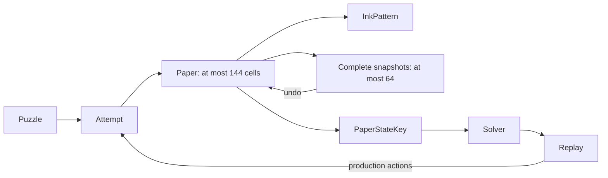
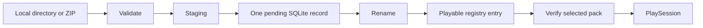

# Orifude notebook

This is the current technical map. [PROJECT.md](PROJECT.md) owns the product
contract, limits, and work queue. [CHANGELOG.md](CHANGELOG.md) owns release notes.

Earlier implementation decisions, rejected designs, corrections, and hosted
verification remain in the [notebook at the previous baseline](https://github.com/nuggocto/orifude/blob/cc4c0654d8993f8f392d7d3c9917c61b689e31cf/NOTEBOOK.md).
That immutable record preserves the history without making a new contributor
read every development session before understanding the current application.

| Area | Source and evidence |
| --- | --- |
| Process and commands | [main](src/main.rs), [CLI](src/cli.rs), [author commands](src/author.rs), [CLI tests](tests/cli.rs) |
| Paper and puzzle rules | [domain](src/domain), [paper tests](tests/paper.rs), [engine tests](tests/engine.rs) |
| Search and generation | [solver](src/solver/mod.rs), [generator](src/generator/mod.rs), [solver tests](tests/solver.rs), [generation tests](tests/generator.rs) |
| Persistence | [storage](src/storage/mod.rs), [replay format](src/storage/replay.rs), [storage tests](tests/storage.rs), [journal recovery](tests/storage_recovery.rs) |
| Community packs | [packs](src/packs), [format guide](docs/puzzle-authoring.md), [pack tests](tests/packs.rs) |
| Player state | [app](src/tui/app.rs), [session](src/tui/session.rs), [view](src/tui/view.rs) |
| Terminal ownership | [event pump](src/tui/event.rs), [terminal session](src/tui/terminal.rs), [native journeys](tests/terminal_pty.rs) |
| Official content | [catalog](src/content/journey.rs), [puzzle files](puzzles/journey), [content tests](tests/content.rs) |
| Tooling and release evidence | [mise tasks](mise.toml), [CI](.github/workflows/ci.yml), [security record](docs/security-review.md), [QA record](docs/release-qa.md) |

Orifude remains a native Rust TUI, keyboard-driven and fully offline. The
separate static frontend explains the game and releases. It is not a browser
game. The artwork supplied by the owner remains the identity source, and
Orifude is a coined name inspired by folding and brushwork. The permanent
default branch is `shrek`. The retired letter-exchange product remains in Git
history but has no data migration or supported upgrade path into the puzzle game.

The repository uses one Cargo package, edition 2024, and Rust 1.98.1 for both
the pinned and minimum compiler. The application denies unsafe code. Release
builds preserve overflow checks and unwind panics so terminal restoration can
run. The small manual CLI inspects at most four arguments to reject overflow;
it does not reflect unknown bytes into output. Exit codes are 0 for success,
1 for operational failure, and 2 for usage errors. Error chains stop after
eight causes. See [Cargo.toml](Cargo.toml), [toolchain](rust-toolchain.toml),
[CLI](src/cli.rs), and [process entry](src/main.rs).

## Paper, replay, and search

[Paper](src/domain/paper.rs) owns one dense physical-cell vector. A stable
row-major `CellId` indexes each cell's current coordinate, layer, face, and
orientation. Ink and target membership use three-word bit sets. A maximum board
has 144 cells, so folds, snapshots, comparisons, and key creation benefit from
bounded dense passes.



The [representation measurement](examples/paper_measure.rs) compares this model
with a coordinate-to-stack tree. The tree improves individual lookup but adds
many allocations and makes snapshots and folds more expensive. On the recorded
64-bit Linux target, the dense cell payload is 720 bytes, and 64 complete
snapshot/action entries have a 50,176-byte payload lower bound. Full snapshots
fit the play budget, so action deltas would add restoration complexity without
solving a memory problem.

Fold validation finishes before mutation. A fold reflects coordinates, reverses
moving layers, flips faces, updates orientation, and places moved stacks above
stationary layers. Empty destinations inside the original rectangle are legal.
Dots and lines ink physical cells through occupied stacks. Failed actions leave
state unchanged. Release-active assertions check cell count, coordinates,
budgets, action/history agreement, and unique complete layer order. Stable cell
identity comes from the vector index; there is no second stored ID to validate.

[Attempt](src/domain/attempt.rs) enforces puzzle-specific rules before applying
paper actions. Undo and reset keep personal hint and undo history while changing
the replayable sequence. [Replay](src/domain/replay.rs) carries an exact gameplay
revision including target, rules, budgets, dimensions, and par. Display-text
changes do not invalidate it. A replay executes on fresh isolated state and must
match its source puzzle. Score ordering is folds first, then strokes.

The [solver](src/solver/mod.rs) keeps exact state keys in a hash set and compact
parent records in a deterministic priority frontier. It never traverses the hash
set. Each restored node replays at most 20 actions through the production
engine, and every reported solution is replayed again for verification.
Cancellation is checked before setup, at each frontier pop, and before candidate
actions. Search stops at its independent visited-state, memory, and depth limits.

The conservative maximum-paper retained charge is 1,312 bytes per state on the
recorded target, including allocator and collection margin. A full attempt with
20 history entries has a 16,750-byte payload lower bound. Retaining full attempts
would multiply memory even though cloning one can be faster than replaying it.
[Solver measurements](examples/solver_measure.rs) preserve that tradeoff.

[Generation](src/generator/mod.rs) owns an explicit versioned seed, fixed attempt
budget, and stable random sequence. It builds legal production actions, derives
a target, rejects duplicates and trivial results, and asks the bounded solver
to establish a useful solution. Exhaustion and cancellation return the seed.
Fixed daily goldens preserve cross-platform output. Broad rule sets and
line-heavy folded layouts can exhaust their limits; generation never retries
until luck supplies a result.

## Local persistence and packs

[Storage](src/storage/mod.rs) owns one SQLite connection and an exclusive process
lock. Tests inject private paths; the player uses platform directories described
in [PROJECT.md](PROJECT.md#local-storage). Migrations precede terminal entry.
Schema markers, quick checks, foreign keys, settings, registry bounds, paths,
and file budgets are checked before use. Corrupt or unsupported data produces
a recovery error rather than a silent reset.

A completion saves the replay, best result, history, and progress in one
transaction. Daily completion joins the same transaction. A revised puzzle's
first current solution replaces its obsolete best regardless of the old score;
same-revision comparisons still prefer fewer folds and then strokes. Reading
official completion also requires the saved replay's exact current puzzle.

SQLite uses 4 KiB pages, DELETE journaling, FULL synchronization, and disabled
cache spilling. The main file stops at 128 MiB. Nonessential writes preserve a
16 MiB reserve by pruning one bounded batch of non-best history. Protected
progress and best solutions may use the reserve but cannot exceed the hard
limit. The separate journal budget is 132 MiB. Tests cover transactional
failure, full storage, migrations, hot-journal recovery, and retained best data.

Pack installation validates local content, writes private staging, records one
pending operation, renames it, and commits its registry entry. Registry rows
alone identify playable packs. Reconciliation converges to a complete registered
pack or no managed copy, while preserving saved progress. Source directories
are never cleanup targets.



The [pack parser](src/packs) enforces byte, file-count, path, text, and expanded
size bounds. It rejects links, special files, traversal, reserved names, duplicate
paths, and undeclared fields. SHA-256 fingerprints include framed sorted paths
and bytes. ZIP preflight checks raw catalog entries before the dependency parses
metadata. The bounded reader exposes one accepted footer, preventing fallback to
an earlier catalog. Comments remain supported; embedded footer signatures in
catalog metadata are refused.

Startup reads bounded registry metadata instead of loading all pack files.
Selecting a pack verifies its fingerprint. The TUI projects at most 128 papers
and discards the raw-file cache. Removing packs preserves saved keepsakes. The
keepsake query returns 128 rows plus one lookahead row and can reach older pages.

## Player and terminal ownership

[App](src/tui/app.rs) owns navigation, dialogs, settings, progress, and one
[PlaySession](src/tui/session.rs). The session owns its puzzle attempt, ready
tool, cursor, reveal, and result. Replay and teaching frames use production
domain actions. They do not maintain separate fold rules.

The first legal tool is ready when paper arrives. Enter applies it; exact ink
readies Open paper. Tab still reaches every tool, and Esc readies Open directly.
Confirmed actions leave persistent feedback. Opening is bounded, interruptible,
and optional. Success is presented as saved only after its durable transaction
commits. A missed comparison returns to the same usable attempt.

The lesson and first journey paper give exact controls. Later official hints
appear only after a missed comparison. Saved replay begins on fresh paper,
steps forward with Enter or Right, rewinds with Left, and resets to the start.
Once paper opens, the stack cursor stays fixed while a separate comparison row
scrolls compact results. [View regressions](src/tui/view.rs) cover visibility,
ASCII output, ink distinction, hints, controls, and minimum-size layouts.

The [event pump](src/tui/event.rs) owns all crossterm polling on one worker.
A startup rendezvous confirms input readiness before the first frame. Keys keep
their order in one 256-entry queue; ticks and resizes coalesce. Full queues apply
backpressure. Shutdown takes the waiters' mutex before changing its predicate
and notifying them. One separate work-completion slot keeps generation joins
independent of a full key queue. [WorkManager](src/tui/work.rs) owns and joins at
most one cancellable generation job.

Terminal capabilities are acquired separately and restored in reverse order.
Failed restoration steps remain available for a bounded retry. The panic
fallback only restores on the terminal-owning thread. Rendering stops at a
160-by-60 viewport, animation at 30 Hz, and dropped resize signals recover
through a 250 ms size check. Smaller than 60 by 20 shows a stable resize message.

Native tests exercise the binary through Unix PTYs and Windows ConPTY, with
isolated state. Each complete journey holds one harness mutex, including fixture
setup and teardown, so another child cannot inherit a fixture's temporary lock.
ConPTY projects console output, so tests inspect meaningful visible fragments
and durable state instead of requiring raw styled phrases to remain contiguous.

## Content and verification

The [official catalog](src/content/journey.rs) embeds 40 TOML papers and validates
them through the public pack boundary once, using `OnceLock`. Eight groups
introduce and combine mechanics. The first two papers are flat; the third adds
a crease. The app borrows the cached catalog and clones only a selected puzzle.
The owner accepted the player journey and artwork after direct play. That
judgment complements the independent solver and content checks.

[Mise](mise.toml) is the development command interface. Ordinary CI runs the
locked check plus five native release-player jobs; pushes and manual runs also
exercise pinned Linux distribution userlands. Tool versions and actions are
pinned, repository permissions are read-only, and publication is separate.
The [QA record](docs/release-qa.md) holds hosted evidence and platform exclusions.

Minimum supported OS releases and GUI inspection in macOS Terminal and Windows
Terminal still require designated-host packaged-artifact evidence. Earlier
sanitizer campaigns and native runs are preserved in the historical notebook
and QA record. They do not substitute for verification of a new release artifact.

## Review corrections on 2026-09-04

The [historical correction record](https://github.com/nuggocto/orifude/blob/cc4c0654d8993f8f392d7d3c9917c61b689e31cf/NOTEBOOK.md#review-corrections-on-2026-09-04)
preserves reproductions and hosted results for revised-completion persistence,
shutdown notification ordering, ZIP duplicate paths, and ambiguous catalogs.
The fixes are implemented at their owning boundaries and retain focused
regressions. Rust's pinned and minimum versions advanced together to 1.98.1.

## Cleanup and measurement on 2026-09-05

The cleanup removed the three bespoke temporary-directory owners in the
[storage](tests/storage.rs), [pack](tests/packs.rs), and
[journal-recovery](tests/storage_recovery.rs) suites in favor of the existing
`tempfile` dependency. It also removed an unused storage-page wrapper, the
doctest's self-comparison, identity assertions that merely repeated loop indexes,
and artwork checks tied to internal padding constants. Behavior tests remain.

The solver now rejects extra ink through the existing bit-set comparison and
skips action classes whose budgets are exhausted. Action ordering, cancellation,
production validation, replay verification, and memory limits remain intact.
The [folded renderer](src/tui/view.rs) summarizes each physical cell once into a
288-byte local array before drawing positions. It previously rescanned every
cell for every position, up to 20,736 visits per grid. The array is rebuilt per
render, so it introduces no mutable persistent index.

```text
Paper -> folded_grid -> 144 count/ink slots -> rendered rows
OnceLock journey -> borrowed App catalog -> selected PlaySession
```

[Release measurements](scripts/release-measure.sh) now include fresh and
returning starts with 1,024 saved puzzles, plus actual fold and brush input on a
12-by-12 paper. [Storage measurements](examples/storage_measure.rs) retain raw
per-write samples for fresh and populated databases. The solver measurement adds
a 20,000-state exhausted search and labels microbenchmark percentiles as batch
averages. Startup no longer presents 25 samples as a meaningful p99 estimate.

The old standalone code-review documents were removed after their corrections
were incorporated. Historical evidence remains available through the immutable
notebook above. This notebook now describes current behavior instead of repeating
superseded session reports. The plain-text teaching exercise and measured
alternative paper representation remain useful and were retained.

`mise run check` and `mise run release-check` each passed all 236 tests and the
doctest, including eight Linux native terminal journeys. `mise run property-check`
passed the exhaustive fold boundaries and independent replay, solver, generation,
and official-content models. The direct-binary lifecycle passed with the previous
baseline and cleaned binary, preserving the saved replay through upgrade,
rollback, removal, and reinstall.

The [updated QA record](docs/release-qa.md#cleanup-verification-on-2026-09-05)
contains the workload, environment, artifact hashes, and measurements. Three
alternating solver runs showed an 18.8% reduction in median time for the
20,000-state search and 31.8% for the two-axis fixture. Outcomes and retained
memory matched. All player and storage budgets passed, including startup with
1,024 saved puzzles and maximum-board fold/brush input. These local measurements
do not establish minimum-OS compatibility or near-limit database latency.

Cleanup commit [`3e38cd7`](https://github.com/nuggocto/orifude/commit/3e38cd7c92ba734dec2e759d0f18db13d25ba564)
passed all seven jobs in [hosted CI](https://github.com/nuggocto/orifude/actions/runs/33972605646).
This includes the repository gate, native Linux x86_64 and ARM64, native macOS
Intel and Apple Silicon, native Windows x86_64, and Linux distribution
compatibility. No job needed a retry.
