# Orifude notebook

This is the friendly technical map of Orifude. It explains what is already in
the repository, why it took this shape, how it was checked, and where to read
the real thing.

[`PROJECT.md`](PROJECT.md) still owns the product rules, limits, architecture,
and work queue. [`CHANGELOG.md`](CHANGELOG.md) is the release-facing summary.
This notebook sits between them. It keeps useful project memory without turning
into another checklist.

## How to use this notebook

- Read the linked source when a detail matters. This file is a map, not a copy
  of the code.
- Add a note when work changes behavior, a boundary, a decision, a measurement,
  or the way we verify something.
- Add the smallest useful graph when it makes ownership, flow, state changes,
  or dependencies easier to understand. A simple fact does not need one.
- Keep it honest. Record untested platforms and rejected ideas too.
- Keep it easy to read. A notebook should help, not ask for its own manual.

## The repository at a glance

| Area | Where to look |
| --- | --- |
| Product rules and current work | [`PROJECT.md`](PROJECT.md) |
| Contributor rules | [`AGENTS.md`](AGENTS.md) |
| Player and contributor introduction | [`README.md`](README.md) |
| Release-facing history | [`CHANGELOG.md`](CHANGELOG.md) |
| Toolchain | [Rust](rust-toolchain.toml), [package](Cargo.toml), [lock](Cargo.lock) |
| Local commands | [`mise.toml`](mise.toml), [`mise.lock`](mise.lock) |
| Ordinary CI | [`.github/workflows/ci.yml`](.github/workflows/ci.yml) |
| Process and command line | [entry](src/main.rs), [CLI](src/cli.rs), [errors](src/error.rs) |
| Terminal shell | [runtime](src/tui), [native smoke](tests/terminal_pty.rs) |
| Paper and game rules | [`src/domain`](src/domain) |
| Plain-text exercise | [`examples/paper.rs`](examples/paper.rs) |
| Representation measurements | [paper](examples/paper_measure.rs), [solver](examples/solver_measure.rs) |
| Bounded action fuzzing | [`examples/domain_actions_fuzz.rs`](examples/domain_actions_fuzz.rs) |
| Search and generation | [solver](src/solver), [generator](src/generator) |
| Local persistence | [`src/storage`](src/storage) |
| Community content | [`src/packs`](src/packs) |
| Behavior tests | [CLI](tests/cli.rs), [terminal](tests/terminal_pty.rs), [paper](tests/paper.rs), [engine](tests/engine.rs), [solver](tests/solver.rs), [generator](tests/generator.rs), [storage](tests/storage.rs), [storage recovery](tests/storage_recovery.rs), [packs](tests/packs.rs) |

## Product contract

Build-plan source: [product contract](PROJECT.md#phase-0-product-contract).

The project settled the rules before growing the application. That was the
right order. A late change to fold meaning would ripple through puzzles,
replays, the solver, saved progress, and the TUI.

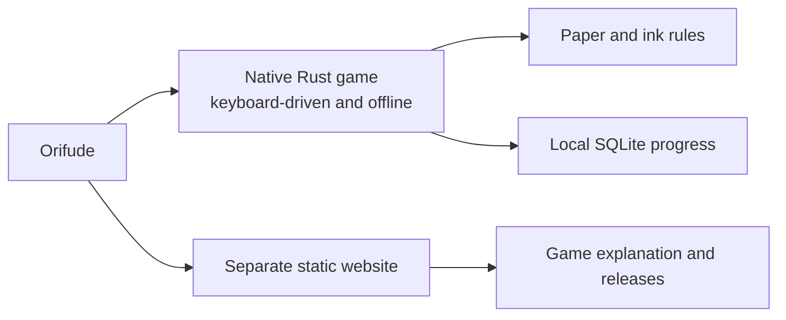

The split is deliberate. Playing never depends on the website or a network
service.

What was decided:

- Orifude is a native Rust terminal game played with the keyboard. It works
  offline and will keep progress in local SQLite storage.
- The player folds paper, places ink through every layer under a dot or line
  brush, unfolds the paper, and tries to match the target exactly.
- Undo and reset are normal tools. There is no timer, account, telemetry,
  leaderboard, streak pressure, advertisement, or required network call.
- The native game and the static Astro website remain separate projects. The
  website explains the game and releases. It never becomes a browser game.
- Orifude is a coined name inspired by folding and brushwork. The supplied
  squirrel, paper, branch, berry, and brush artwork is the identity source.
- `shrek` is the permanent default branch. It currently accepts direct pushes,
  then ordinary CI reports whether the pushed commit passes.
- The product has explicit limits for paper size, actions, history, solver
  work, storage, packs, terminal events, and release artifacts. Raising a limit
  needs a resource estimate and tests.
- Operational failures such as bad input, I/O errors, cancellation, and full
  storage must be recoverable. Panics are reserved for broken internal
  invariants.

The detailed contracts live in the
[canonical game rules](PROJECT.md#canonical-game-rules),
[architecture](PROJECT.md#architecture),
[explicit limits](PROJECT.md#explicit-v1-bounds),
[security model](PROJECT.md#security-model),
[test strategy](PROJECT.md#test-strategy), and
[distribution contract](PROJECT.md#distribution-contract).

The puzzle-game reboot began in
[`0e3f08c`](https://github.com/nuggocto/orifude/commit/0e3f08c272eb99e28c804d265fe8b28ff745157e).
The older letter-exchange application remains in Git history, but it is a
retired product with no upgrade or data-migration path into this game.

## Rust repository foundation

Build-plan source: [repository foundation](PROJECT.md#phase-1-repository-foundation).

The repository has one small, reproducible Rust application base. It is meant
to fail clearly before domain code, storage, and terminal work make failures
more expensive.

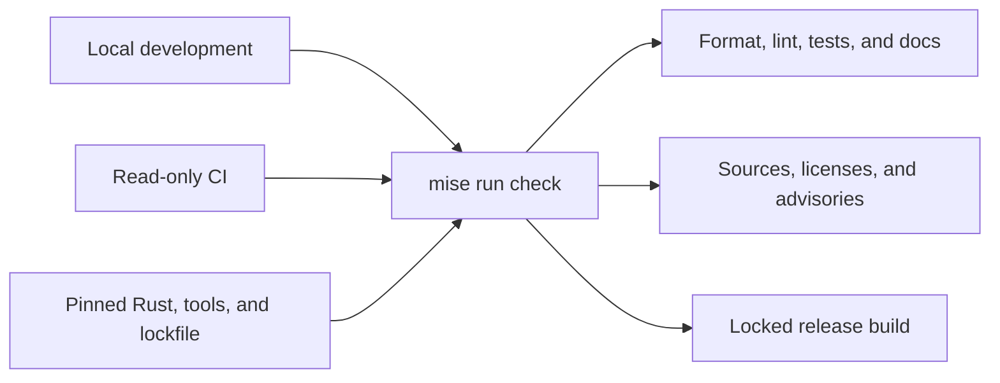

Local work and CI enter through the same bounded check. The pinned inputs keep
that check reproducible.

What was built:

- [`rust-toolchain.toml`](rust-toolchain.toml) pins Rust 1.98.0 with the minimal
  rustup profile, Clippy, and rustfmt. [`Cargo.toml`](Cargo.toml) records Rust
  1.98 as the minimum compiler and uses edition 2024 with resolver 3.
- The crate denies unsafe code. Development, test, and release builds keep
  overflow checks enabled. Release panics unwind so the later terminal owner
  can restore terminal state during handled failures.
- [`Cargo.lock`](Cargo.lock) is committed because Orifude ships an application,
  not a reusable library. Locked builds make local work and CI resolve the same
  dependency graph.
- The foundation began without a runtime dependency. The command line remains
  small enough that a hand-written parser is easier to audit than a parser
  framework. Later storage work added only its bounded persistence and content
  dependencies.
- [`src/cli.rs`](src/cli.rs) separates an empty interactive launch from help,
  version, and invalid usage. It inspects at most two arguments and never
  reflects unknown argument bytes into terminal output.
- Exit codes are stable: success is 0, operational failure is 1, and invalid
  usage is 2. Output failures retain their I/O cause instead of becoming a
  vague top-level message.
- [`src/main.rs`](src/main.rs) prints at most eight linked error causes. That
  prevents a strange error chain from turning reporting into unbounded work.
- [`mise.toml`](mise.toml) is the one command menu for formatting, linting,
  tests, doctests, release builds, dependency policy, the paper exercise,
  measurements, and domain fuzzing.
- [`deny.toml`](deny.toml) rejects unknown dependency sources, wildcard
  dependencies, unreviewed licenses, and known advisories. Duplicate versions
  remain denied except for two exact Ratatui dependency versions whose upstream
  graph cannot unify yet.
- [Ordinary CI](.github/workflows/ci.yml) runs `mise run check` on Linux for
  pull requests and pushes to `shrek`. It has read-only repository permission,
  no publication credentials, a 15-minute timeout, pinned actions, and no
  cross-run executable cache.
- [`.gitattributes`](.gitattributes) fixes text and line-ending behavior across
  supported platforms.

Why these choices:

- One package is enough right now. A workspace would add navigation and build
  cost before there is a real ownership boundary to justify it.
- No build cache was added because the first hosted check took about 15 seconds.
  Ten seconds were tool installation and roughly 1.5 seconds were repository
  checks. Cache invalidation would cost more attention than it saves today.
- Dependency policy runs before compilation. A bad source or license should
  stop early, before the machine spends time building it.
- CI checks direct pushes after they land because that matches the live branch
  settings. The notebook records reality, not the branch policy we might wish
  we had on a sleepy afternoon.

The main foundation commits are
[`09e4291`](https://github.com/nuggocto/orifude/commit/09e4291a95efd9fef5b0e08364a62a2d367df945),
[`cdc2b22`](https://github.com/nuggocto/orifude/commit/cdc2b22f095523c1b58d26c0bec35606cec5769c),
and
[`9046529`](https://github.com/nuggocto/orifude/commit/9046529daf3277f46197c45a13e433c7d2963e5d).

## Paper model and rule exercise

Build-plan source:
[paper model and rule prototype](PROJECT.md#phase-2-paper-model-and-rule-prototype).

The paper model proves the fold algebra before a TUI tries to make it pretty.
The core idea is simple: every physical cell keeps one stable identity even
when its position, layer, face, and orientation change.

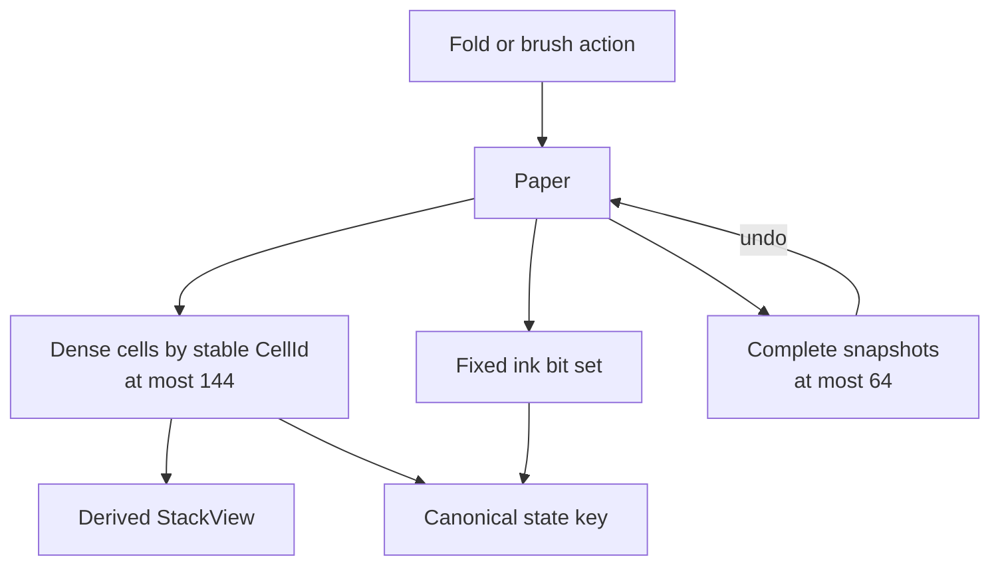

`Paper` is the only mutable source of truth. Stack views and state keys are
derived, while undo restores an earlier complete state.

What was built in [`src/domain/paper.rs`](src/domain/paper.rs):

- Boards are between 4 by 4 and 12 by 12 cells, with at most 144 physical cells.
- Small newtypes keep cell IDs, rows, columns, dimensions, layers, fold counts,
  stroke counts, and action counts inside their declared ranges.
- The canonical paper is one dense vector indexed by stable row-major
  `CellId`. Ink is a fixed three-word bit set indexed by the same ID.
- A caller-owned [`StackView`](src/domain/paper.rs) derives one bottom-to-top
  stack without keeping a second coordinate map in sync.
- Folds reflect coordinates across a cell boundary, flip the visible face,
  update orientation, and reverse every moving stack before placing it above
  stationary layers.
- A moved stack may land on an empty destination inside the original board.
  Cells may never leave that bounded working area.
- Dot ink passes through every layer at one occupied position. Target
  comparison reports missing and extra physical cells separately.
- Undo stores complete canonical snapshots. Failed actions leave the previous
  state untouched.
- Release-active assertions check cell conservation, unique identity,
  in-bounds coordinates, action-count agreement, and complete zero-based layer
  order. These are programmer-error checks, not input validation.

Why dense storage won:

- Folding, snapshotting, hashing, and future solver expansion touch most or all
  physical cells. Those are the common operations.
- The measured coordinate-to-stack `BTreeMap` made one stack lookup faster, at
  about 5 ns instead of roughly 111 ns on the recorded machine. It made a
  maximum snapshot clone about 190 times slower and clone-plus-two-fold work
  about 6 times slower. It also split one board across up to 144 small
  allocations.
- A maximum dense cell payload is 720 bytes. A snapshot's named payloads total
  779 bytes on the recorded Linux target. Sixty-four snapshot and action
  entries total 50,176 bytes before allocator bookkeeping. Complete snapshots
  fit comfortably, so action deltas would add restoration bugs without solving
  a memory problem.
- Rust does not promise the same layout on every target. The numbers guide this
  representation choice; they are not a portable ABI promise.

The checked-in measurement and rejected alternative live in
[`examples/paper_measure.rs`](examples/paper_measure.rs). The focused public-API
tests live in [`tests/paper.rs`](tests/paper.rs).

The plain-text exercise in [`examples/paper.rs`](examples/paper.rs) has six
one-fold and two-fold examples. Its model-driven walkthrough shows the crease,
bottom-to-top layer order, ink passing through a stack, and the current numeric
answer format. Menu and prediction input stop at 16 bytes, and one run stops
after 12 menu attempts. Oversized input ends the session instead of leaving a
tail that could become a later command.

The fold-destination and branch-policy clarification landed in
[`aaa348c`](https://github.com/nuggocto/orifude/commit/aaa348c3f13f8f7032d3a10e7925cf8157dc8323).
The model and measurement landed in
[`9419443`](https://github.com/nuggocto/orifude/commit/941944316dd9f5e2996d09e3b3f40a3194d8cc62).
The visual lesson landed in
[`67d0c72`](https://github.com/nuggocto/orifude/commit/67d0c727ea1f501150d9b7ee0a51bae96ef653ef).

## Deterministic game engine

Build-plan source:
[deterministic game engine](PROJECT.md#phase-3-deterministic-game-engine).

The prototype became the production domain API. The TUI, solver, generator,
authoring tools, and replay loader are expected to call this API instead of
reimplementing paper rules.

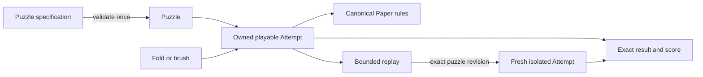

The validated puzzle stays with its attempt. Replays start from fresh paper and
must match the complete gameplay revision before any action runs.

The domain is split by behavior:

- [`paper.rs`](src/domain/paper.rs) owns physical cells, folds, brushes, ink,
  snapshots, canonical state keys, and low-level legality.
- [`puzzle.rs`](src/domain/puzzle.rs) validates identity, dimensions, target,
  allowed folds and brushes, budgets, and optional par before play starts.
- [`attempt.rs`](src/domain/attempt.rs) owns one validated puzzle and paper. It
  rejects puzzle-disallowed actions before asking the paper to apply them.
- [`score.rs`](src/domain/score.rs) reports exact success, fold and stroke
  score, undo count, hints, and whether a successful result meets par.
- [`replay.rs`](src/domain/replay.rs) records bounded actions and executes them
  against a fresh isolated attempt.

What the engine can do now:

- Apply any valid horizontal or vertical crease in all four directions,
  including consecutive folds on the same axis and nested stacks at least eight
  layers deep.
- Reject an empty moving side, an out-of-area reflection, a disallowed action,
  an empty brush position, an invalid line, or an exhausted budget without
  mutating the attempt.
- Apply a dot or a bounded inclusive horizontal or vertical line. Line endpoint
  order is canonical, so drawing the same line backward produces the same
  action.
- Compare every original physical cell and report exact, missing, and extra ink.
- Undo one successful action exactly, reset to fresh paper, and keep replayable
  actions aligned with the current state.
- Produce exact canonical state equality and a stable non-cryptographic hash
  for solver bookkeeping. Equality still resolves hash collisions.
- Score folds before strokes. Time is never part of the score.

Replay compatibility deserves its own note. Identity and format numbers were
not enough because a puzzle author could change a target, allowed action, budget,
or par while keeping the same IDs. A replay now carries an exact bounded
`PuzzleRevision` with every gameplay field. Display text is left out because a
spelling fix should not invalidate a solution. This uses exact equality instead
of a custom digest, so correctness does not depend on hoping two revisions never
collide. Replay execution validates first and then works on fresh state, which
keeps a failed replay away from the live attempt.

The engine keeps these hard bounds:

| Resource | Limit |
| --- | ---: |
| Physical cells | 144 |
| Fold actions | 12 |
| Brush actions | 8 |
| Total actions and history entries | 64 |
| Allowed fold rules in one puzzle | 44 |
| Allowed brush rules in one puzzle | 23 |
| Pack and puzzle ID length | 64 ASCII bytes each |

Verification lives in [`tests/engine.rs`](tests/engine.rs):

- 26 integration tests cover construction, all fold directions, off-center and
  nested folds, dots, lines, scoring, history, canonical keys, replay
  compatibility, and atomic failure.
- An exhaustive fold pass covers all 2,268 board, direction, and crease cases
  across supported board dimensions.
- Eight fixed seeds cover 256 direct actions and fresh replay execution.
- [`examples/domain_actions_fuzz.rs`](examples/domain_actions_fuzz.rs) accepts at
  most 256 input bytes, which decode to at most 64 operations. A 257-byte input
  exits with usage status before domain work starts.
- Debug and release runs produce the same recorded state hash and replay result.
- `mise run check`, release tests for every Cargo target, warning-denied Rust
  documentation, the locked dependency audit, the bounded fuzz run, and the
  plain-text exercise all passed on Rust 1.98.0 and x86_64 Arch Linux.
- Native macOS and Windows execution has not been tested yet. No TUI terminal
  lifecycle exists yet, so those claims wait for the native work that can
  actually prove them.

The complete engine landed in
[`5da6052`](https://github.com/nuggocto/orifude/commit/5da6052d85c5b1ea804ba9eedce1ee48bbce23cb).
Its [GitHub CI run](https://github.com/nuggocto/orifude/actions/runs/33527703571)
passed after the direct push to `shrek`.

## Bounded search and generation

Build-plan source: [solver and generator work](PROJECT.md#phase-4-solver-and-deterministic-generator).

The engine can now prove a small puzzle, explain why search stopped, and build a
repeatable puzzle from a seed. The important bit is that neither side gets to
invent paper rules. Both return to the production engine before Orifude trusts
their answer.

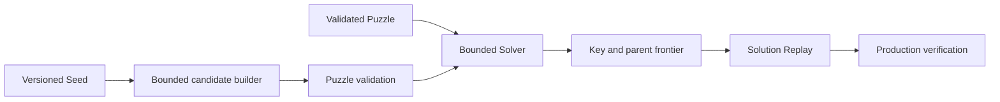

What was built:

- [`src/solver/mod.rs`](src/solver/mod.rs) has one deterministic priority
  search. It compares folds first and strokes second, just like the game score.
  It returns solved, unsolved, exhausted, cancelled, and invalid as different
  outcomes.
- Search keeps exact [`PaperStateKey`](src/domain/paper.rs) values in a hash
  set, plus small parent records in its frontier. It never iterates the hash
  set, so private hash-table order cannot change the chosen replay.
- A state is restored by resetting one reusable attempt and replaying at most
  20 parent actions through the real engine. Every reported solution is then
  replayed once more against the exact puzzle revision.
- The solver checks its fixed setup before allocating search collections. It
  stops independently for 250,000 visited states, 128 MiB of conservatively
  charged memory, configured depth, or cancellation.
- [`src/generator/mod.rs`](src/generator/mod.rs) owns an explicit versioned seed
  and a maximum of 512 candidate attempts. It receives a calendar date from its
  caller and never opens a clock.
- The generator builds legal bounded action sequences. Construction guarantees
  a non-empty target and enforces the action budgets through the production
  engine. It rejects repeated and trivial targets, and one solver-exhausted
  target does not prevent it from trying the remaining bounded candidates.
- The generated action sequence is already a solution witness. If the complete
  solver called that target unsolved, or if the internal puzzle validator
  rejected data built from the validated template, that would be a code defect
  rather than ordinary bad luck. Those cases are assertions instead of public
  rejection reasons.
- The first random compatibility path uses fixed-width SplitMix64 arithmetic.
  A daily seed comes from `orifude:1:YYYY-MM-DD`. The golden in
  [`tests/generator.rs`](tests/generator.rs) fixes the date, seed, target,
  actions, puzzle ID, and accepted candidate so a future algorithm change does
  not quietly rewrite old daily papers.

Why the frontier looks a little unusual:

- Cloning a complete maximum-depth attempt is quick here, around 0.34
  microseconds in the recorded release runs. It also has a 16,750-byte
  named-payload lower bound for every retained state because the puzzle, paper,
  and 20 snapshots come along for the ride.
- The selected key and parent representation is conservatively charged at
  1,312 bytes per maximum-paper state. Rebuilding a 20-action path is slower,
  around 18.73 to 18.99 microseconds, but it keeps the hard memory story simple
  and leaves one production rules engine.
- On 256 maximum-paper keys, hashed membership took about 1.50 microseconds per
  lookup. A linear vector took about 11.7 microseconds. The small extra table
  storage earns its keep once the search grows.
- The representative solver fixtures visited 2 to 35 states and took roughly
  4.6 to 184.3 microseconds at the median on the recorded AMD Linux machine. Run
  [`mise run solver-measure`](mise.toml) for the full local table. These numbers
  guide the structure; they are not promises for another computer.

The generator is deliberately not an artist or a lesson designer. Fold-free
introductions, carefully shaped pictures, story pacing, unique-solution
puzzles, line-heavy folded layouts, and rule sets that exhaust bounded search
still belong in handcrafted content. A failed seed is reported and ends. It
does not keep shaking the branch until a convenient puzzle falls out.

## Repository-wide review on 2026-09-01

The clean `shrek` commit
[`06da3c3`](https://github.com/nuggocto/orifude/commit/06da3c3bb77427238578deed928c4798d17c9a8f)
received a full source, test, configuration, documentation, security-boundary,
and local behavior review. It found one boundedness defect in
[`GeneratorConfig`](src/generator/mod.rs), which the follow-up change repaired.

The old configuration accepted rule vectors of any length. `Generator::new`
then cloned both vectors before `Puzzle::new` enforced the 44-fold and 23-brush
limits. The old configuration constructor also copied its pack ID before the
64-byte identity check. Rejection was correct, but it arrived after memory use
had already grown with invalid input.

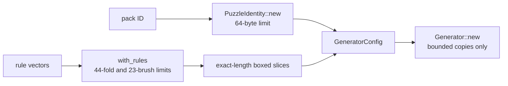

An isolated reproduction confirmed the vector path twice. A one-rule policy
peaked near 2.5 MiB resident memory, while five million rejected fold rules
peaked near 21.7 MiB. The command line could not reach this constructor, so the
defect was not an exposed vulnerability. It was still the wrong boundary to
carry into local content parsing.

On 2026-09-02, configuration construction became fallible. It retains a pack ID
only after `PuzzleIdentity` validates it, and `with_rules` rejects either
oversized list before retaining either one. Accepted rules become `Box<[Fold]>`
and `Box<[BrushRule]>`. Generation reads and copies these collections but never
appends to them, so exact-length slices express the real ownership and discard
irrelevant spare vector capacity. Keeping growable vectors offered no useful
operation in return. The public regression in
[`tests/generator.rs`](tests/generator.rs) checks the 65-byte ID, 45th fold, and
24th brush rule and their exact typed errors. It failed against the old
infallible boundary and passes with the bounded one.

The original five-million-rule reproduction now rejects while constructing the
configuration. Its peak resident memory fell from about 21.7 MiB to 11.9 MiB
because the caller's input remains but the generator no longer clones it. A
normal one-rule policy still constructs and generates its preserved daily
golden. The generator suite passed ten consecutive debug runs. `mise run check`,
release tests for every Cargo target, and warning-denied Rust documentation all
passed after the repair. Release-binary default, help, version,
hostile-argument, paper-exercise, and fuzz-boundary checks also remained
unchanged.

The rest of the reviewed implementation had no confirmed defect. `mise run
check`, release tests for every local Cargo target, warning-denied Rust
documentation, and `git diff --check` passed on Rust 1.98.0 and x86_64 Arch
Linux. The release
binary produced the recorded default, help, version, and usage behavior. A
control-sequence argument was rejected without reflection. The paper exercise
completed its two-fold, prediction, ink, exact-comparison, undo, and quit path.
The domain fuzz entrypoint accepted 256 bytes and rejected 257 before domain
work.

The solver also matched an independent exhaustive reference for all 499 targets
reachable in a small four-direction fold-and-dot puzzle. The
[baseline hosted check](https://github.com/nuggocto/orifude/actions/runs/33548263881)
passed for the same commit. Rust 1.98.0 remains the current stable release in
the [official Rust release record](https://blog.rust-lang.org/releases/1.98.0/).
That reviewed commit had no runtime dependency, unsafe code, network path,
database, archive handling, pack parser, or TUI lifecycle. Native macOS and
Windows execution remained untested at that review point.

## Persistence and local packs

Build-plan source: [persistence and local packs](PROJECT.md#phase-5-persistence-and-local-packs).

Orifude now has one durable source for progress and one bounded path from local
authored files to playable community content. Neither path interprets paper
rules on its own: saved replays and parsed puzzles return through the domain
engine before they are trusted.

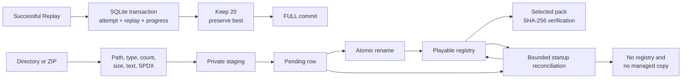

The implementation lives in [`src/storage`](src/storage) and
[`src/packs`](src/packs). The important choices are:

- [`AppPaths`](src/storage/paths.rs) uses the operating system project
  directories. Linux follows the XDG data, config, and cache variables with
  their standard home-directory fallbacks. macOS uses Application Support for
  data and config and Library/Caches for cache data. Windows uses roaming
  AppData for data and config and local AppData for cache data. Tests inject
  three isolated roots and never write into the working tree.
- [`rusqlite`](Cargo.toml) links the reviewed bundled SQLite so every native
  artifact gets the same database feature set. Semver-compatible dependency
  updates are accepted only through a reviewed `Cargo.lock` change followed by
  the complete license, source, advisory, lint, test, and release-build check.
  The allowlist records Apache-2.0, MIT, MPL-2.0, Unicode-3.0, and Zlib after
  reviewing the locked graph; it has no skip tree.
- [`Storage::open`](src/storage/mod.rs) owns one connection and one advisory
  lock. It rejects a symlinked database path, then lets the writable connection
  recover a hot rollback journal before it reads the schema version. Newer
  schemas still stop before writable pragmas or migrations can touch them. The
  connection applies the initial schema in an immediate transaction, caps
  SQLite strings, blobs, SQL, expression depth, variables, attachments,
  triggers, and worker threads, and checks the schema markers, foreign keys,
  and database image without silently replacing corrupt data.
- The schema separates metadata, rendering-independent settings, progress,
  completed attempts, bounded replay documents, generator-versioned daily
  history, installed-pack metadata, and the single pending installation.
  The pending row retains the original installation timestamp for restart
  recovery. Progress has no pack-registry foreign key, so removing content does
  not erase the history that explains an earlier completion.
- A successful replay is executed first, then its attempt, replay, best marker,
  and progress summary commit together. The connection uses 4096-byte pages,
  32,768 maximum pages, `DELETE` journaling, `FULL` synchronization, no retained
  journal, disabled cache spilling, and memory-backed SQLite temporary storage.
  The main file is capped at 128 MiB. Nonessential replay and daily-history
  writes preserve 16 MiB of free page capacity after one pruning batch. A
  completion may use that reserve for progress and its best replay. When a
  worse replay will not fit outside the reserve, its progress commits and only
  that nonessential replay is discarded. Per-puzzle history keeps 20 replays
  including the best.
- A rollback journal can hold one original page record per database page. The
  132 MiB transient-sidecar budget covers 32,768 records of 4096 data bytes and
  eight framing bytes plus SQLite's maximum sector-sized header. Disabling
  cache spilling keeps a transaction to that one header. WAL and shared memory
  files are forbidden by the selected journal mode, and actual main, journal,
  WAL, and shared-memory lengths remain available through `Storage::footprint`.
- Pack metadata and puzzles are strict versioned TOML. A target is an ASCII
  `.`/`#` grid that must exactly match the declared dimensions. Display text is
  UTF-8 with scalar limits and no control characters. IDs, filenames, rules,
  budgets, tutorial cues, authors, SPDX licenses, file declarations, and all
  resource bounds are validated before a `Puzzle` is constructed.
- ZIP is the only archive format. Only stored and deflated regular files are
  accepted. A bounded end-record preflight rejects excessive, split, and ZIP64
  entry tables before the ZIP library allocates its catalog. Directory sources
  stream entries rather than collecting an untrusted directory. Both sources
  reject traversal, absolute paths, case-folded duplicates, Windows device
  names, trailing dots or spaces, symbolic links, Unix and Windows hard links,
  devices, sockets, undeclared directories and files, excessive depth,
  excessive count, and compressed, extracted, or per-file size excess.
- Installation writes the already validated byte set into one owner-private
  staging directory under the data root, synchronizes files and directories,
  commits the pending identity, fingerprint, and timestamp, renames within that
  filesystem, then registers the pack and clears the journal in one transaction.
  Startup rejects a symlinked managed root and performs bounded reconciliation
  before terminal code. It removes a registry row whose directory is missing
  and removes unregistered managed entries without following links. This closes
  the Windows power-loss state where SQLite survives but the rename does not.
  A selected pack is reparsed and checked against its recorded SHA-256
  fingerprint; startup does not eagerly parse installed puzzle files.

The integration suites in [`tests/storage.rs`](tests/storage.rs) and
[`tests/packs.rs`](tests/packs.rs) exercise restart persistence, better-solution
replacement, 20-replay pruning, migration rollback, schema refusal, corruption,
read-only paths, lock contention, completion-transaction rollback, every
durable installation state, failed-cleanup retry, conflicts, fingerprint drift,
removal with retained progress, directory links, archive escape attempts,
portable names, resource excess, control text, SPDX parsing, replay identity
and success, the 32-error reporting ceiling, a spilled hot rollback journal,
protected reserve writes, managed-root links, missing registry directories,
unknown managed entries, recovery timestamps, and independent puzzle errors.
The four parser entrypoints are
[`examples/puzzle_parser_fuzz.rs`](examples/puzzle_parser_fuzz.rs),
[`examples/pack_metadata_fuzz.rs`](examples/pack_metadata_fuzz.rs),
[`examples/replay_parser_fuzz.rs`](examples/replay_parser_fuzz.rs), and
[`examples/archive_parser_fuzz.rs`](examples/archive_parser_fuzz.rs).

The implementation review found and corrected real boundary defects rather
than adding speculative complexity. A better score used to insert its new best
replay before clearing the old unique best marker; the order is now reversed in
the same transaction. The review also removed unbounded directory collections,
added the ZIP entry-table preflight, made idempotent installation verify the
existing managed bytes, required decoded replays to be successful and match the
requested identity, protected daily history with the free-page reserve, made
pending-row removal exact, and stopped newer schemas before writable setup.
Focused regressions cover each correction in the two integration suites.

A later report found several boundary cases that the first review missed.
Validation now caps diagnostic allocation while it collects issues and keeps
independent display, identity, target, par, and rules errors in one report.
Storage now recovers a rollback journal that has spilled pages before checking
the schema, lets protected completion state use reserved pages, keeps recovery
timestamps, rejects a symlinked managed root, and converges a missing registered
directory to the safe no-pack state. Unknown entries under the private managed
root are removed as bounded orphan cleanup instead of blocking every startup.

The security review treated pack bytes, archive metadata, paths, persisted
SQLite values, and error text as hostile. All accepted sizes have a numeric
bound before retained allocation or installation, pack content cannot select a
managed path, SQL is parameterized, stored display text is revalidated, and
errors do not reflect untrusted bytes. Packs contain no executable content and
the dependency graph adds no network client. Concurrent changes by the same
user to an explicitly selected source directory are not an isolation boundary;
the install still fingerprints and stages only the validated bytes it read.

On the recorded x86_64 Arch Linux host and its Btrfs SSD, the final five
independent release runs of 500 completion writes with `FULL` synchronization
measured 20.228 to 22.120 milliseconds at p50, 21.544 to 28.613 milliseconds at
p95, 22.602 to 29.459 milliseconds at p99, and 26.559 to 62.811 milliseconds
maximum. Every p95 is below the 50-millisecond local-SSD target. The locked
ordinary check, all 100 tests in both debug and release across local targets,
warning-denied documentation, and release build passed. Random maximum-size
input passed through all four bounded parser harnesses without a crash. The
Windows Rust target check reached the bundled SQLite C build but could not
finish because this Linux host lacks a Windows CRT; native Windows and macOS
execution remain later native QA, not claims made by this work.

## How the notebook was checked

On 2026-09-01, this notebook was checked against `PROJECT.md`, the current
source and tests, and the puzzle-game Git history beginning at `0e3f08c`.
Every relative link resolves inside the repository, every linked commit exists
in local history, and every linked `PROJECT.md` heading exists.
`git diff --check` and `mise run check` also passed. This was a
documentation-only check at that point. Search and generation later added their
own linked tests, measurement harness, and verification record.

A follow-up added four small Mermaid graphs for the product boundary, shared
check path, paper ownership, and engine flow. Their nodes and limits were
checked against the same linked contracts and source. The graphs explain
existing behavior; they do not add a new rule.

The search-and-generation review then checked every reported candidate
rejection against the actual builder. It fixed one real control-flow bug: a
solver-exhausted candidate used to stop the whole generation run. A regression
test now proves that all 32 configured attempts are considered and that repeated
targets skip duplicate solver work. Impossible rejection labels were removed
instead of manufacturing tests for states that validated construction cannot
produce. The same review removed a redundant full-state scan at the start of
in-place paper reset; the release median for resetting and replaying the fixed
20-action path was 18.73 to 18.99 microseconds across five processes. Reset
still checks the rebuilt state before returning.

On 2026-09-02, a whole-repository review reread the committed core and the
uncommitted pack and storage work together. Its initial clean verdict was wrong.
A follow-up compared three independent reports with the contract and reproduced
each surviving claim before changing code. Eight claims were confirmed: reserve
handling, spilled-journal recovery, managed-root links, Windows rename recovery,
recovery timestamps, unknown managed entries, diagnostic allocation, and lost
independent puzzle errors. Four claims were rejected because the contract or
reachable behavior contradicted them: newline rejection in notes, the independent
256-file pack limit, cache invalidation after any removal, and the deliberately
single pruning batch. The focused regressions failed against the old behavior
and pass after the corrections.

`mise run check`, all 100 tests in release mode, warning-denied documentation,
the release build, and ten repeated runs of the generator, pack, and storage
suites passed after the corrections. Release QA also exercised hostile CLI
input, the paper walkthrough, and maximum accepted input through each bounded
parser harness. One independent 500-write storage run measured 21.075
milliseconds at p50, 23.658 milliseconds at p95, 24.598 milliseconds at p99,
and 30.949 milliseconds maximum. That run is useful confirmation on this Linux
host, not a cross-platform benchmark; native Windows and macOS behavior was not
exercised by this review.

The first repeatability run exposed a test bug rather than a storage bug. The
hot-journal test forked the multithreaded storage-test process. During the short
fork-to-exec window, the child could retain another test's open lock descriptor
and make an unrelated immediate reopen report `Locked`. The recovery check now
lives alone in [`tests/storage_recovery.rs`](tests/storage_recovery.rs). The
storage and recovery binaries then passed 100 consecutive runs, followed by the
ten complete focused-suite runs recorded above.

## Terminal runtime design

The terminal shell has one main-thread renderer and one owned event worker. Its
dominant operations are appending a key, replacing a pending resize or tick,
removing the oldest event, and waking shutdown. The queue can hold at most 256
fixed-size events, so a preallocated `VecDeque` keeps those operations bounded
without another index or synchronized collection.

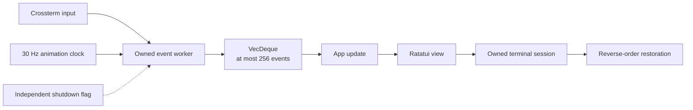

A design with separate key, resize, and tick stores was rejected. It makes the
total capacity and the position of coalesced events harder to inspect. The one
queue preserves key order, replaces an existing resize or tick in place, and
uses condition-variable backpressure when a new entry would exceed the limit.
Shutdown is not an event, so a full queue cannot hide it.

The terminal session records raw mode, alternate-screen entry, cursor hiding,
line wrapping, and focus reporting as separate acquired capabilities. Normal
exit and handled errors restore every capability in reverse order. Successful
steps are cleared while failed steps remain available for a bounded retry. A
process-level fallback makes the same restoration as separate best-effort
operations. The panic hook only performs that fallback on the thread that owns
the terminal, so a caught event-worker panic returns through the normal error
path instead of removing the alternate screen under the renderer. The renderer
uses a centered viewport capped at 160 by 60 cells, so a hostile or accidental
giant terminal size cannot turn into an unbounded Ratatui buffer.

[`src/tui`](src/tui) now contains the app state, event pump, lifecycle, safe
text boundary, capability profile, layouts, components, and pure view. The
shell opens the home branch, help, a rules preview, terminal settings, quit
confirmation, and readable error dialogs. Preferred, narrow, and undersized
layouts share the same state. The narrow layout keeps all choices visible, and
the undersized view keeps dialogs and focus waiting until the terminal returns.
ASCII, monochrome, reduced-motion, and instant-reveal choices are stored with
the existing settings through the schema migration in
[`src/storage/mod.rs`](src/storage/mod.rs). Primary text uses the terminal's
default foreground so it remains readable on both light and dark backgrounds.

The opening composition now keeps its shape on a large terminal instead of
inflating two bordered panels to the full render cap. [`layout.rs`](src/tui/layout.rs)
centers a 120-by-38 shell, gives the courier three fifths of the content width,
and keeps the seven-choice card at 32 by 9 cells. At 60 by 20 it switches to a
two-line mark above the complete choice list.

```text
160 by 60 render viewport
└── 120 by 38 centered shell
    ├── title
    ├── courier mark        32 by 9 branch card
    └── keyboard status
```

[`components.rs`](src/tui/components.rs) derives the Unicode mark from the
supplied monochrome artwork as a fixed Braille raster. This retains the brush
circle, side-profile squirrel, folded letter, branch, and berries. A separate
ASCII drawing carries the same composition without Unicode. The opening uses
24 fixed visual states over 1.1 seconds. Ink moves diagonally across the final
raster, any key completes it, reduced-motion and instant-reveal modes start on
the final state, and the event clock stops after the reveal. The work per frame
is bounded by 48 columns and 15 Braille rows. The full mark starts with the
artwork itself; the redundant `paper courier` label above it was removed while
the Orifude wordmark and arrival caption remain.

The view tests use Ratatui's `TestBackend` for the three layout boundaries,
ASCII-only output, and resize with an open dialog. Queue tests cover exact
capacity, key order, tick and resize coalescing, backpressure, failure priority,
and shutdown while full. Lifecycle tests inject each acquisition and
restoration failure, including a retry that touches only the capability that
still needs cleanup. [`tests/terminal_pty.rs`](tests/terminal_pty.rs) drives the
shipped binary through `script` on Linux and macOS and ConPTY on Windows, then
checks normal exit, alternate-screen cleanup, cursor visibility, and isolated
state. Unix PTYs also expose the line-wrap restoration sequence. ConPTY
intercepts that console mode change and projects a presentation stream, so its
absence from the captured Windows bytes is not evidence that cleanup failed.
The injected lifecycle tests verify the line-wrap restoration call on every
platform. The suite's opt-in `isolated-test-paths` build feature accepts one
absolute temporary root
and is enabled only by the repository test tasks. The suite proves that its
database was created below that root, so native tests cannot migrate or
reconcile a developer's live data. The Linux launcher passes the binary through
one quoted environment value, which also keeps paths containing spaces intact.
The test is not built on unsupported Unix targets. Hosted CI now runs the
release-profile suite through one native-player matrix on pull requests,
`shrek` pushes, manual dispatch, and release tags. Linux x86_64 and ARM64,
macOS Intel and Apple Silicon, and Windows x86_64 therefore use the same gate.

A whole-repository review on 2026-09-02 confirmed and fixed seven other defects
at their owning boundaries. An unbound key now redraws the completed opening
mark. Failed settings persistence restores the app's pre-event value without
making another fallible database read. Storage checks its file budget before
settings, completion, daily-history, and pack-install mutations, so a reported
capacity rejection leaves durable state unchanged. Existing schema markers are
verified before the settings migration changes an older database. The ASCII
mark uses its actual 33-cell source width, keeping the drawing and reveal sweep
centered. The cleanup and panic ownership changes described above cover the
remaining two defects. Focused regressions reproduced each reachable failure
before the fixes and passed afterward in [`app.rs`](src/tui/app.rs),
[`terminal.rs`](src/tui/terminal.rs),
[`components.rs`](src/tui/components.rs), and
[`tests/storage.rs`](tests/storage.rs).

The same review reread every authored source, test, example, configuration, and
project document on the dirty tree based on `6001a6c`. The complete locked
check, the release all-target test suite, and 20 consecutive release PTY
restoration runs passed on x86_64 Linux. Release-binary QA also covered the 80
by 24 and 60 by 20 layouts, the 59 by 19 resize message, navigation, errors,
help and quit dialogs through resize, persisted ASCII settings, normal quit,
and Ctrl-C. Native macOS and Windows execution remains unverified locally.

Exploratory release QA on the recorded Linux host covered true color, ANSI 16,
`NO_COLOR`, ASCII, 80 by 24, the exact 60 by 20 minimum, and an undersized
terminal while an error dialog was open. A fresh database reached a usable
screen in 93.583 milliseconds including tmux startup. One navigation key was
visible through tmux in 4.906 milliseconds. After animation settled, `ps`
reported 0.0 percent CPU and 6,256 KiB resident memory. These are local
end-to-end samples, not cross-platform distributions. The unstripped,
dynamically linked release binary was 4,403,224 bytes; packaged and stripped
artifact size remains release work. The native macOS and Windows smoke jobs
still need hosted evidence before the cross-platform exit claim is checked.

The launch redesign was checked on the dirty tree based on `6001a6c` with the
release binary on x86_64 Arch Linux. Unicode captures at 160 by 60, 80 by 24,
and 60 by 20 kept the courier and menu centered without clipping. Separate
captures observed the early, middle, and final ink states. A navigation key
finished the reveal and still moved focus, ASCII mode used only ASCII cells,
and a persisted reduced-motion setting opened directly on the complete mark.
One settled release-process sample reported 0.0 percent CPU and 11,840 KiB
resident memory. The complete locked check, release build, and shipped-binary
terminal-restoration smoke passed. Native macOS and Windows behavior was not
rerun by this local design check.

A later hand-drawn courier variant failed owner review and was removed. The
source-derived Braille raster, matching ASCII drawing, and original ink reveal
are restored. The focused component tests and an 80 by 24 release capture
confirmed the rollback on x86_64 Arch Linux.

Dialogs now receive a host region from the active layout. Preferred layouts
place the modal over the courier column and preserve the complete branch card
beside it. Narrow layouts clear their shared content region first, so no stacked
menu row survives above or below the modal.

```text
preferred  [ modal over courier ]  [ complete Home branch ]
narrow     [       cleared modal content region          ]
```

View regressions check both behaviors. Release captures at 160 by 60, 80 by 24,
and 60 by 20 confirmed the quit text, footer, borders, and surrounding content
do not collide on x86_64 Arch Linux.

The redundant label above the full courier mark was then removed. Release
captures at 160 by 60 and 80 by 24 confirmed that the artwork, wordmark, and
arrival caption remain centered without a blank row. The 60 by 20 compact mark
was unchanged. This local visual check did not rerun native macOS or Windows.

After the review corrections, `mise run check` passed the locked format,
dependency-policy, lint, test, doctest, and release-build tasks on x86_64 Linux.
The release all-target suite passed 135 tests, including both PTY cases. The
release PTY cases then passed 20 consecutive runs. A release-binary capture sent
an unbound key during the opening wash and immediately showed the complete mark
and arrival caption. The installed Windows Rust target again reached bundled
SQLite before stopping at the host's missing MSVC `lib.exe`; native Windows and
macOS execution still belongs to the hosted smoke matrix in
[`ci.yml`](.github/workflows/ci.yml).

The first manual native matrix on commit `c258213` passed the repository check
and the Linux and macOS terminal smoke jobs. The Windows child also built and
exited normally, left the alternate screen, showed the cursor, and kept its
database isolated, but the test rejected the run because ConPTY did not echo
the line-wrap mode sequence. Crossterm had sent that sequence through Windows'
virtual-terminal console path; ConPTY consumes console mode changes and emits a
projected terminal presentation rather than a byte-for-byte copy. The smoke now
uses the raw line-wrap assertion only on Unix and keeps its behavioral lifecycle
coverage on all platforms. The same correction removes a Windows-only unused
parameter warning in the private-file helper. The failed hosted evidence is
[run 33647259312](https://github.com/nuggocto/orifude/actions/runs/33647259312);
the corrected commit `b6d5154` passed the full ordinary check in
[run 33648103544](https://github.com/nuggocto/orifude/actions/runs/33648103544),
then passed the full check and the native terminal smoke on Linux x86_64, macOS
Apple Silicon, and Windows x86_64 without retries in
[run 33648348790](https://github.com/nuggocto/orifude/actions/runs/33648348790).

## Playable loop

The playable shell keeps one mutable source for an active paper. The common
operations are moving one cursor, preparing one action, applying through the
production engine, opening a bounded overlay, rendering at most 144 cells, and
saving one successful replay. One session owns the validated puzzle, attempt,
draft, reveal, and result. Screens select a view of that session; they do not
copy its paper state.

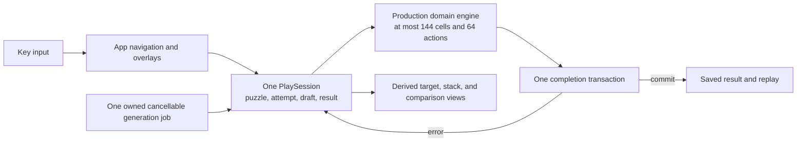

A separate mutable model for each puzzle, lesson, result, and replay screen was
rejected. It would make undo, resize, help, storage failure, and replay update
several copies in lockstep. Read-only lesson and replay frames instead rebuild
their tiny bounded prefixes through the engine. The generation worker is the
only additional mutable owner, runs one job at a time, and must publish one
result or cancellation before its thread is joined.

[`app.rs`](src/tui/app.rs), [`session.rs`](src/tui/session.rs), and
[`view.rs`](src/tui/view.rs) now connect the shell to the production engine.
The first launch checks the terminal and storage before showing a hands-on
paper. The same session model drives that lesson, the built-in journey,
generated daily and endless papers, installed packs, and saved replays. The
home card shows journey progress, locked papers follow durable completion, and
the keepsake list pages through every protected best solution in groups of 128.
Removed community packs remain labelled while their embedded replay stays
usable.

Fold drafts mark the moving side and name the direction and crease. Brush
drafts follow the cursor and show their complete footprint. The player can
undo, preview, or open a reset dialog without copying the attempt. Opening a
finished paper reverses the validated folds one at a time for at most 1.1
seconds; one input skips the reveal without also triggering the next action.
The final comparison uses `?` for missing ink and `!` for extra ink. A matched
paper is not described as saved until its replay, attempt metadata, and
progress transaction commit. The result can then retry, replay the stored best
solution, or show a spoiler-free text keepsake.

Fresh-player QA first found that `Tab` could appear inert in the lesson. A
later owner play-through showed that requiring `Tab` before the first useful
action was itself the larger problem. [`session.rs`](src/tui/session.rs) now
readies the first legal fold or brush when a paper arrives. `Enter` begins
immediately, a confirmed action readies the next tool, and an exact target
match readies Open paper. `Tab` and `Shift+Tab` still traverse every legal tool
and Open paper, while `Esc` reaches Open paper directly. Undo and reset derive
the ready tool again from the one owned attempt.

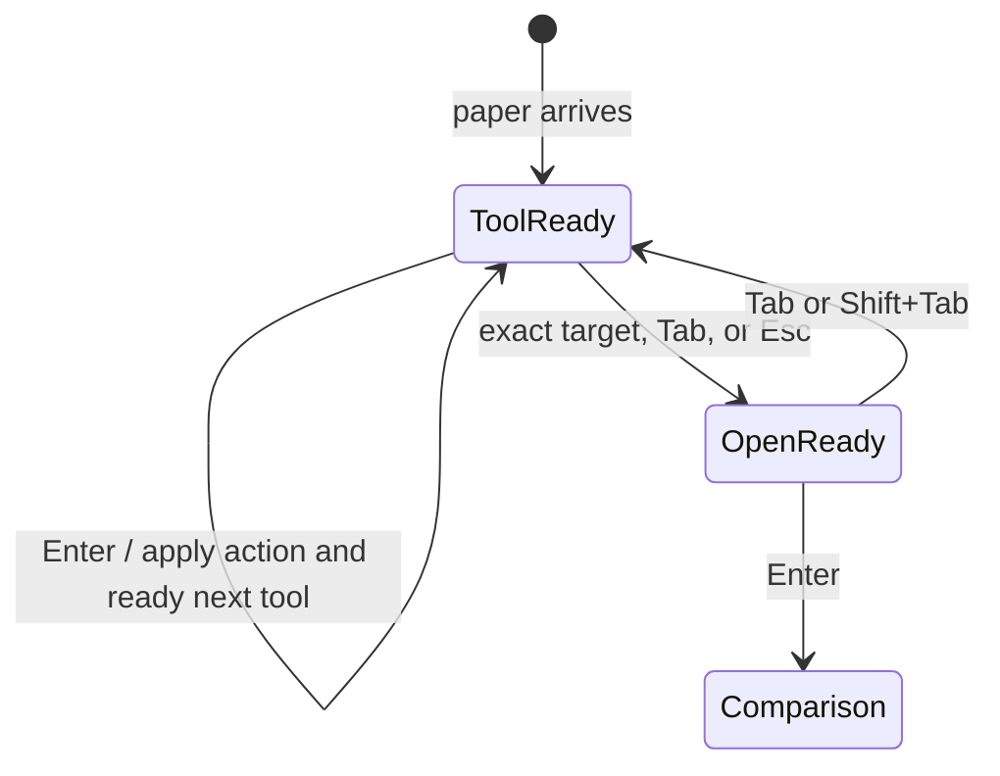

The timed fold and brush cards were removed after owner play-through showed
that they flashed too quickly to teach anything. [`session.rs`](src/tui/session.rs)
now retains one bounded action explanation as ordinary state. [`view.rs`](src/tui/view.rs)
shows that line without covering the paper, and renders placed ink as a filled
glyph that remains distinct in monochrome and ASCII. The only gameplay
animation is the bounded opening reveal; reduced motion still replaces it with
the final state.

An opened paper keeps its stack inspector fixed. Solving needs one movable
`cursor`, while a compact comparison needs one vertical `comparison_row` to
reach every row of a board. Both values fit the same validated paper dimensions
and can cover at most 12 rows. Reusing the cursor for both jobs was rejected
because result scrolling changed the stack location and made a keepsake look
interactive. During replay, the cursor follows only the recorded brush actions;
ordinary movement keys cannot alter it. After the paper opens, Up and Down
change only the comparison row. The view regression checks both the fixed stack
and all eight rows of the largest official comparison used by that test.

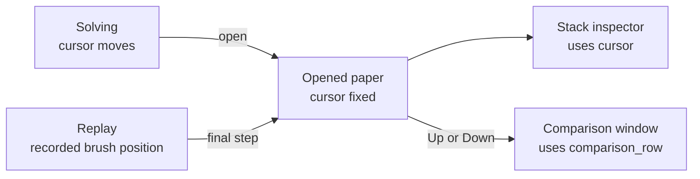

Saved replay originally rebuilt the complete attempt before its first frame.
That was technically an exact result, but it looked like a frozen duplicate of
the screen the player had just left. [`session.rs`](src/tui/session.rs) now
validates the complete replay once, then owns a bounded, read-only playback on
fresh paper. Enter or Right applies one recorded action, Left rebuilds the
previous bounded prefix, reset returns to the start, and the step after the last
action opens the comparison. Invalid or non-solving saved actions are refused
before playback begins. [`app.rs`](src/tui/app.rs) preserves the paper title and
[`view.rs`](src/tui/view.rs) names the current step and controls.

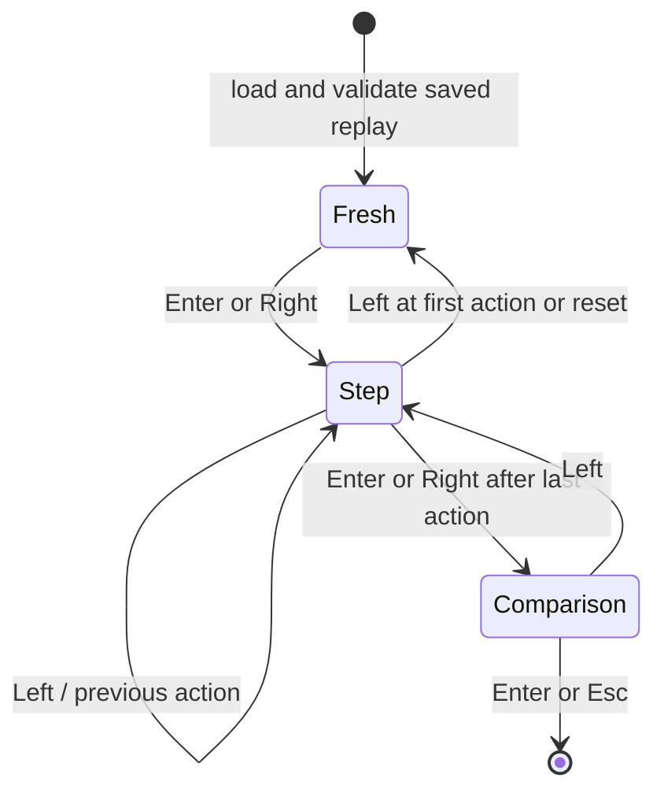

The follow-up tree based on commit `22606a0` passed `mise run check`, including
strict Clippy, dependency policy, 213 unit, integration, example, and native
PTY tests, the doctest, and the optimized build. The same 213 tests passed in
the optimized profile, then all seven native terminal journeys passed again.
Release-binary QA on x86_64 Arch Linux used a synthetic player root at
`/tmp/orifude-cast-final`. At 100 by 30, `First drop` kept row 2, column 2 in
the stack after result arrows and again after loading the replay and pressing
all four arrows. At 60 by 20, the structured help kept every line and its close
instruction visible. The goal panel appeared in the wide result and the replay
stayed free of the success card. The tmux session was removed; the
synthetic root remains in `/tmp` for inspection. No commit or push was made.

Exact cursor coordinates now stop after onboarding and the first journey
paper. Later built-in papers begin with the `Pattern to match` and no clue. A
missed opening reveals the paper's short description as a persistent hint and
records that help in attempt metadata. Installed packs can still opt into
authored guidance through the public cue format. The controls panel names the
ready tool in plain language, while the contextual help is split into movement,
tools, and result meanings. A saved solution holds a congratulations card on
screen and explains whether the reference path was found; a valid longer path
is celebrated without hiding the shorter reference. Keepsake playback omits
the card so the replay remains visible.

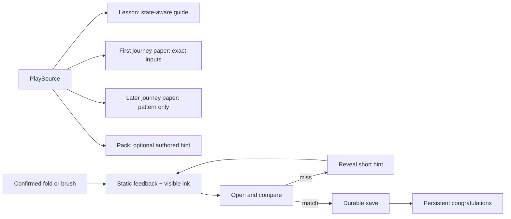

The opening journey now teaches the brush on two flat papers, then introduces
one crease on `two-drops`. `open-window` and `small-sprig` turn that crease and
add a second touch before the later groups build on the same mechanics. Stable
paper IDs and catalog positions remain unchanged; only these pre-release paper
definitions changed. The catalog regression requires exactly two flat opening
papers, and the independent solver still executes every official definition.

The squirrel drawings and opening mark in
[`components.rs`](src/tui/components.rs) were redrawn from the supplied
monochrome logo rather than from a generic animal face. The home branch now
uses one asymmetric twig with eight visible buds that turn into progress gifts.
Its seven rows fit within 44 columns in Unicode and ASCII, and its caption is
rendered separately so centering cannot break the drawing. The adjacent home
card now measures its title against its actual width, keeping `Saved yes`
complete instead of clipping the last character.

The dirty tree based on commit `22606a0` passed the complete locked check:
formatting, dependency policy, strict all-target Clippy, 212 unit, integration,
and example tests, the documentation example, and the optimized build. The
same 212 tests passed again in the optimized profile, and the seven native PTY
journeys passed in a separate run. Release-binary play-throughs covered the
onboarding paper, static fold and ink feedback, persistent success, first-paper
coordinates, later clue-only play, contextual help, and the connected branch
at 100 by 30, 80 by 24, and 60 by 20. The six output frames in
[`journey.cast`](docs/recordings/journey.cast) were recaptured from that 80 by
24 optimized session. No commit or push was made for this owner-review pass.

Repeating the native terminal suite exposed an older startup race in
[`event.rs`](src/tui/event.rs): crossterm installs its resize signal source on
the first poll, so a resize immediately after the first frame could be lost.
The event pump now initializes that source before returning and verifies the
terminal dimensions every 250 milliseconds as a bounded fallback. The original
small-terminal recovery test passed twenty consecutive isolated runs after the
change, then passed in the full native and optimized suites.
The final locked check passed strict Clippy, dependency policy, 209 unit,
integration, and example tests, the doctest, and the optimized build. The same
209 tests passed in the optimized profile. Warning-denied private
documentation, all seven native PTY journeys, and every JSON line in the
recording passed as separate checks.

A screenshot review then found that the highlighted pane still looked like a
developer focus indicator and that the first paper arrived before the player
understood the goal. The first-launch card now explains the lesson before
creating the session: use the ready fold, move the cursor and place ink, then
open the paper. The footer names `Enter start` instead of the
menu-only `Up/Down move`, and each lesson cue gives the exact next key or target
coordinate. The preferred and minimum layouts keep the goal, all four steps,
the next-move explanation, help keys, and start prompt visible at once.
The compact play footer also keeps movement, action, confirmation, help, and
quit visible within 60 columns. The follow-up tree passed `mise run check` and
all three native PTY cases on x86_64 Arch Linux with Rust 1.98.0. Isolated
development-binary runs at 100 by 30 and 60 by 20 confirmed the introduction,
contextual help, paper emphasis, exact first cue, and unclipped footer. The QA
state and terminal sessions were removed afterward.

The lesson paper now uses the empty part of its target pane for a small
squirrel and a speech bubble. The bubble gives one instruction at a time:
preview, fold, move to the shared stack, choose the dot, place it, then open the
paper. It derives the ink coordinate from the target cells' current physical
positions rather than copying the answer into the view. Undo, reset, direct
action keys, and cursor movement therefore change the advice through the same
[`PlaySession`](src/tui/session.rs) that owns the attempt.
If ink arrives before the fold or misses the target stack, the bubble names the
mistake and shows the configured undo key. It does not pretend the lesson is
still on its expected path.

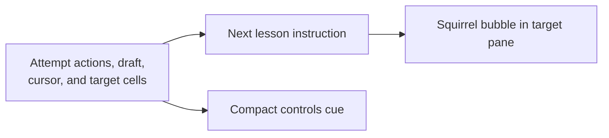

The coach takes at most seven rows and renders only when the target pane has
room for the mascot and a 21-column bubble. Smaller terminals retain the exact
lesson step across the compact controls and status text. A view regression
drives the complete successful lesson sequence and checks each instruction. A
second regression places ink before the fold and on the wrong stack, then
checks the recovery advice. Release-profile captures at 160 by 60 and 100 by
30 confirmed that the squirrel, bubble, target grid, paper, stack, and controls
remain separate and readable. At 60 by 20 the coach yields its space while the
controls retain the preview and confirmation directions.

Compact puzzle rendering now shows either the target or the paper beside the
selected stack. `t` switches the board, and a cursor-following row window keeps
the active cell visible when a maximum 12-by-12 paper is taller than the
available area. Wide layouts retain all three panes. Long journey, pack,
keepsake, and settings lists use the selected row to scroll their bounded
viewport instead of letting keyboard focus move below the terminal.

```text
wide:    [ target ][ folded paper ][ stack ]
compact: [ target or folded paper ][ stack ]  (t switches)
```

[`storage/mod.rs`](src/storage/mod.rs) advances the settings schema with the
lesson marker and seven configurable action keys. Migration accepts both older
settings shapes only after their database markers pass validation. Movement
keys, the compact target key, and the fixed replay and export keys stay
reserved. Space is the default unfolded-preview binding and is the only
non-graphic character accepted by binding validation. Daily completion and its
best replay commit in one transaction; reopening that date cannot clear a
completion or silently replace its deterministic puzzle identity. The indexed
keepsake query fetches 129 rows, exposes 128, and uses the extra row only to
decide whether an older page exists. Enter leaves any saved successful result,
while the same help and quit keys close the dialogs they opened.

The local date boundary in [`clock.rs`](src/tui/clock.rs) uses the locked
`time` crate with its explicit local-offset feature. Runtime observations ask
the operating system for its current local offset instead of retaining the
startup offset across a daylight-saving or timezone change. Native tests inject
fixed date and timestamp values, the app refreshes the date before a key
action, and generation receives an explicit `CalendarDate`. The generator
still never reads a clock.

[`work.rs`](src/tui/work.rs) owns at most one generator thread and always joins
it after completion or cancellation. Work completion has one separate bounded
slot in [`event.rs`](src/tui/event.rs), so a full key queue cannot deadlock a
cancel or shutdown. A late notice from an already joined job is ignored, while
the result for a current job remains observable. A selected pack is verified
once, projected into at most 128 playable papers, and its raw validated-file
cache is then discarded.

The adversarial implementation review confirmed and corrected several paths
before the final check: live undo metadata was initially lost when saving;
daily reopening could lower a completed marker; result-skip input could also
acknowledge the result; line brushes could evaluate a puzzle when their draft
did not fit; the earliest keepsake page hid older protected best solutions;
work notification could block a join behind a full queue; and compact layouts
could clip the active cue or overwrite the home-card border. Focused tests now
cover each boundary. A follow-up review also found that large papers and long
menus could move focus off-screen, the documented preview key did not match the
default, teaching frames omitted the pre-fold and selected-stack states, a save
could relabel an older keepsake cache as page zero, text export flattened its
line breaks, and contextual help clipped its final controls. Those paths now
have behavior-level regressions. The separate work-ready slot was reviewed but
not changed: [`work.rs`](src/tui/work.rs) owns at most one active job and that
job publishes exactly once before it can be replaced, so no second completion
can overwrite an unread one.

[`tests/terminal_pty.rs`](tests/terminal_pty.rs) waits for the shipped binary to
enter its alternate screen instead of sleeping for an assumed startup time. A
fresh isolated player completes the lesson, solves and saves a journey paper,
replays it, quits, restarts, revisits the keepsake, exports text, and exits with
the terminal restored. Additional synchronized journeys exercise Space
preview, undo, both reset choices, Enter from a saved result, a stable injected
daily paper, recovery from a 59-by-19 terminal, and malformed installed-pack
reporting. The bounded native task runs all seven PTY cases.
[`ci.yml`](.github/workflows/ci.yml) assigns it to Linux x86_64 and ARM64,
macOS Intel and Apple Silicon, and Windows x86_64 for direct branch pushes,
pull requests, manual runs, and release tags.

The first hosted Windows journey exposed test-portability details rather than
an application failure: ConPTY may split styled screen updates inside a
multiword label or coalesce a transient frame when several inputs arrive in one
write. Assertions use unique visible words, and the malformed-pack journey
waits for the pack menu before opening it and for the fingerprint error before
dismissing it. The controls journey likewise waits for the unfolded preview and
reset dialog before continuing through both reset choices. Durable-state and
terminal-restoration checks still cover the complete journeys without
depending on one PTY backend's byte chunking.

Local x86_64 Linux verification ran the complete locked check: formatting,
dependency policy, strict all-target Clippy, tests, doctests, and an optimized
build passed. The suite included 68 library tests, 103 other tests and example
tests, and seven shipped-binary PTY cases. The native task finished its test
body in under one second. Keyboard-only exploratory runs at 100 by 30 and the
minimum 60 by 20 layout covered first launch, the fold and brush lesson,
comparison, durable lesson completion, the home summary, daily generation,
endless generation, compact stack order, cues, and normal exit. ASCII backend
tests contain only ASCII cells. A local Windows-target check reached the
bundled SQLite build before stopping at the Linux host's missing MSVC
`lib.exe`. Commit
[`7458ca0`](https://github.com/nuggocto/orifude/commit/7458ca080b03c52bdb1480a7722075d8c984fa13)
then passed the complete locked check and all five native player jobs in
[push run 33695312454](https://github.com/nuggocto/orifude/actions/runs/33695312454).
The same commit passed the locked check, three terminal-restoration smoke jobs,
and all five native player jobs again in
[manual run 33695504274](https://github.com/nuggocto/orifude/actions/runs/33695504274).
Together those hosted runs cover Linux x86_64 and ARM64, macOS Intel and Apple
Silicon, and Windows x86_64 without retries.

## Journey content and branch identity

The built-in journey now comes from the same versioned TOML boundary as a
community pack. [`journey.rs`](src/content/journey.rs) embeds one manifest and
forty puzzle files, validates them once through [`packs`](src/packs/mod.rs),
then keeps the bounded catalog in a `OnceLock`. Eight groups contain five
papers each. They begin with cursor and dot placement, then add centered folds,
deep stacks, uneven creases, fold order, line brushes, mixed brushwork, and
larger combined papers. Titles, descriptions, and cues live beside each puzzle
instead of in a second Rust catalog.

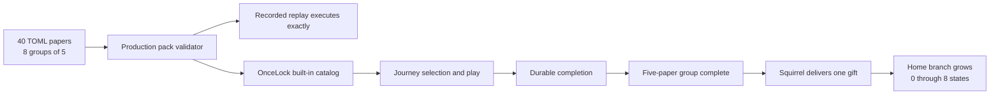

Puzzle files may carry an optional `solution` array. Validation bounds it to
the replay action limit, validates every coordinate, executes it through the
production engine, and accepts it only when the target matches exactly.
External packs remain compatible when the field is absent. The catalog test in
[`content.rs`](tests/content.rs) also asks the independent bounded solver to
find and replay a solution for every official paper. This separates authored
solution evidence from solver evidence.

The persistent home area shows the growing branch, never a resident mascot.
Each completed group adds a named leaf, berry, folded object, bird, or branch
shape, and its caption carries the same state without relying on color. The
squirrel remains in the opening delivery, the hands-on lesson delivery, and a
one-time group-completion card. Unicode and ASCII branch drawings share the
same eight states. Reduced motion skips both the opening wash and folded-result
reveal while retaining the final frame and completion message.

[`author.rs`](src/author.rs) connects the documented local author commands to
the existing validator, solver, and atomic pack storage. Command output is
bounded to one MiB. Pack diagnostics use only validator-owned, control-free
locations and messages; supplied paths are never echoed. Solver output is
valid TOML with zero-based action coordinates, so its `solution` arrays can be
copied into puzzle files. The shipped-binary checks cover validation, solving,
malformed input, and install, list, and removal across separate processes.

The installable [`paper-garden`](puzzles/example-pack/pack.toml) example and
[`puzzle-authoring.md`](docs/puzzle-authoring.md) describe every file, action,
coordinate convention, bound, license field, and contribution check. The
README links a deterministic asciicast-v2
[`journey.cast`](docs/recordings/journey.cast) whose fixed terminal size,
timestamp, output frames, and first-paper path make it reusable by project and
site documentation without network access.

The adversarial follow-up review found six concrete corrections. Zero branch
progress first claimed the first gift because a saturating subtraction selected
group zero. Community content could also install under a built-in pack ID and
write progress against the journey identity. The minimum-height completion
card clipped its return instruction, one five-action paper combined its final
mark and open step in one cue, and the first solver report used readable action
labels instead of copyable TOML. Nested brush and solution tables also accepted
undeclared fields even though the format is strict. The state lookup,
reserved-ID installation guard, compact completion card, cue, solver
serialization, and nested-table parsing now have focused regressions in
[`app.rs`](src/tui/app.rs),
[`components.rs`](src/tui/components.rs), [`storage.rs`](tests/storage.rs),
[`content.rs`](tests/content.rs), [`packs.rs`](tests/packs.rs), and
[`cli.rs`](tests/cli.rs).

The complete locked repository check passed on x86_64 Linux with Rust 1.98.0.
It included strict all-target Clippy, dependency and license policy, all unit,
integration, example, and native PTY tests, the doctest, and an optimized
build. The forty-paper solver check completed in about 4.4 seconds in the test
profile. All seven native terminal journeys passed, including terminal
restoration. A separate optimized-binary QA run validated the example pack,
installed it, listed it from a new process, removed it, and confirmed an empty
registry. Every line of the checked-in cast parsed as JSON.

Two conclusions still need people rather than code: the difficulty curve must
be observed with fresh players, and the owner must confirm that the derived
terminal drawings use the supplied identity appropriately. Automated checks
can prove validation, solutions, bounds, text safety, and fallback behavior,
but they cannot substitute for either judgment.

## Whole-repository review and corrections

The 2026-09-03 review covered every authored Rust module, test, example,
configuration file, project document, embedded journey paper, example-pack
file, and the complete working-tree diff based on commit `de234f4`. Generated
lockfiles were checked through locked Cargo resolution and
[`cargo-deny`](deny.toml), rather than treated as handwritten source. The
separate frontend repository remained outside the requested scope.

Three independent review reports were traced through the implementation and
reproduced where they described runtime behavior. None was a false alarm. The
hard-coded five-paper display number was a latent inconsistency rather than a
current player failure because every present group has five papers; it was
still corrected to derive the number from `first_paper`. Some proposed
severities were debatable, but the underlying defects were real.

Terminal output now has two defensive boundaries. [`PackIssue`](src/packs/mod.rs)
replaces control characters when a structured diagnostic is created, so even
a rejected ZIP entry name is safe to print. The process-level
[`SafeErrorReport`](src/main.rs) also replaces controls from every error source,
stops at 16 KiB, limits source traversal, and flushes one final line. This
covers SQLite and operating-system messages that do not pass through pack
validation. [`cli.rs`](tests/cli.rs) exercises both original attack paths
through the compiled binary: an escape-bearing ZIP filename and a SQLite
`RAISE` message.

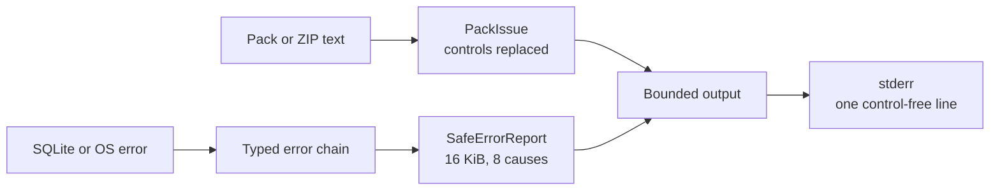

Runtime storage selection now belongs to [`AppPaths`](src/storage/paths.rs),
so both the TUI and author commands honor the same feature-gated test root.
The CLI lifecycle deliberately points XDG and Windows compatibility variables
elsewhere and confirms that its database is created only below the injected
root. This keeps native tests away from a player's real database and managed
packs on every supported operating system.

Built-in identities are protected during recovery as well as installation.
[`Storage`](src/storage/mod.rs) discards legacy reserved registry rows and
pending installs before the managed-pack orphan sweep, while keeping their
saved progress. A journey paper is considered complete only when the best
saved replay decodes successfully and its full gameplay definition equals the
embedded paper. This prevents an older community definition with the same IDs
from unlocking official content. Existing completions that do match remain
open even when new papers have been inserted earlier in the catalog.

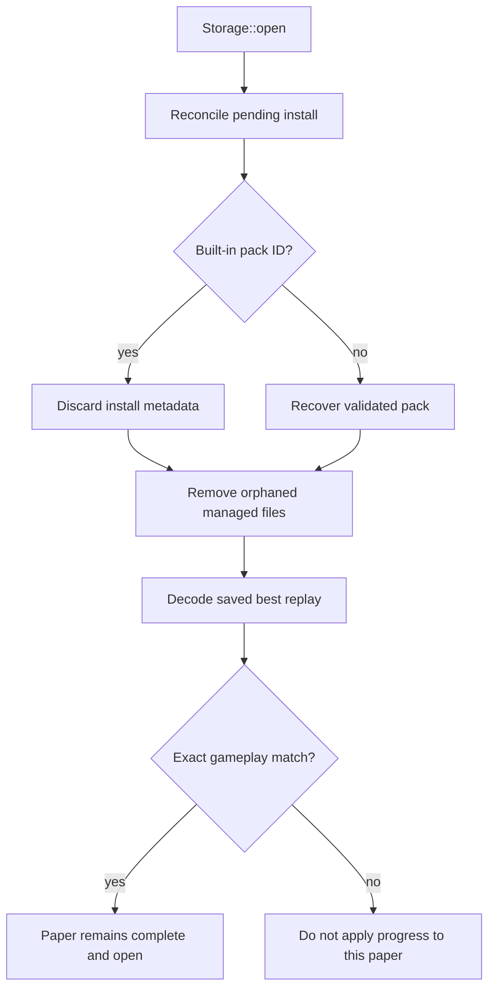

The player state and minimum layouts received the remaining corrections in
[`app.rs`](src/tui/app.rs), [`session.rs`](src/tui/session.rs),
[`components.rs`](src/tui/components.rs), and [`view.rs`](src/tui/view.rs).
Loading a replay consumes a pending group-delivery card. Arrow keys reuse the
bounded cursor during play. Once opened, Up and Down use the separate bounded
comparison row so every row remains inspectable without moving the stack.
Group mechanics are wrapped body copy instead of oversized border titles,
branch captions wrap at the preferred minimum, and compact stack and home
headings no longer lose characters. The stack and home clipping was found
during the second shipped-binary pass rather than in the supplied reports.

Tutorial cues in the example pack now advance with completed action count, and
`quiet-canopy` describes one fold per cue. The
[`author guide`](docs/puzzle-authoring.md) matches all three example files and
uses the repository's mise interface, as does the README. The checked-in
[`journey.cast`](docs/recordings/journey.cast) was recaptured at 80 by 24 from
the optimized binary. Its result frame is the real opened-comparison and Paper
controls view; the unreachable standalone panels are gone.

Focused regressions cover control-free diagnostics, isolated CLI storage,
reserved recovery, exact replay revision matching, completion-card
consumption, old completion access, wrapped mechanics and branch progress,
and scrolling all eight comparison rows at 60 by 20. The complete locked check
passed with strict all-target Clippy, dependency policy, 203 unit, integration,
and example tests, the doctest, and the optimized build. The same 203 tests
passed in the optimized profile. Warning-denied private documentation, all
seven native PTY journeys, the three-paper validator and solver commands, and
the five 80-by-24 cast frames present at that commit also passed locally.
Commit
[`f554992`](https://github.com/nuggocto/orifude/commit/f554992d31a19648118fb5fd6e5070ec7e077eb6)
then passed the complete locked check and all five native player jobs in
[push run 33707719803](https://github.com/nuggocto/orifude/actions/runs/33707719803),
covering Linux x86_64 and ARM64, macOS Intel and Apple Silicon, and Windows
x86_64 without retries.

Residual judgment remains explicit. Difficulty observation and artwork
approval still require the two human decisions identified in
[`PROJECT.md`](PROJECT.md#current-work); code and automation cannot honestly
close them.

The final owner play-through kept the visible goal but renamed it `Pattern to
match`, because the pattern defines success while the fold and brush sequence
remains the puzzle. Later journey papers now reveal their short hint only after
the first missed opening. The same pass moved the first crease to the third
journey paper, replaced the staircase placeholder with the bounded eight-bud
twig, and fixed the home-card width found during release-binary inspection.
Four focused regressions were observed failing before those behaviors were
implemented.

The resulting dirty tree passed `mise run check`: dependency policy, strict
all-target Clippy, 216 unit, integration, native-terminal, and example tests,
the documentation example, and the optimized build. The same 216 tests passed
again in the optimized profile, warning-denied private documentation passed,
and all seven native PTY journeys passed in a separate third run. The
independent solver covered all forty official papers in both profiles.
Release-binary QA used isolated player roots at 100 by 30, 80 by 24, and 60 by
20. It covered hidden and revealed hints, a missed result, comparison scrolling,
replay input, persistent ink, the success card, contextual help, the full home
title, and the recorded lesson. Every frame in
[`journey.cast`](docs/recordings/journey.cast) parses as JSON. No commit or push
was made.

A focused replay QA pass reproduced the apparent freeze: the old loader placed
the complete saved attempt on screen before the player could press a key. The
new player-controlled playback regression failed against that behavior first.
Session-level sweeps then used the real fold and brush tools to solve all forty
official papers and walked every saved action forward for all forty replays.
The locked debug and optimized suites each passed 222 tests, including all
seven native PTY journeys; strict Clippy, dependency policy, the optimized
build, warning-denied private documentation, the independent solver, and the
three example-pack puzzles also passed. A 60-by-20 optimized-binary walkthrough
confirmed forward stepping, rewind, restart, final comparison, fixed stack
inspection, terminal restoration, the paper title, and an unclipped footer. The
returning-player PTY journey also waits for the real text-export overlay instead
of treating the keepsake menu itself as export evidence.
Replay documents remain bounded by the validated 64-action limit and are
executed successfully before their read-only steps become visible. No commit or
push was made.

A follow-up report check on 2026-09-04 reproduced six player and terminal
defects before correcting them. [`session.rs`](src/tui/session.rs) now probes
the bounded fold list against one cloned attempt and readies the first fold that
can actually be applied; the direct fold shortcut uses the same choice. A
failed comparison returns to the unchanged attempt with a usable tool ready.
[`view.rs`](src/tui/view.rs) gives ASCII cursor-on-ink its own `&` glyph and
uses an ASCII separator throughout the saved-success card.
[`components.rs`](src/tui/components.rs) keeps the compact courier card until
the full drawing and both messages have twelve rows available.

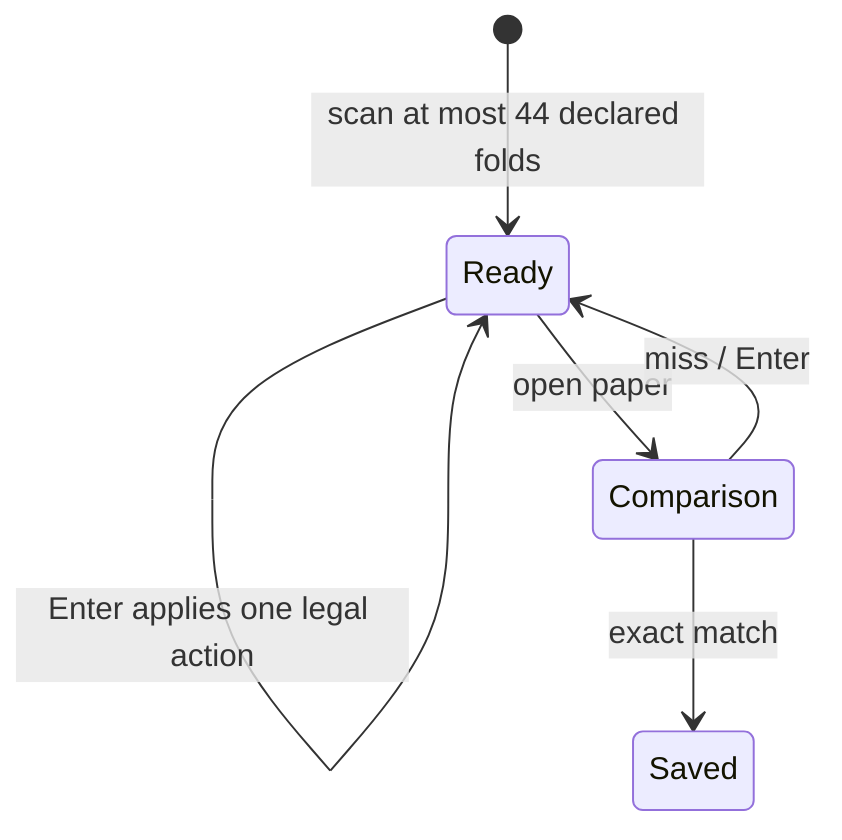

The input startup report was also correct. Crossterm requires every `poll` and
`read` call to stay on one thread. [`event.rs`](src/tui/event.rs) now performs
the initializing zero-duration poll inside the owned worker and uses one
bounded rendezvous to tell the caller that input and resize handling are ready
before the first frame. Initialization failures and panics still join the
worker and return through the typed event error path.

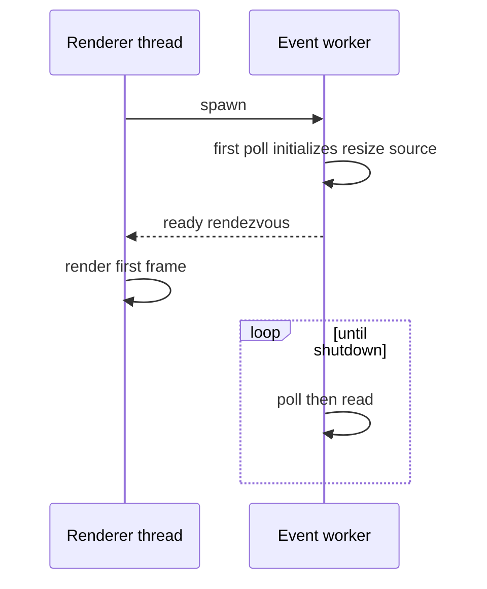

Two reports were rejected against existing contracts and regressions. Reset
deliberately keeps personal hint and undo history, as specified by
[`PROJECT.md`](PROJECT.md#undo-reset-and-replay) and checked in
[`tests/engine.rs`](tests/engine.rs). Changed built-in gameplay does not inherit
completion from an older definition: [`Storage::completion_matches`](src/storage/mod.rs)
decodes the saved best replay and requires its complete embedded puzzle to
equal the current paper, with the mismatch case covered in
[`tests/storage.rs`](tests/storage.rs). Old keepsakes remain valid for their own
embedded paper without unlocking revised journey content.

The five new or extended behavior regressions failed on the reported paths
before the fixes. The locked repository check then passed dependency policy,
strict all-target Clippy, 224 unit, integration, native-terminal, and example
tests, the doctest, and the optimized build. The same 224 tests passed in the
optimized profile, warning-denied private documentation passed, and the
optimized resized-terminal startup test passed twenty consecutive runs. This
pass exercised native terminal behavior on x86_64 Linux; macOS and Windows
remain for the hosted native matrix after a later authorized push. No commit or
push was made.

The home branch now follows the etched tree reference and the curved berry
sprigs in the supplied Orifude mark instead of a row of rising steps.
[`BranchGrowth`](src/tui/components.rs) uses a fixed 44-by-12 Braille drawing of
one tapered limb with asymmetric upper and lower twigs. It keeps the wrapped
progress caption on smaller regions. Eight dormant buds remain visible and are
replaced by the named journey gifts as groups are completed. ASCII mode has a
separate bounded drawing with the same composition. The home menu no longer
repeats an offline caption, and [`view.rs`](src/tui/view.rs) keeps the masthead
to the Orifude name. The reviewed
[`terminal recording`](docs/recordings/journey.cast) carries the same masthead
and branch.

```text
44 x 16 or larger: etched branch + eight buds + progress caption
smaller region:    wrapped progress caption
```

The locked repository check still passed all 224 tests, strict all-target
Clippy, dependency policy, the doctest, and the optimized build. An isolated
80-by-24 optimized-binary run confirmed that the new branch and home menu fit
without clipping. A second isolated run solved the 2026-09-04 daily paper from
the shipped TUI in one left fold and one dot, producing the exact two-corner
opened pattern and the reference-score congratulations card. No commit or push
was made.

The owner then accepted the revised player journey and etched branch after
direct play had driven several rounds of correction. That review covered how a
new paper begins, when exact directions disappear, how later hints arrive,
what saved replay controls do, how a successful comparison is explained, and
whether the derived terminal artwork still belongs to the supplied Orifude
identity. This supplies the human judgment that automated validation and
solver checks cannot provide.

The complete implementation landed in
[`1888450`](https://github.com/nuggocto/orifude/commit/1888450451297360b2207b4d3d438b6e4b571df3).
Its [hosted check](https://github.com/nuggocto/orifude/actions/runs/33821020552)
passed the locked repository check and the complete player journey on Linux
x86_64, Linux ARM64, macOS Intel, macOS Apple Silicon, and Windows x86_64
without retries. The work queue can now move from content judgment to focused
release hardening.

## Committed baseline review on 2026-09-04

The complete handwritten tree at
[`bb011d0`](https://github.com/nuggocto/orifude/commit/bb011d0b82605521a69907c5556c11a2fcc4bcac)
and its locked dependency graph received a correctness, safety, security, test,
and user-behavior review. The architecture is cohesive, resource limits are
carried through the trust boundaries, failure paths are generally recoverable,
and the tests concentrate on behavior and invariants. No high- or
medium-severity defect was confirmed.

The review found one low-severity format-strictness defect in the
[`replay decoder`](src/storage/replay.rs). Its outer document, gameplay, fold,
and score records reject unknown fields, but the tagged brush and action
records silently ignore them. A runtime probe against the public
[`decode_replay_bytes`](src/storage/mod.rs) boundary confirmed that a valid
document decodes, an unknown outer field fails, and unknown brush and action
fields both decode. This is inconsistent with the strict equivalent records in
the [`pack parser`](src/packs/format.rs) and can discard unexpected or future
nested semantics. It does not provide a code-execution or path escape route:
the decoder still reconstructs every accepted value through the domain types,
executes the replay, and requires a successful result. Add Serde's
`deny_unknown_fields` rule to both replay enums and keep regression cases for
unknown fields in each tagged record.

The locked repository check passed 224 debug tests and the doctest, strict
all-target Clippy, dependency policy, and the optimized build. All 224
non-documentation tests passed again in the optimized profile. The native PTY
suite and hot-journal recovery test each passed three additional runs;
warning-denied private documentation passed; `cargo audit --deny warnings`
found no advisory in 136 dependencies; and targeted credential patterns were
absent from both the tracked tree and patch history. Maximum-size inputs passed
one smoke execution through each of the domain, pack metadata, puzzle, replay,
and archive fuzz harnesses. An isolated optimized-binary run verified version
output, all shipped and example papers, pack installation and removal, replay
output, database creation, and alternate-screen restoration.

This review ran on x86_64 Linux. It did not repeat the hosted macOS and Windows
runs or conduct a sustained fuzzing campaign, so those remain the most useful
independent checks during release hardening. The separate static frontend was
outside this repository review. The baseline review itself did not change
product source or tests.

The replay format correction now makes both tagged records reject undeclared
fields through the existing typed replay-data error. The dot brush uses the
same empty record shape as the strict
[`pack format`](src/packs/format.rs), while valid replay fields and resource
bounds remain unchanged. The focused
[`storage regression`](tests/storage.rs) reads a real encoded replay from
SQLite, confirms it is valid, then injects an unknown brush field and an
unknown action field through the public decoder. Its brush assertion failed on
the old implementation and passed after the correction.

The complete locked check passed with 225 tests plus the doctest, strict
all-target Clippy, dependency policy, and the optimized build. The same 225
tests passed in the optimized profile. A maximum-size 64 KiB input completed
through the replay parser fuzz entry point, and `cargo audit --deny warnings`
found no advisory in the 136 locked dependencies. This closes the confirmed
format finding; longer fuzz campaigns and native-platform release checks stay
part of the later hardening work.

The correction landed in
[`4538da3`](https://github.com/nuggocto/orifude/commit/4538da3ce0cb1ac3c2adeebc0a88a0c53875a453).
Its [hosted check](https://github.com/nuggocto/orifude/actions/runs/33826120880)
passed the locked repository check and the complete player journey on Linux
x86_64, Linux ARM64, macOS Intel, macOS Apple Silicon, and Windows x86_64.

## Release-candidate hardening and QA on 2026-09-04

The release-candidate review now has a durable
[`trust-boundary record`](docs/security-review.md) and
[`QA record`](docs/release-qa.md). The source-to-effect pass covers command
arguments, puzzle and pack text, replay documents, archives, paths, SQLite,
terminal input and restoration, configuration, dependencies, and CI. It found
one low-severity product defect: required display text accepted an all-space
value. [`validate_display`](src/packs/format.rs) now treats it as blank while
preserving valid mixed-script and combining-mark text, and the public parser
regression covers the complete boundary.

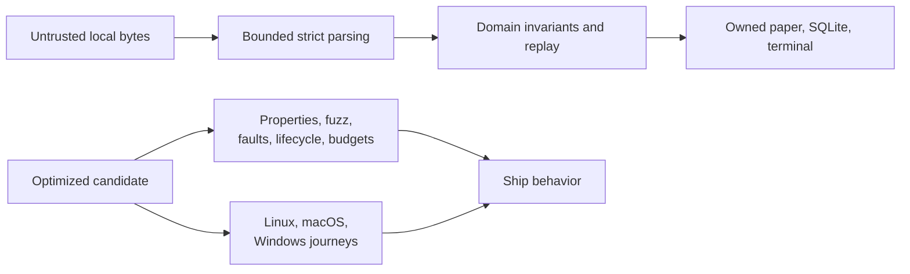

[`4264e06`](https://github.com/nuggocto/orifude/commit/4264e06d825fa970aeb9b5a5dcd1fc0e96baeda3)
added separate locked fuzz tooling, five sanitizer targets, fixed-seed property
and repository-content checks, optimized release gates, direct-binary lifecycle
QA, Linux distribution checks, and raw release measurements. The mandatory
post-implementation review corrected lifecycle cleanup reporting, strengthened
saved-state comparison to the exact best replay, made untracked filename
enumeration NUL-safe, and included the first rejected byte above every parser
limit. A first hosted run then exposed two test-oracle mistakes rather than
runtime failures: one command named a nonexistent pack path and one expected
verification output omitted the pack fingerprint. It also showed that the fuzz
tool belonged to its task instead of every ordinary job. Those corrections
landed in
[`ef3385e`](https://github.com/nuggocto/orifude/commit/ef3385ea94a045d0a26f48bfa52378454f1f5920).
The final automation pass stopped command-backed shell declarations from
masking setup failures in
[`769e8b9`](https://github.com/nuggocto/orifude/commit/769e8b945e9a66e10e14c06607633e98762ddc6c).
[`f89d11d`](https://github.com/nuggocto/orifude/commit/f89d11dcc76ace5223ae7392277d6fb9c4e356ba)
made the pinned syntax and static-analysis pass part of both ordinary and
release checks so the correction remains enforced.
The first hosted enforcement exposed a runner-specific diagnostic for that
trap-managed cleanup.
[`89077d2`](https://github.com/nuggocto/orifude/commit/89077d2dec2a706668e793b6f14427de26627dab)
installs the locked analyzer explicitly in the repository job and limits both
suppressed diagnostics to the indirectly invoked cleanup function.

The corrected
[`hosted run`](https://github.com/nuggocto/orifude/actions/runs/33832142361)
passed all seven runnable jobs: the complete repository gate, five supported
native OS/architecture combinations, and the pinned
Ubuntu 24.04, Debian 12, Fedora 44, and Arch userlands. Each native job ran the
complete optimized PTY player journey and the production command surface. The
macOS builds set a 13.0 deployment target. The distribution job executed the
x86_64 musl binary without container capabilities, writable root storage, or
network access.

Local sanitizer campaigns completed 6,007,659 executions across domain actions,
puzzle text, metadata, replay text, and archive bytes with no crash, timeout,
or slow input. The property gate exhausted 2,268 fold boundaries and eight
32-action replay seeds, with independent solver and generated-content checks.
Seven mapped interruption cases each passed ten optimized repetitions. The
direct-binary journey preserved its exact saved replay through upgrade,
rollback, executable removal, pack removal, reinstall, and uninstall, then
confirmed cleanup.

The final Linux measurement used 25 starts, 100 visible input samples, a
three-second idle observation, five 500-write storage sets, the full journey
solver, and deterministic stripping and compression. Startup p95 was 127.421
ms, input p95 was 5.065 ms, idle CPU was 0.000%, ordinary play used 7,584 KiB
RSS, solver high-water memory was 9,232 KiB, and the worst storage p95 was
28.517 ms. Every declared budget passed. The original, stripped, and compressed
x86_64 binaries measured 5,798,480, 4,887,288, and 2,203,799 bytes.

Ghostty 1.3.1, foot 1.27.0, tmux 3.7c, Unix PTYs, and Windows ConPTY all
received real optimized-binary input and restoration checks. Hosted automation
does not provide the minimum supported OS releases or GUI access to macOS
Terminal and Windows Terminal, so those designated-host visual checks remain
recorded evidence gaps rather than claimed results. They did not reproduce a
product defect and do not block archive and installer work; the final packaged
artifacts still need their own minimum-version pass before publication.

## Full-tree review on 2026-09-04

The complete handwritten repository at
[`4a19a15`](https://github.com/nuggocto/orifude/commit/4a19a15fc306fcbb4aa87ff12943e151bbcdcf17)
received another correctness, Rust, safety, security, test-quality, and
user-behavior review. Generated lockfiles were checked through locked Cargo
metadata and dependency policy rather than treated as handwritten source. The
paper representation, replay identity, bounded solver and generator, pack
staging, transactional storage, event ownership, terminal restoration, and TUI
state flow are cohesive. No high- or medium-severity defect was confirmed.

The review confirmed one low-severity stored-metadata defect. The current
[`pack parser`](src/packs/format.rs) rejects an all-whitespace title or
description, but [`validate_registered_pack`](src/storage/mod.rs) only checks
whether the stored value is empty. A pack accepted by an earlier build can
therefore leave a whitespace-only registry row that the current startup and
`pack list` path accept. An isolated real-binary probe installed the example
pack, changed its registry title to three spaces to reproduce that durable
state, reopened storage, and observed `paper-garden` with a blank title. The
older parser at `1888450` was also checked and did accept that value, so this is
a reachable local upgrade case rather than a theoretical malformed row. It
does not permit terminal control output, path escape, code execution, or an
unbounded allocation. The required correction was the same trimmed nonblank
rule at the registry read boundary, with a persisted-row regression beside the
existing control-text case in [`storage.rs`](tests/storage.rs).

The registry read boundary now applies that trimmed nonblank rule to both
fields. The persisted-row regression creates separate legacy title and
description cases, and startup rejects both as corrupt before either value can
reach a caller. The regression failed at the title case before the correction
and passed afterward. An optimized real-binary check installed the example
pack, changed its stored title to spaces, and confirmed that `pack list` exits
with the bounded database-recovery message instead of emitting the row.

Both `mise run check` and `mise run release-check` passed: 227 tests passed in
each of the debug and optimized profiles, along with strict all-target Clippy,
formatting, shell analysis, locked advisory/license/source policy, the doctest,
and the optimized build. The separate property gate passed all 2,268 fold
boundaries, fixed replay seeds, independent solver comparison, deterministic
generation, and the complete official catalog. The credential scan found no
high-confidence pattern in the tree or Git history. The direct current-binary
lifecycle preserved saved progress while the executable and pack were removed
and restored. The pushed correction at
[`d36df88`](https://github.com/nuggocto/orifude/commit/d36df8821d2e8b5a20486909d6014a7319539f69)
passed its
[`hosted run`](https://github.com/nuggocto/orifude/actions/runs/33860521665):
the repository gate, all five native OS and architecture jobs, and the Linux
distribution job were green. The pull-request and manual terminal-smoke job was
skipped on that push by its declared event condition.

This pass ran locally on x86_64 Linux. It did not repeat the already recorded
multi-million-input sanitizer campaign, minimum supported OS checks, or GUI
checks in macOS Terminal and Windows Terminal. Those limits remain stated in
the release QA record. The separate static frontend was outside this repository
review. The registry validation and its focused regression are the only product
changes made after the review.

## Native CI consolidation on 2026-09-04

The former `terminal-smoke` job and mise task had become duplicate names for
the complete [`terminal_pty`](tests/terminal_pty.rs) suite. The separate job was
skipped on every direct push, while the native-player matrix ran the same tests
in the optimized profile on more platforms. Keeping both paths made the CI
result harder to read and made manual dispatch run the suite twice.

[`ci.yml`](.github/workflows/ci.yml) now has one native-player matrix for every
workflow event, and [`mise.toml`](mise.toml) keeps `test-native` as the focused
local command and `test-native-release` as the hosted optimized command. Pull
requests spend more runner time than before because they now receive all five
optimized native jobs instead of three debug smoke jobs. In return, pre-merge,
direct-push, manual, and release-tag checks all enforce the same native
contract. The ordinary check still exercises the debug PTY suite on Linux.

The edited workflow parsed successfully, and the remaining mise tasks contain
no duplicate command. Both focused native commands passed all seven PTY
journeys. The ordinary and optimized repository gates each passed 227 tests,
the doctest, strict Clippy, shell checks, dependency policy, formatting, and the
release build. The consolidation commit at
[`0c3ddcb`](https://github.com/nuggocto/orifude/commit/0c3ddcbe4150dfb875cb998d5fffaeb8e776f753)
passed its
[`hosted run`](https://github.com/nuggocto/orifude/actions/runs/33870503669).
GitHub created exactly the repository check, five native-player jobs, and the
Linux distribution job. All seven passed, and no terminal-smoke placeholder
remained.

## Code review on 2026-09-04

A review of the implemented repository at
[`027360f`](https://github.com/nuggocto/orifude/commit/027360f02d47b2975f7b461338b3272ced7f568c)
confirmed four issues. The [full report](docs/code-review-2026-09-04.md) records
locations, reproduction inputs, impact, fix directions, and evidence limits.
Product source and tests were left unchanged.

[`storage`](src/storage/mod.rs) compares a revised puzzle's score against the
old revision's best, so an equal or worse new solution can save successfully
and still lose its completion status after restart. The public API reproduced
this in a private database. [`event`](src/tui/event.rs) changes its shutdown
predicate without the waiters' mutex; a controlled scheduling probe reproduced
a lost wakeup. Ordinary repeated races did not reproduce a hang. The report's
sequence diagram shows the exact ordering.

[`archive`](src/packs/archive.rs) can preflight a decoy ZIP footer while the
dependency parses an earlier, larger catalog. A 300-entry probe passed the
258-entry preflight and failed only after library parsing. Exact duplicate ZIP
filenames also collapse inside the dependency before Orifude can reject them;
a duplicate metadata probe returned a valid pack. Neither archive probe wrote
pack content to disk. These results qualify the earlier security review's ZIP
and shutdown assurances.

The optimized repository gate and debug all-target suite each passed 227 tests,
including seven native Linux PTY tests. Formatting, strict Clippy, shell checks,
locked product and fuzz dependency policy, the doctest, production build,
property gate, and local credential scan passed. Sandbox restrictions required
authorized native reruns for advisory locking and CLI filesystem effects.
The production binary also verified and solved all three example-pack papers.
This pass did not repeat sustained fuzzing, performance measurements, or
macOS/Windows and minimum-OS verification; existing evidence remains in
[release QA](docs/release-qa.md).

The report separately notes the
[Rust 1.98.1 compiler correction](https://blog.rust-lang.org/2026/09/03/Rust-1.98.1/)
released after the current toolchain pin. No manifestation of that compiler
defect was established in Orifude. The review found no reason for an
architectural rewrite; the confirmed issues need focused corrections.

## Review corrections on 2026-09-04

The four findings in the [review report](docs/code-review-2026-09-04.md) now have
focused corrections. [`storage`](src/storage/mod.rs) decodes the saved best
inside the completion transaction and compares scores only when its puzzle
matches the current gameplay revision. A first completion of revised content
replaces the obsolete best; the old replay remains eligible for bounded
history. Equal and worse new scores, same-revision ties, restart, and retention
are covered in [`storage tests`](tests/storage.rs).

```mermaid
flowchart LR
    Save["record_completion_inner"] --> Old["Decode previous best in transaction"]
    Old --> Revision{"Same Puzzle?"}
    Revision -- Yes --> Score["Compare folds, then strokes"]
    Revision -- No --> Replace["Current revision becomes best"]
    Score --> Commit["Commit progress and replay together"]
    Replace --> Commit
```

[`SharedQueue::begin_shutdown`](src/tui/event.rs) now takes the waiters' state
mutex before changing the shutdown predicate and notifying both conditions.
It recovers the poisoned guard only to publish shutdown, so poisoned waiters
still return their normal queue error. The controlled regression covers both
an empty receiver and a full sender at the check-to-wait boundary. Another case
checks shutdown after mutex poisoning.

[`archive`](src/packs/archive.rs) validates every raw central entry within the
258-entry limit, including lengths, portable names, duplicates, and the exact
catalog end. During dependency metadata parsing, `ArchiveReader` masks earlier
bytes and omits the unused archive comment. It exposes one checked footer at
unchanged offsets, then permits ordinary file reads only after the parsed
catalog matches. The adapter borrows the original bytes and does not allocate
another archive-sized buffer. Catalog metadata containing an embedded footer
signature is rejected; normal archive comments remain supported. This stricter
ZIP contract is documented in the [author guide](docs/puzzle-authoring.md).

```mermaid
flowchart LR
    Bytes["ZIP, at most 8 MiB"] --> Raw["preflight_catalog: at most 258 entries"]
    Raw --> View["ArchiveReader: one visible footer"]
    View --> Library["ZipArchive metadata"]
    Library --> Match["Count and offsets match preflight"]
    Match --> Files["Original bytes, existing extraction bounds"]
```

The new regressions failed against the old implementations for revised
completion, shutdown notification ordering, duplicate filenames, a decoy footer,
and fallback from a malformed current catalog to an older valid pack. They
passed with the corrections. The review originally named the manifest's ZIP
minimum, 8.1.0; the actual product and fuzz lockfiles resolve 8.6.0. The report
now names the locked version, and the before/after regressions used it.

The pinned and minimum compiler are both Rust 1.98.1, so ordinary CI remains
the minimum-version check. [`mise.lock`](mise.lock) was regenerated without
changing unrelated tool entries. The sanitizer script now uses
`nightly-2026-09-04`; the previous nightly reported 1.98.0 and no longer meets
the package minimum. This nightly emits manifest-style warnings about existing
fuzz target names and the explicit README field; these are not sanitizer or
compiler failures.

The added [native terminal regression](tests/terminal_pty.rs) seeds an obsolete
journey replay, solves the current first paper through the executable, reopens
storage, and restarts the player to replay the current keepsake. Its initial
output check incorrectly required a phrase to be contiguous in the raw terminal
stream. Ratatui splits words across cursor updates, so the check now uses the
same stable substrings as the existing replay journey. The durable-puzzle
comparison remains exact.

The final local release gate and debug all-target suite each passed 236 tests,
including eight native Linux PTY journeys. Formatting, strict all-target Clippy,
shell analysis, locked product and fuzz dependency policies, the doctest, and
the default-feature production build passed. The property gate and local
credential scan also passed. A production-binary check verified and installed
a ZIP made by the system ZIP tool, rejected conflicting duplicate metadata
without changing the installed registry, then removed the pack and confirmed
an empty listing. Its private state and temporary archives were cleaned up.

Five 60-second AddressSanitizer campaigns used seed 424242. Domain actions ran
396,723 inputs; puzzle parsing 2,860,479; metadata 2,845,897; replay parsing
2,993,949; and archive parsing 2,932,686. All 12,029,734 executions completed
without a crash or timeout. The archive campaign started with a valid example
ZIP so mutations could reach the new catalog checks. The generated corpus and
sanitizer artifacts remain under ignored test-output directories. These runs
do not replace minimum-OS or final packaged-artifact verification.

The corrections landed in
[`7d228c0`](https://github.com/nuggocto/orifude/commit/7d228c0f0300c226dc0ad03fb8d79c7e51b00cbb).
Its [hosted run](https://github.com/nuggocto/orifude/actions/runs/33920149998)
passed the repository gate, all five native OS/architecture jobs, and Linux
distribution compatibility. The logs confirm that the new revised-journey
restart regression ran on each native platform. The first Apple Silicon job
ended during toolchain installation because the runner killed `rustup` with
SIGKILL before compilation. The other six jobs passed. One diagnostic retry of
that failed job on a fresh runner installed Rust and passed the native journey
and production commands without source or workflow changes. This was a setup
failure, not a discarded application-test failure.

The documentation follow-up's
[hosted run](https://github.com/nuggocto/orifude/actions/runs/33920556915)
exposed a separate native-test setup failure on macOS Intel: the new journey's
immediate database reopen returned `Locked`, before starting the player. The
other six jobs passed. That application-test failure was investigated without
rerunning the failed job. Parallel terminal tests were launching children while
other fixtures held file locks; inherited descriptors can extend those locks
past the original owner's close, as documented by
[`File::try_lock`](https://doc.rust-lang.org/std/fs/struct.File.html#method.try_lock).
This fits the failure, although the runner log cannot establish its exact
scheduling. The [native harness](tests/terminal_pty.rs) now holds one mutex across
each complete journey, from fixture creation through child exit and teardown.
It keeps immediate storage reopens and all behavior assertions, while preventing
another journey's child launch from overlapping fixture ownership.
The correction passed the debug and release native suites, formatting, and
strict all-target Clippy. Twenty further debug runs requested eight test threads
each and passed all 160 Linux journeys with the guard in place. The hosted
matrix attached to this correction's commit provides its native-platform check.

## What comes next

The ordered build work and its completion evidence stay in
[`PROJECT.md`](PROJECT.md#current-work). This notebook records the durable
design and verification context without becoming a second tracker.
