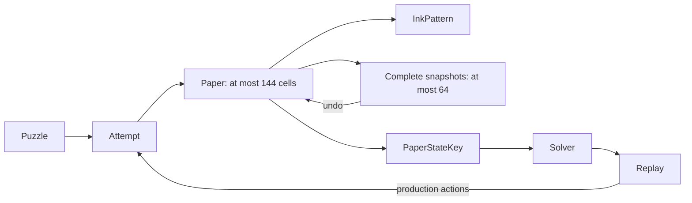
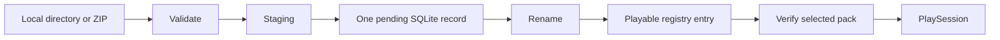
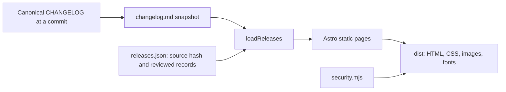
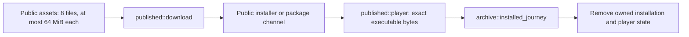

# Orifude notebook

This is the current technical map. [PROJECT.md](PROJECT.md) owns the product
contract, limits, and work queue. [CHANGELOG.md](CHANGELOG.md) owns release notes.

Earlier implementation decisions, rejected designs, corrections, and hosted
verification remain in the [notebook at the previous baseline](https://github.com/nuggocto/orifude/blob/cc4c0654d8993f8f392d7d3c9917c61b689e31cf/NOTEBOOK.md).
That immutable record preserves the history without making a new contributor
read every development session before understanding the current application.

| Area | Source and evidence |
| --- | --- |
| Process and commands | [main](src/main.rs), [CLI](src/cli.rs), [author commands](src/author.rs), [CLI tests](tests/cli.rs) |
| Paper and puzzle rules | [domain](src/domain), [paper tests](tests/paper.rs), [engine tests](tests/engine.rs) |
| Search and generation | [solver](src/solver/mod.rs), [generator](src/generator/mod.rs), [solver tests](tests/solver.rs), [generation tests](tests/generator.rs) |
| Persistence | [storage](src/storage/mod.rs), [replay format](src/storage/replay.rs), [storage tests](tests/storage.rs), [journal recovery](tests/storage_recovery.rs) |
| Community packs | [packs](src/packs), [format guide](docs/puzzle-authoring.md), [pack tests](tests/packs.rs) |
| Player state | [app](src/tui/app.rs), [session](src/tui/session.rs), [view](src/tui/view.rs) |
| Terminal ownership | [event pump](src/tui/event.rs), [terminal session](src/tui/terminal.rs), [native journeys](tests/terminal_pty.rs) |
| Official content | [catalog](src/content/journey.rs), [puzzle files](puzzles/journey), [content tests](tests/content.rs) |
| Tooling and release evidence | [mise tasks](mise.toml), [CI](.github/workflows/ci.yml), [security record](docs/security-review.md), [QA record](docs/release-qa.md) |

Orifude remains a native Rust TUI, keyboard-driven and fully offline. The
separate static frontend explains the game and releases. It is not a browser
game. The artwork supplied by the owner remains the identity source, and
Orifude is a coined name inspired by folding and brushwork. The permanent
default branch is `shrek`. The retired letter-exchange product remains in Git
history but has no data migration or supported upgrade path into the puzzle game.

The repository uses one Cargo package, edition 2024, and Rust 1.98.1 for both
the pinned and minimum compiler. The application denies unsafe code. Release
builds preserve overflow checks and unwind panics so terminal restoration can
run. The small manual CLI inspects at most four arguments to reject overflow;
it does not reflect unknown bytes into output. Exit codes are 0 for success,
1 for operational failure, and 2 for usage errors. Error chains stop after
eight causes. See [Cargo.toml](Cargo.toml), [toolchain](rust-toolchain.toml),
[CLI](src/cli.rs), and [process entry](src/main.rs).

## Paper, replay, and search

[Paper](src/domain/paper.rs) owns one dense physical-cell vector. A stable
row-major `CellId` indexes each cell's current coordinate, layer, face, and
orientation. Ink and target membership use three-word bit sets. A maximum board
has 144 cells, so folds, snapshots, comparisons, and key creation benefit from
bounded dense passes.



The [representation measurement](examples/paper_measure.rs) compares this model
with a coordinate-to-stack tree. The tree improves individual lookup but adds
many allocations and makes snapshots and folds more expensive. On the recorded
64-bit Linux target, the dense cell payload is 720 bytes, and 64 complete
snapshot/action entries have a 50,176-byte payload lower bound. Full snapshots
fit the play budget, so action deltas would add restoration complexity without
solving a memory problem.

Fold validation finishes before mutation. A fold reflects coordinates, reverses
moving layers, flips faces, updates orientation, and places moved stacks above
stationary layers. Empty destinations inside the original rectangle are legal.
Dots and lines ink physical cells through occupied stacks. Failed actions leave
state unchanged. Release-active assertions check cell count, coordinates,
budgets, action/history agreement, and unique complete layer order. Stable cell
identity comes from the vector index; there is no second stored ID to validate.

[Attempt](src/domain/attempt.rs) enforces puzzle-specific rules before applying
paper actions. Undo and reset keep personal hint and undo history while changing
the replayable sequence. [Replay](src/domain/replay.rs) carries an exact gameplay
revision including target, rules, budgets, dimensions, and par. Display-text
changes do not invalidate it. A replay executes on fresh isolated state and must
match its source puzzle. Score ordering is folds first, then strokes.

The [solver](src/solver/mod.rs) keeps exact state keys in a hash set and compact
parent records in a deterministic priority frontier. It never traverses the hash
set. Each restored node replays at most 20 actions through the production
engine, and every reported solution is replayed again for verification.
Cancellation is checked before setup, at each frontier pop, and before candidate
actions. Search stops at its independent visited-state, memory, and depth limits.

The conservative maximum-paper retained charge is 1,312 bytes per state on the
recorded target, including allocator and collection margin. A full attempt with
20 history entries has a 16,750-byte payload lower bound. Retaining full attempts
would multiply memory even though cloning one can be faster than replaying it.
[Solver measurements](examples/solver_measure.rs) preserve that tradeoff.

[Generation](src/generator/mod.rs) owns an explicit versioned seed, fixed attempt
budget, and stable random sequence. It builds legal production actions, derives
a target, rejects duplicates and trivial results, and asks the bounded solver
to establish a useful solution. Exhaustion and cancellation return the seed.
Fixed daily goldens preserve cross-platform output. Broad rule sets and
line-heavy folded layouts can exhaust their limits; generation never retries
until luck supplies a result.

## Local persistence and packs

[Storage](src/storage/mod.rs) owns one SQLite connection and an exclusive process
lock. Tests inject private paths; the player uses platform directories described
in [PROJECT.md](PROJECT.md#local-storage). Migrations precede terminal entry.
Schema markers, quick checks, foreign keys, settings, registry bounds, paths,
and file budgets are checked before use. Corrupt or unsupported data produces
a recovery error rather than a silent reset.

A completion saves the replay, best result, history, and progress in one
transaction. Daily completion joins the same transaction. A revised puzzle's
first current solution replaces its obsolete best regardless of the old score;
same-revision comparisons still prefer fewer folds and then strokes. Reading
official completion also requires the saved replay's exact current puzzle.

SQLite uses 4 KiB pages, DELETE journaling, FULL synchronization, and disabled
cache spilling. The main file stops at 128 MiB. Nonessential writes preserve a
16 MiB reserve by pruning one bounded batch of non-best history. Protected
progress and best solutions may use the reserve but cannot exceed the hard
limit. The separate journal budget is 132 MiB. Tests cover transactional
failure, full storage, migrations, hot-journal recovery, and retained best data.

Pack installation validates local content, writes private staging, records one
pending operation, renames it, and commits its registry entry. Registry rows
alone identify playable packs. Reconciliation converges to a complete registered
pack or no managed copy, while preserving saved progress. Source directories
are never cleanup targets.



The [pack parser](src/packs) enforces byte, file-count, path, text, and expanded
size bounds. It rejects links, special files, traversal, reserved names, duplicate
paths, and undeclared fields. SHA-256 fingerprints include framed sorted paths
and bytes. ZIP preflight checks raw catalog entries before the dependency parses
metadata. The bounded reader exposes one accepted footer, preventing fallback to
an earlier catalog. Comments remain supported; embedded footer signatures in
catalog metadata are refused.

Startup reads bounded registry metadata instead of loading all pack files.
Selecting a pack verifies its fingerprint. The TUI projects at most 128 papers
and discards the raw-file cache. Removing packs preserves saved keepsakes. The
keepsake query returns 128 rows plus one lookahead row and can reach older pages.

## Player and terminal ownership

[App](src/tui/app.rs) owns navigation, dialogs, settings, progress, and one
[PlaySession](src/tui/session.rs). The session owns its puzzle attempt, ready
tool, cursor, reveal, and result. Replay and teaching frames use production
domain actions. They do not maintain separate fold rules.

The first legal tool is ready when paper arrives. Enter applies it; exact ink
readies Open paper. Tab still reaches every tool, and Esc readies Open directly.
Confirmed actions leave persistent feedback. Opening is bounded, interruptible,
and optional. Success is presented as saved only after its durable transaction
commits. A missed comparison returns to the same usable attempt.

The lesson and first journey paper give exact controls. Later official hints
appear only after a missed comparison. Saved replay begins on fresh paper,
steps forward with Enter or Right, rewinds with Left, and resets to the start.
Once paper opens, the stack cursor stays fixed while a separate comparison row
scrolls compact results. [View regressions](src/tui/view.rs) cover visibility,
ASCII output, ink distinction, hints, controls, and minimum-size layouts.

The [event pump](src/tui/event.rs) owns all crossterm polling on one worker.
A startup rendezvous confirms input readiness before the first frame. Keys keep
their order in one 256-entry queue; ticks and resizes coalesce. Full queues apply
backpressure. Shutdown takes the waiters' mutex before changing its predicate
and notifying them. One separate work-completion slot keeps generation joins
independent of a full key queue. [WorkManager](src/tui/work.rs) owns and joins at
most one cancellable generation job.

Terminal capabilities are acquired separately and restored in reverse order.
Failed restoration steps remain available for a bounded retry. The panic
fallback only restores on the terminal-owning thread. Rendering stops at a
160-by-60 viewport, animation at 30 Hz, and dropped resize signals recover
through a 250 ms size check. Smaller than 60 by 20 shows a stable resize message.

Native tests exercise the binary through Unix PTYs and Windows ConPTY, with
isolated state. Each complete journey holds one harness mutex, including fixture
setup and teardown, so another child cannot inherit a fixture's temporary lock.
ConPTY projects console output, so tests inspect meaningful visible fragments
and durable state instead of requiring raw styled phrases to remain contiguous.

## Content and verification

The [official catalog](src/content/journey.rs) embeds 40 TOML papers and validates
them through the public pack boundary once, using `OnceLock`. Eight groups
introduce and combine mechanics. The first two papers are flat; the third adds
a crease. The app borrows the cached catalog and clones only a selected puzzle.
The owner accepted the player journey and artwork after direct play. That
judgment complements the independent solver and content checks.

[Mise](mise.toml) is the development command interface. Ordinary CI runs the
locked check plus five native release-player jobs; pushes and manual runs also
exercise pinned Linux distribution userlands. Tool versions and actions are
pinned, repository permissions are read-only, and publication is separate.
The [QA record](docs/release-qa.md) holds hosted evidence and platform exclusions.

Minimum supported OS releases and GUI inspection in macOS Terminal and Windows
Terminal still require designated-host packaged-artifact evidence. Earlier
sanitizer campaigns and native runs are preserved in the historical notebook
and QA record. They do not substitute for verification of a new release artifact.

## Review corrections on 2026-09-04

The [historical correction record](https://github.com/nuggocto/orifude/blob/cc4c0654d8993f8f392d7d3c9917c61b689e31cf/NOTEBOOK.md#review-corrections-on-2026-09-04)
preserves reproductions and hosted results for revised-completion persistence,
shutdown notification ordering, ZIP duplicate paths, and ambiguous catalogs.
The fixes are implemented at their owning boundaries and retain focused
regressions. Rust's pinned and minimum versions advanced together to 1.98.1.

## Cleanup and measurement on 2026-09-05

The cleanup removed the three bespoke temporary-directory owners in the
[storage](tests/storage.rs), [pack](tests/packs.rs), and
[journal-recovery](tests/storage_recovery.rs) suites in favor of the existing
`tempfile` dependency. It also removed an unused storage-page wrapper, the
doctest's self-comparison, identity assertions that merely repeated loop indexes,
and artwork checks tied to internal padding constants. Behavior tests remain.

The solver now rejects extra ink through the existing bit-set comparison and
skips action classes whose budgets are exhausted. Action ordering, cancellation,
production validation, replay verification, and memory limits remain intact.
The [folded renderer](src/tui/view.rs) summarizes each physical cell once into a
288-byte local array before drawing positions. It previously rescanned every
cell for every position, up to 20,736 visits per grid. The array is rebuilt per
render, so it introduces no mutable persistent index.

```text
Paper -> folded_grid -> 144 count/ink slots -> rendered rows
OnceLock journey -> borrowed App catalog -> selected PlaySession
```

[Release measurements](scripts/release-measure.sh) now include fresh and
returning starts with 1,024 saved puzzles, plus actual fold and brush input on a
12-by-12 paper. [Storage measurements](examples/storage_measure.rs) retain raw
per-write samples for fresh and populated databases. The solver measurement adds
a 20,000-state exhausted search and labels microbenchmark percentiles as batch
averages. Startup no longer presents 25 samples as a meaningful p99 estimate.

The old standalone code-review documents were removed after their corrections
were incorporated. Historical evidence remains available through the immutable
notebook above. This notebook now describes current behavior instead of repeating
superseded session reports. The plain-text teaching exercise and measured
alternative paper representation remain useful and were retained.

`mise run check` and `mise run release-check` each passed all 236 tests and the
doctest, including eight Linux native terminal journeys. `mise run property-check`
passed the exhaustive fold boundaries and independent replay, solver, generation,
and official-content models. The direct-binary lifecycle passed with the previous
baseline and cleaned binary, preserving the saved replay through upgrade,
rollback, removal, and reinstall.

The [updated QA record](docs/release-qa.md#cleanup-verification-on-2026-09-05)
contains the workload, environment, artifact hashes, and measurements. Three
alternating solver runs showed an 18.8% reduction in median time for the
20,000-state search and 31.8% for the two-axis fixture. Outcomes and retained
memory matched. All player and storage budgets passed, including startup with
1,024 saved puzzles and maximum-board fold/brush input. These local measurements
do not establish minimum-OS compatibility or near-limit database latency.

Cleanup commit [`3e38cd7`](https://github.com/nuggocto/orifude/commit/3e38cd7c92ba734dec2e759d0f18db13d25ba564)
passed all seven jobs in [hosted CI](https://github.com/nuggocto/orifude/actions/runs/33972605646).
This includes the repository gate, native Linux x86_64 and ARM64, native macOS
Intel and Apple Silicon, native Windows x86_64, and Linux distribution
compatibility. No job needed a retry.

## Release tooling on 2026-09-06

[Release tooling](examples/distribution/archive.rs) builds the declared native targets,
packages fixed archive layouts, validates executable architecture, and generates
installers and package metadata from the completed archive hashes. The developer tool is Rust; its archive and JSON dependencies stay outside the
shipped binary. Package
version `1.0.0` lets the candidate exercise the intended public version before a
tag or GitHub release exists.

```text
Cargo platform targets -> native binaries -> five archives -> SHA256SUMS
SHA256SUMS -> install.sh / install.ps1 / package metadata -> native installation QA
Verified candidate run -> draft -> immutable release -> package repository updates
```

The extracted default-feature binary reuses the existing first-player and returning
player [terminal journey](tests/terminal_pty.rs). Archive checks reject wrong
architectures, dynamic Linux interpreters, missing or extra targets, links,
traversal, duplicate members, and altered generated files. Repacking identical
inputs preserves archive bytes; independent compiler reproducibility is not claimed.

The [installer fixture](examples/distribution/install.rs) exercises real local HTTPS
transfers, embedded hashes, clean installation, replacement, failure preservation,
destination conflicts, partial transfers, and cleanup. Only its private script copy
uses the local URL. Windows curl receives the private CA explicitly through
[`--cacert`](https://curl.se/docs/manpage.html#--cacert), leaving the certificate
store unchanged. The [package fixtures](examples/distribution/packages.rs) use real
Homebrew, Scoop, and Arch tools. Package revision upgrades retain the verified binary.
The x86_64 Arch job assembles ARM packages; the ARM payload runs in native Linux QA.

Self-review tightened expanded tar bytes before metadata parsing, removed inherited
release-profile ambiguity, and kept package-file writes inside their temporary
checkout. The POSIX installer renames through the chosen parent directory. Windows
now selects one curl executable when Windows and Git both provide it. Its
replacement path passes `[NullString]::Value` to `File.Replace`; Windows PowerShell
5.1 otherwise coerces `$null` to an empty backup filename and rejects reinstalls.
The native fixture reproduced that failure after clean installation passed. Scoop uses
its supported `XDG_CONFIG_HOME` directory and a fresh update timestamp to preserve
the pinned tool revision. These changes address concrete failure or ownership paths.
The extra-archive regression restores a complete matrix before adding an unexpected
file, so it detects that problem independently of a missing archive.

Failure evidence remains in the hosted runs. The
[first candidate run](https://github.com/nuggocto/orifude/actions/runs/34006610997)
exposed missing Python and Ruff platform locks in the earlier implementation.
Those tools have since been removed. Later macOS setup runs killed `rustup` before application compilation;
release tool setup is now sequential. Windows certificate-provider and import
attempts failed or prompted in the headless account, so that setup was removed.
The later missing `Get-FileHash` failure came from Python passing PowerShell 7's
module directories to Windows PowerShell 5.1. The fixture now lets 5.1 reconstruct
its default module path, as described by
[Microsoft](https://learn.microsoft.com/powershell/module/microsoft.powershell.core/about/about_psmodulepath).
The [Windows installer run](https://github.com/nuggocto/orifude/actions/runs/34007685513)
then exposed the multiple-curl invocation bug. Failed runs remain evidence and do
not count as passing player checks. The artifact actions now use pinned Node 24
revisions and reject service-reported digest mismatches.

The downloaded Linux musl binary passed the existing performance budgets. Fresh
startup p95 was 127.060 ms, returning startup 103.916 ms, fold 5.434 ms, and brush
5.397 ms. Idle CPU was 0.000%, with 6,832 KiB resident memory during ordinary play.
The [QA record](docs/release-qa.md#packaged-binary-measurements-on-2026-09-06) links
the hosted commit, binary hash, workloads, and limits. Solver and storage
microbenchmarks use local GNU helpers and are labelled accordingly.

All three package-update dry runs inspected the approved remote repositories using
the hosted `1.0.0` archive set. Homebrew and Scoop showed new package files; AUR
showed `PKGBUILD` and `.SRCINFO`. None pushed. The AUR registry has no active
`orifude-bin` entry, although its Git remote retains the retired product's history.
Read-only SSH checks confirmed the official remote and dedicated AUR login.
Candidate previews work before public release; failed attestation stops the write
path before any package checkout or write.

Repository release immutability is enabled. The GitHub `release` environment permits
only `shrek`, matching the workflow's branch and exact-commit guards. Publication
also requires successful ordinary and candidate checks, a clean checkout, complete
archive hashes, and a verified signed tag. The
[distribution guide](docs/distribution.md) covers credential scopes, dry runs, and
recovery. No publication token, tag, public release, or package update was created.
The release operator supplies the documented narrowly scoped credential when
publication is due, or uses the local GitHub CLI command. Live release attestation
and public-channel verification remain at the release handoff from the accepted
implementation plan. Existing minimum-OS and terminal-GUI evidence gaps remain in
the QA record.

Local ordinary and optimized checks passed 236 Rust tests plus the doctest; the
separate archived-player journey remains explicitly invoked on native hosts.
Eleven release-integrity and publication-guard tests passed. The local tree and
Git-history credential scan found no high-confidence credential pattern. Review
also removed an unused Homebrew fixture argument and redundant Git configuration
on the fixture's staging command.

Native artifact and package checks run independently after archive verification,
even if the classic installer check fails. The job still fails, but its report
now retains all available installation results instead of hiding later failures.

The Windows installer and extracted-player journey passed together. Scoop then
exposed a missing bootstrap directory in its disposable checkout; the fixture now
creates the standard shims and buckets directories before invoking its CLI. It also
checks an explicit completion result and exact shim version. Homebrew's upgrade
check now confirms the installed package revision. Installer fixtures validate all five real candidate archives and serve the native
archive through a private URL. They use no dummy foreign-platform payloads.

Scoop requires a Git URL when adding a bucket and rejected the fixture's Windows
filesystem path. The fixture now passes its local `file:///` URI and reports bucket
setup failure immediately. The package definition and its public HTTPS URL are
unchanged by this test setup correction.

Commit [`eebe25b`](https://github.com/nuggocto/orifude/commit/eebe25b1c49df03a26ccdda9f3c9e4431d5d6985)
passed all seven [ordinary CI jobs](https://github.com/nuggocto/orifude/actions/runs/34008975101)
and all eleven [candidate jobs](https://github.com/nuggocto/orifude/actions/runs/34008975129)
without a job retry. This includes both Homebrew architectures, Scoop installation,
version, upgrade and uninstall, Arch packaging, both classic installers, and all
five extracted-player journeys. The local publication dry run then downloaded and
verified that exact successful candidate and printed all eight proposed asset
hashes. No tag, release, or package repository changed. The
[QA verdict](docs/release-qa.md#native-distribution-verification-on-2026-09-06)
records the completed review and remaining publication and minimum-OS limits.

The separate [publication workflow dry run](https://github.com/nuggocto/orifude/actions/runs/34009326859)
also passed on that commit using the environment's read-only default token. Its
archive and installer hashes matched the local proposal. Actual publication remains
an explicit operation with the signed tag and scoped publication credential.

The distribution code was first implemented in Python. The user rejected that
extra toolchain, so it has been replaced with the [Rust development example](examples/distribution.rs).
The README and CI setup now require Rust, cargo-deny, and ShellCheck. Python scripts,
Ruff, their mise locks, and the Python cache exclusion were removed. Existing
POSIX and PowerShell installers remain required distribution formats;
[GitHub language attributes](.gitattributes) exclude those templates and shell
automation from language statistics. Earlier hosted results above describe the
previous implementation; the replacement is being verified separately.

The Rust replacement passed ordinary and optimized repository checks, dependency
policy, the Linux musl build and archive smoke check, HTTPS installer failures and
replacement, the extracted-player journey, and real Arch package installation,
revision upgrade, removal, and ARM package assembly. Ten focused Rust tooling tests
cover archive integrity, publication approval fields, and complete fixture transfers.
Temporarily bypassing generated-file validation made the tamper test fail; restoring
the guard returned it to passing. The local credential scan passed.

Self-review removed duplicate execution of tooling tests from the aggregate mise
checks; Cargo's all-target suites already run them. It also tightened ELF program
header bounds and made the partial-download check require received script bytes
before asserting that execution never occurred. The private HTTPS fixture uses
OpenSSL's complete-response mode; the Rust owner stops and reaps the server. Package
HTTP requests have bounded headers and timeouts. No TLS library enters the game.
The completed hosted verification is recorded below.

Further review reproduced duplicate ZIP catalog records being accepted because the
ZIP library normalizes repeated names. The [archive checker](examples/distribution/archive.rs)
now validates the three physical catalog records, bounds, and expected names before
library parsing. The regression failed before the correction and now rejects both
honest and forged record counts. All eleven tooling tests pass in both profiles.
The cleanup assertion also recognizes the POSIX staging prefix's dot separator.

The first Rust [candidate run](https://github.com/nuggocto/orifude/actions/runs/34010553440)
lost its Apple Silicon runner's `rustup` process to SIGKILL before compilation.
Ordinary native CI passed on the same image and commit; one diagnostic rerun of the
failed job passed. This is retained as an infrastructure failure, not a product fix.
The later Windows fixture run exposed OpenSSL's default text-mode file reads:
even the complete ZIP transfer ended early. The fixture now explicitly uses
[`-http_server_binmode`](https://docs.openssl.org/3.0/man1/openssl-s_server/).
Windows's extracted player journey and Scoop install, upgrade, and removal passed
independently. The corrected fixture requires another native run.

Intel Homebrew then reproduced a truncated local HTTP transfer. Accepted sockets
can inherit the listener's nonblocking mode on macOS, so the fixture now explicitly
sets each accepted stream to blocking mode before bounded reads and writes. It also
reports request errors instead of discarding them. The complete-transfer regression
uses a 4 MiB body, matching archive-scale traffic. Intel's installer and extracted
player journey had passed; Homebrew's corrected fixture needs native verification.

The Windows correction passed all native installer, player, and Scoop checks in
[candidate run 34011165226](https://github.com/nuggocto/orifude/actions/runs/34011165226).
Its macOS HTTPS fixture exposed a portability mistake in that correction: the
bundled LibreSSL does not support OpenSSL's binary-mode option. The option is now
Windows-only; Unix does not translate text-mode file reads. Server stderr remains
visible so a startup failure keeps its actual diagnostic. Linux fixture checks
passed again after this adjustment.

The final Rust implementation at
[`962d7c3`](https://github.com/nuggocto/orifude/commit/962d7c31c238da7c06c5e5064e73e143a1c5a23e)
passed all seven [ordinary CI jobs](https://github.com/nuggocto/orifude/actions/runs/34011618551)
and all eleven [candidate jobs](https://github.com/nuggocto/orifude/actions/runs/34011618555)
without retries. Both macOS installers and Homebrew architectures, Windows installer
replacement and Scoop, both Linux targets, Arch packaging, and all five extracted
player journeys passed together. The local publication dry run and the separate
[publication workflow](https://github.com/nuggocto/orifude/actions/runs/34011974392)
passed with identical eight-asset proposals. All three package-repository dry runs
also passed using that exact candidate; no public release or package update was made.

Self-review verdict: PASS, with no confirmed findings remaining in the distribution
changes. The reproduced ZIP and fixture defects above are fixed and verified. GitHub's
language API now reports only Rust. The extracted Linux musl executable retains SHA-256
`ec57fa12e4c9d8809290b3e9578d5b52694b4a578690104caf8060ec3de12600`,
matching the binary in the [performance record](docs/release-qa.md#packaged-binary-measurements-on-2026-09-06).
The earlier measurements still describe the delivered executable. Existing minimum-OS,
terminal-GUI, and live public-release verification limits remain documented there.

## Whole-repository review on 2026-09-06

Reviewed [`d06c429`](https://github.com/nuggocto/orifude/commit/d06c4298c9f053f1fc206d8b3298ab23b2909762)
across the domain, solver, generator, content, persistence, pack boundaries, terminal
player, tests, dependencies, and distribution tooling. Verdict: **PASS: No confirmed
findings in the reviewed scope.** No corrective refactor, test removal, or performance
change was justified before starting frontend work. The shared production engine,
bounded search and event queues, validated content, and transactional storage remain
consistent with the product contract. Test review found useful behavioral, boundary,
replay, and recovery coverage rather than a material test-quality problem.

The [ordinary and optimized checks](mise.toml) each passed 247 tests and the doctest.
Formatting, Clippy, shell checks, dependency advisory and license policy, deterministic
property checks, and the local credential scan also passed. The complete hosted
archive set from `962d7c3` passed release verification. Its Linux x86_64 musl binary
passed the [extracted player journey](tests/terminal_pty.rs) and
[HTTPS installer failure checks](examples/distribution/install.rs). That candidate
has the same application and tooling source as the reviewed commit; the intervening
changes are documentation. A fresh musl build could not run because this machine
lacks `musl-gcc`.

Fresh [release measurements](scripts/release-measure.sh) used the same packaged
binary hash, host, and release settings as the
[earlier performance record](docs/release-qa.md#packaged-binary-measurements-on-2026-09-06),
with no other review builds or tests running alongside them. All measured budgets
passed:

| Measurement | Result | Workload |
| --- | ---: | --- |
| Fresh / returning startup p95 | 126.243 / 101.605 ms | 25 starts each; returning state has 1,024 saved puzzles |
| Help input p95 / p99 | 5.698 / 5.997 ms | 100 inputs |
| Maximum-board fold / brush p95 | 5.584 / 5.438 ms | 100 actions each |
| Durable write p95 | 22.700 to 28.673 ms | Two processes, each with 500 fresh and 500 populated writes |
| Ordinary play RSS | 4,788 KiB | Packaged player process |
| Idle CPU | 0.000% | Three-second observation |

Terminal timing includes tmux observation overhead and warm filesystem state.
Storage and solver helper measurements use the local GNU build. Native macOS,
Windows, minimum-OS, and terminal-GUI checks were not rerun here; their existing
[QA evidence and limitations](docs/release-qa.md) still apply. The separate frontend
was outside this review. Minimum-platform checks and live public-release verification
remain necessary before publishing the corresponding v1 claims.

## Static website on 2026-09-06

The separate [frontend](https://github.com/nuggocto/orifude-front/blob/01a6c0c464e3ecc31ea08b2ee01e247f9b4c32c2/README.md) now builds a landing page,
release changelog, and static 404 with Astro. Its design uses the supplied squirrel,
wordmark, and icon on warm paper, with moss green sections and four main type sizes.
Fraunces and Source Sans are bundled locally. Monospace appears only in the native
terminal still and installation commands. The [fold sequence](https://github.com/nuggocto/orifude-front/blob/01a6c0c464e3ecc31ea08b2ee01e247f9b4c32c2/src/components/FoldSequence.astro)
explains the real first lesson, including the moving half, stack order, ink through
both layers, and exact unfolded match. The still comes from the reviewed
[native recording](docs/recordings/journey.cast); no puzzle engine enters the site.

The [release loader](https://github.com/nuggocto/orifude-front/blob/01a6c0c464e3ecc31ea08b2ee01e247f9b4c32c2/src/lib/releases.ts) checks a canonical
changelog snapshot against its recorded commit and SHA-256. It accepts at most
512 KiB of notes and 128 reviewed release records, requires dated summaries and
change bullets, and derives links from the fixed GitHub repository. Notes render
as escaped text. Release and package verification remains the native operator's
responsibility, recorded before adding a public entry. The actual release list is
empty, so the site offers source links and an honest pre-release status.



The [built policy](https://github.com/nuggocto/orifude-front/blob/01a6c0c464e3ecc31ea08b2ee01e247f9b4c32c2/scripts/security.mjs) blocks scripts, frames,
external page dependencies, and browser network connections. There is no client
JavaScript, tracking, form, or CDN font. Published installer instructions download
an exact version, ask the reader to inspect it, then create a user-owned destination
and execute the file separately. Unverified package channels stay hidden.

A clean isolated copy passed the frozen dependency install, Astro checks without
warnings, all 19 [release tests](https://github.com/nuggocto/orifude-front/blob/01a6c0c464e3ecc31ea08b2ee01e247f9b4c32c2/tests/releases.test.mjs), the static
build, and the full dependency audit on Node 24.19.0. Removing hash validation in a
temporary copy made the changed-notes test fail as intended. All 24
[browser cases](https://github.com/nuggocto/orifude-front/tree/01a6c0c464e3ecc31ea08b2ee01e247f9b4c32c2/tests/browser) passed in Chromium 153, Firefox 155,
and WebKit 26.6 using the matching Playwright Ubuntu container. The affected release
cases passed again after clarifying supported platforms. Checks exercised no-script
navigation, keyboard focus, reflow down to 320 pixels, doubled text, missing CSS,
reduced motion, real 404 responses, local image loading, HTML escaping, and axe
accessibility rules. Smooth scrolling interfered with Chromium's no-script
navigation checks; immediate anchor navigation resolved that failure. Lazy-image
checks now scroll to the image and wait for loading instead of assuming it loads
with the initial document.

The frontend workflow also passed actionlint with ShellCheck. Its actions are pinned
to immutable commits, it retains browser failure evidence, and it has no deployment
credentials or publication step.

The [local preview](https://github.com/nuggocto/orifude-front/blob/01a6c0c464e3ecc31ea08b2ee01e247f9b4c32c2/scripts/preview.mjs) also applies security
headers before routing. Astro's static-file header option omitted the not-found
handler; the no-script browser journey now checks the 404 response policy too.

The [browser measurement script](https://github.com/nuggocto/orifude-front/blob/01a6c0c464e3ecc31ea08b2ee01e247f9b4c32c2/scripts/measure-browser.mjs)
measured five cold loads each at desktop and mobile sizes with 150 ms latency,
1.6 Mbit/s download throughput, and fourfold CPU slowdown. Initial response bodies
totaled 128,391 bytes. Median LCP was 804 ms in both views; the highest observed
desktop LCP was 856 ms. Layout shift was 0.0035 desktop and 0.0070 mobile. Bundled
fonts total 69,560 bytes, gzip CSS 3,603 bytes, and application JavaScript zero.
The measured landing HTML has SHA-256
`3eab7574bf078677af9c1d7b08c7087f87a750b31486951ec847d3e5ea65e54e`.
These are local lab results, not deployed performance or field Core Web Vitals.

Initial local QA verdict: pass for visual review. The owner kept the frontend
uncommitted and unpublished while reviewing the design. Checks of Cloudflare account
settings, preview deployment, production headers, the apex domain, and the `www`
redirect were deferred until publication approval, recorded below.
The [frontend guide](https://github.com/nuggocto/orifude-front/blob/01a6c0c464e3ecc31ea08b2ee01e247f9b4c32c2/README.md#cloudflare-pages) records the expected
settings. Headless WebKit is not a native Safari or iPhone test, and automated
accessibility checks do not establish complete WCAG conformance. The native
application and `PROJECT.md` were left unchanged.

The owner simplified the landing hero: ["long way." now inherits the heading's ink
colour](https://github.com/nuggocto/orifude-front/blob/01a6c0c464e3ecc31ea08b2ee01e247f9b4c32c2/src/styles/site.css), and [the page](https://github.com/nuggocto/orifude-front/blob/01a6c0c464e3ecc31ea08b2ee01e247f9b4c32c2/src/pages/index.astro)
no longer shows "Built in Rust. Played offline." The static build passed, and a
Chromium preview confirmed both changes. Nothing was committed or published at that
point.

## Website publication on 2026-09-06

The owner approved publishing the reviewed landing page. Frontend commit
[`01a6c0c`](https://github.com/nuggocto/orifude-front/commit/01a6c0c464e3ecc31ea08b2ee01e247f9b4c32c2)
passed a fresh Git checkout, frozen dependency install, Astro checks, all 19 release
tests, and the static build with Node 24.19.0. Cloudflare's existing Git integration
uses `pnpm build`, output `dist`, production branch `shrek`, and both Orifude domains.
Web Analytics is disabled. No Cloudflare account or DNS settings were changed.

The [Pages preview](https://421a2c04.orifude-front.pages.dev/) passed live anonymous
Chromium checks before that same commit was pushed to `shrek`. The landing page
and changelog returned 200, an unknown path returned 404, and all three responses
carried the restrictive security policy. Artwork and fonts loaded from the same
origin. Navigation worked with JavaScript disabled, the requested heading colour
and copy corrections were present, and unpublished installers stayed hidden.

The first production check caught Cloudflare injecting its bot-detection script
into the apex domain, although the Pages preview contained no scripts. The strict
CSP blocked execution. [The header correction](https://github.com/nuggocto/orifude-front/commit/d51f1970fd9afa798b06ee905e5ce1e544fab3cb)
adds `no-transform` to the existing cache policy, following
[Cloudflare's documented opt-out](https://developers.cloudflare.com/cloudflare-challenges/challenge-types/javascript-detections/#if-your-origin-sends-a-no-transform-header).
The local build passed with the restrictive script policy intact.

The correction passed a [second Pages preview](https://e46d6bf7.orifude-front.pages.dev/)
before publication. Commit `d51f197` is now pushed to frontend `shrek` and deployed
at [orifude.com](https://orifude.com/). Its
[CI run](https://github.com/nuggocto/orifude-front/actions/runs/34054869909)
passed Astro checks, all 19 release tests, the static build, and all 24 browser
cases across Chromium, Firefox, and WebKit. The frontend working tree is clean.

Live Chromium checks confirmed the landing page and changelog return 200 without
script tags, all artwork decodes, and security headers remain restrictive. The
canonical URL, public metadata assets, full-size terminal capture, font licences,
and GitHub destination resolve correctly. Navigation through both pages and
recovery from a real 404 work with JavaScript disabled. Unpublished downloads and
installer links remain hidden.

Two Cloudflare details remain. `www.orifude.com/changelog/?check=redirect` returns
200 instead of redirecting to the apex domain; the redirect must retain the path
and query, as described in [Cloudflare's guide](https://developers.cloudflare.com/pages/how-to/www-redirect/).
Pages also replaces the custom cache policy with `no-store` on unknown paths, so
the bot-detection script is still injected into 404 responses. A JavaScript-enabled
Chromium check confirmed CSP blocks its execution: no challenge request, iframe,
or cookie appeared. Resolve this hosting setting before treating publication QA as
complete. No Cloudflare account or DNS settings were changed, and the native
repository's tracker and notebook edits remain local.

## Release planning on 2026-09-07

Reviewed the [release checklist](PROJECT.md#phase-12-v1-release) against the
[distribution guide](docs/distribution.md) and [QA record](docs/release-qa.md).
The existing Rust tooling already builds, checks, and previews publication of the
candidate. Minimum-OS and native terminal-app evidence, followed by verification
of public artifacts and installation channels, remain necessary for the final
support claims. The detailed execution plan was requested in chat; this review
did not run release commands or change any external service.

## Public installation verification on 2026-09-07

The owner authorized release and package publication, followed by the website
update. [The changelog](CHANGELOG.md) now contains a player-facing `1.0.0` entry;
the package version was already correct. The README explains using an installed
copy and keeps contributor commands in its development section. The frontend
release loader accepted the prepared dated notes without enabling any download.

[Public verification](examples/distribution/published.rs) downloads the exact
eight public assets only after checking the immutable release and bounded asset
metadata. Each asset must pass attestation verification. Downloaded checksums and
installers are compared with the archive-derived values before package metadata
is generated. The publisher and verifier share the same public asset list.



The [manual workflow](.github/workflows/published.yml) separates public installer
checks from package-channel checks, uses disposable hosted runners and read-only
GitHub credentials, and reuses the existing packaged-player journey. Homebrew
checks refuse an existing tap or installation. Scoop stays in a private root.
AUR builds and removes its package in an Arch container, then the installed
executable runs the player journey on the native Linux host.

The twelve release-tool tests passed. An isolated checkout with a deliberately
weakened download-size bound failed the new regression as intended. The workflow
passed actionlint with ShellCheck, using the installed pinned tools. Its public
installation paths still need a real release and package publication to execute.

The configured Cloudflare credential can manage Pages, but both the zone ruleset
and bot-management APIs returned 403 after credential refresh. No zone setting
was changed. GitHub reports no self-hosted runners, this machine has no VM tools,
and no designated minimum-OS host is configured. The owner was asked for these
missing capabilities while release preparation continued; the existing
[platform evidence gaps](docs/release-qa.md) remain open.

The complete ordinary and optimized checks each passed 248 Rust tests and the
doctest after adding public verification. Deterministic property checks and the
local tree/history credential scan also passed. Self-review covered the new
download guards, artifact comparisons, installation ownership, workflow permissions,
and player-test reuse; no confirmed defect remained in that reviewed scope.
Public network installation and minimum-platform coverage still need their own
runtime evidence.

The frontend's general navigation tests now check the changelog destination and
readable heading without requiring an empty release history. Its release fixture
still checks hidden unverified channels and escaped notes. All eight Chromium
cases passed, and the two changed journeys passed again after removing a copy
assertion. The change is committed as
[`f32f4f6`](https://github.com/nuggocto/orifude-front/commit/f32f4f6).

## Candidate verification on 2026-09-07

Signed preparation commit
[`8b940fe`](https://github.com/nuggocto/orifude/commit/8b940fec51f60b3492ef1b83e7205f322e316d62)
passed all seven [ordinary jobs](https://github.com/nuggocto/orifude/actions/runs/34067331240)
and all eleven [candidate jobs](https://github.com/nuggocto/orifude/actions/runs/34067331245)
without retries. The [QA record](docs/release-qa.md#current-publication-decision-on-2026-09-07)
contains the five archive hashes, native environments, repeated Linux archive and
installer checks, and fresh measurements. Startup p95 was 131.243 ms, input p95
5.565 ms, and ordinary play RSS 6,832 KiB. Every performance budget passed.
Five sanitizer campaigns completed 22,589,373 executions without a crash or timeout.

Dry-run pushes from owned temporary clones confirmed write access to the existing
Homebrew, Scoop, and AUR branches. No package entry changed. The
[security review](docs/security-review.md#distribution-and-website-review-on-2026-09-07)
now includes publication, installers, public-channel verification, and the static
site. Self-review caught a Scoop comparison that could reject normal Windows Git
CRLF checkouts. It now hashes canonical LF text; formatting and Clippy passed.
The actual public Scoop installation remains a required runtime check.

The frontend navigation correction passed
[CI](https://github.com/nuggocto/orifude-front/actions/runs/34067216995), including
all 19 release tests and 24 browser cases, and deployed through Cloudflare Pages.
The subsequent [hero change](https://github.com/nuggocto/orifude-front/commit/96fb90a)
shows a direct installation link when a reviewed release exists. Its local build
and all eight Chromium cases passed, followed by all 19 release tests and 24
browser cases in [CI](https://github.com/nuggocto/orifude-front/actions/runs/34068095489).
An owned temporary preview combined the actual prepared notes with synthetic
channel verification. All five installation methods opened without JavaScript
at 1,440, 390, and 320 pixels, with no horizontal page overflow. Desktop and mobile
captures were inspected; the temporary site was removed afterward. The first
manual probe expected shorter package labels than the interface uses; correcting
the probe resolved it without a product change. The production release list
remains empty; adding a record requires actual public release and channel
verification.

Publication remains on hold for the missing minimum-platform and terminal-app
evidence and the two Cloudflare settings. The owner has authorized publication,
but the required hosts and zone permissions are unavailable. The public
installation workflow is ready to run after those gaps are resolved and the real
release exists. No public release, release tag, or package update was created.
