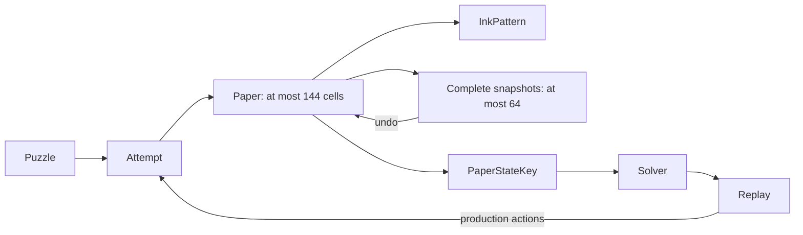
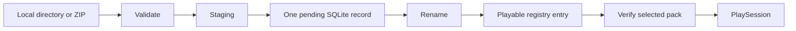
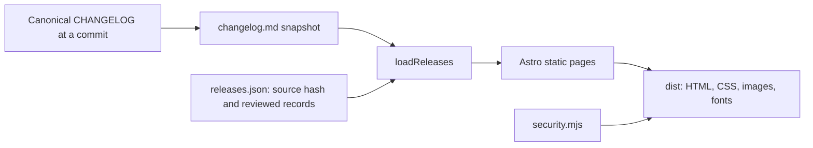
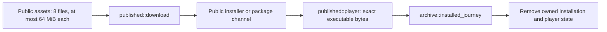
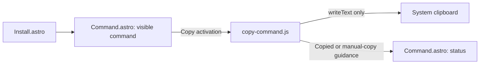
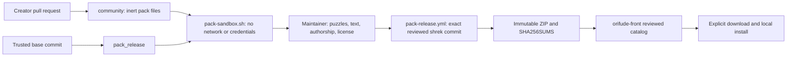

# Orifude notebook

This is the current technical map. [PROJECT.md](PROJECT.md) owns the product
contract, limits, and work queue. [CHANGELOG.md](CHANGELOG.md) owns release notes.

Earlier implementation decisions, rejected designs, corrections, and hosted
verification remain in the [notebook at the previous baseline](https://github.com/nuggocto/orifude/blob/cc4c0654d8993f8f392d7d3c9917c61b689e31cf/NOTEBOOK.md).
That immutable record preserves the history without making a new contributor
read every development session before understanding the current application.

| Area | Source and evidence |
| --- | --- |
| Process and commands | [main](src/main.rs), [CLI](src/cli.rs), [author commands](src/author.rs), [CLI tests](tests/cli.rs) |
| Paper and puzzle rules | [domain](src/domain), [paper tests](tests/paper.rs), [engine tests](tests/engine.rs) |
| Search and generation | [solver](src/solver/mod.rs), [generator](src/generator/mod.rs), [solver tests](tests/solver.rs), [generation tests](tests/generator.rs) |
| Persistence | [storage](src/storage/mod.rs), [replay format](src/storage/replay.rs), [storage tests](tests/storage.rs), [journal recovery](tests/storage_recovery.rs) |
| Community packs | [packs](src/packs), [format guide](docs/puzzle-authoring.md), [pack tests](tests/packs.rs) |
| Player state | [app](src/tui/app.rs), [session](src/tui/session.rs), [view](src/tui/view.rs) |
| Terminal ownership | [event pump](src/tui/event.rs), [terminal session](src/tui/terminal.rs), [native journeys](tests/terminal_pty.rs) |
| Official content | [catalog](src/content/journey.rs), [puzzle files](puzzles/journey), [content tests](tests/content.rs) |
| Tooling and release evidence | [mise tasks](mise.toml), [CI](.github/workflows/ci.yml), [security record](docs/security-review.md), [QA record](docs/release-qa.md) |

Orifude remains a native Rust TUI, keyboard-driven and fully offline. The
separate static frontend explains the game and releases. It is not a browser
game. The artwork supplied by the owner remains the identity source, and
Orifude is a coined name inspired by folding and brushwork. The permanent
default branch is `shrek`. The retired letter-exchange product remains in Git
history but has no data migration or supported upgrade path into the puzzle game.

The repository uses one Cargo package, edition 2024, and Rust 1.98.1 for both
the pinned and minimum compiler. The application denies unsafe code. Release
builds preserve overflow checks and unwind panics so terminal restoration can
run. The small manual CLI inspects at most four arguments to reject overflow;
it does not reflect unknown bytes into output. Exit codes are 0 for success,
1 for operational failure, and 2 for usage errors. Error chains stop after
eight causes. See [Cargo.toml](Cargo.toml), [toolchain](rust-toolchain.toml),
[CLI](src/cli.rs), and [process entry](src/main.rs).

## Paper, replay, and search

[Paper](src/domain/paper.rs) owns one dense physical-cell vector. A stable
row-major `CellId` indexes each cell's current coordinate, layer, face, and
orientation. Ink and target membership use three-word bit sets. A maximum board
has 144 cells, so folds, snapshots, comparisons, and key creation benefit from
bounded dense passes.



The [representation measurement](examples/paper_measure.rs) compares this model
with a coordinate-to-stack tree. The tree improves individual lookup but adds
many allocations and makes snapshots and folds more expensive. On the recorded
64-bit Linux target, the dense cell payload is 720 bytes, and 64 complete
snapshot/action entries have a 50,176-byte payload lower bound. Full snapshots
fit the play budget, so action deltas would add restoration complexity without
solving a memory problem.

Fold validation finishes before mutation. A fold reflects coordinates, reverses
moving layers, flips faces, updates orientation, and places moved stacks above
stationary layers. Empty destinations inside the original rectangle are legal.
Dots and lines ink physical cells through occupied stacks. Failed actions leave
state unchanged. Release-active assertions check cell count, coordinates,
budgets, action/history agreement, and unique complete layer order. Stable cell
identity comes from the vector index; there is no second stored ID to validate.

[Attempt](src/domain/attempt.rs) enforces puzzle-specific rules before applying
paper actions. Undo and reset keep personal hint and undo history while changing
the replayable sequence. [Replay](src/domain/replay.rs) carries an exact gameplay
revision including target, rules, budgets, dimensions, and par. Display-text
changes do not invalidate it. A replay executes on fresh isolated state and must
match its source puzzle. Score ordering is folds first, then strokes.

The [solver](src/solver/mod.rs) keeps exact state keys in a hash set and compact
parent records in a deterministic priority frontier. It never traverses the hash
set. Each restored node replays at most 20 actions through the production
engine, and every reported solution is replayed again for verification.
Cancellation is checked before setup, at each frontier pop, and before candidate
actions. Search stops at its independent visited-state, memory, and depth limits.

The conservative maximum-paper retained charge is 1,312 bytes per state on the
recorded target, including allocator and collection margin. A full attempt with
20 history entries has a 16,750-byte payload lower bound. Retaining full attempts
would multiply memory even though cloning one can be faster than replaying it.
[Solver measurements](examples/solver_measure.rs) preserve that tradeoff.

[Generation](src/generator/mod.rs) owns an explicit versioned seed, fixed attempt
budget, and stable random sequence. It builds legal production actions, derives
a target, rejects duplicates and trivial results, and asks the bounded solver
to establish a useful solution. Exhaustion and cancellation return the seed.
Fixed daily goldens preserve cross-platform output. Broad rule sets and
line-heavy folded layouts can exhaust their limits; generation never retries
until luck supplies a result.

## Local persistence and packs

[Storage](src/storage/mod.rs) owns one SQLite connection and an exclusive process
lock. Tests inject private paths; the player uses platform directories described
in [PROJECT.md](PROJECT.md#local-storage). Migrations precede terminal entry.
Schema markers, quick checks, foreign keys, settings, registry bounds, paths,
and file budgets are checked before use. Corrupt or unsupported data produces
a recovery error rather than a silent reset.

A completion saves the replay, best result, history, and progress in one
transaction. Daily completion joins the same transaction. A revised puzzle's
first current solution replaces its obsolete best regardless of the old score;
same-revision comparisons still prefer fewer folds and then strokes. Reading
official completion also requires the saved replay's exact current puzzle.

SQLite uses 4 KiB pages, DELETE journaling, FULL synchronization, and disabled
cache spilling. The main file stops at 128 MiB. Nonessential writes preserve a
16 MiB reserve by pruning one bounded batch of non-best history. Protected
progress and best solutions may use the reserve but cannot exceed the hard
limit. The separate journal budget is 132 MiB. Tests cover transactional
failure, full storage, migrations, hot-journal recovery, and retained best data.

Pack installation validates local content, writes private staging, records one
pending operation, renames it, and commits its registry entry. Registry rows
alone identify playable packs. Reconciliation converges to a complete registered
pack or no managed copy, while preserving saved progress. Source directories
are never cleanup targets.



The [pack parser](src/packs) enforces byte, file-count, path, text, and expanded
size bounds. It rejects links, special files, traversal, reserved names, duplicate
paths, and undeclared fields. SHA-256 fingerprints include framed sorted paths
and bytes. ZIP preflight checks raw catalog entries before the dependency parses
metadata. The bounded reader exposes one accepted footer, preventing fallback to
an earlier catalog. Comments remain supported; embedded footer signatures in
catalog metadata are refused.

Startup reads bounded registry metadata instead of loading all pack files.
Selecting a pack verifies its fingerprint. The TUI projects at most 128 papers
and discards the raw-file cache. Removing packs preserves saved keepsakes. The
keepsake query returns 128 rows plus one lookahead row and can reach older pages.

## Player and terminal ownership

[App](src/tui/app.rs) owns navigation, dialogs, settings, progress, and one
[PlaySession](src/tui/session.rs). The session owns its puzzle attempt, ready
tool, cursor, reveal, and result. Replay and teaching frames use production
domain actions. They do not maintain separate fold rules.

The first legal tool is ready when paper arrives. Enter applies it; exact ink
readies Open paper. Tab still reaches every tool, and Esc readies Open directly.
Confirmed actions leave persistent feedback. Opening is bounded, interruptible,
and optional. Success is presented as saved only after its durable transaction
commits. A missed comparison returns to the same usable attempt.

The lesson and first journey paper give exact controls. Later official hints
appear only after a missed comparison. Saved replay begins on fresh paper,
steps forward with Enter or Right, rewinds with Left, and resets to the start.
Once paper opens, the stack cursor stays fixed while a separate comparison row
scrolls compact results. [View regressions](src/tui/view.rs) cover visibility,
ASCII output, ink distinction, hints, controls, and minimum-size layouts.

The [event pump](src/tui/event.rs) owns all crossterm polling on one worker.
A startup rendezvous confirms input readiness before the first frame. Keys keep
their order in one 256-entry queue; ticks and resizes coalesce. Full queues apply
backpressure. Shutdown takes the waiters' mutex before changing its predicate
and notifying them. One separate work-completion slot keeps generation joins
independent of a full key queue. [WorkManager](src/tui/work.rs) owns and joins at
most one cancellable generation job.

Terminal capabilities are acquired separately and restored in reverse order.
Failed restoration steps remain available for a bounded retry. The panic
fallback only restores on the terminal-owning thread. Rendering stops at a
160-by-60 viewport, animation at 30 Hz, and dropped resize signals recover
through a 250 ms size check. Smaller than 60 by 20 shows a stable resize message.

Native tests exercise the binary through Unix PTYs and Windows ConPTY, with
isolated state. Each complete journey holds one harness mutex, including fixture
setup and teardown, so another child cannot inherit a fixture's temporary lock.
ConPTY projects console output, so tests inspect meaningful visible fragments
and durable state instead of requiring raw styled phrases to remain contiguous.

## Content and verification

The [official catalog](src/content/journey.rs) embeds 40 TOML papers and validates
them through the public pack boundary once, using `OnceLock`. Eight groups
introduce and combine mechanics. The first two papers are flat; the third adds
a crease. The app borrows the cached catalog and clones only a selected puzzle.
The owner accepted the player journey and artwork after direct play. That
judgment complements the independent solver and content checks.

[Mise](mise.toml) is the development command interface. Ordinary CI runs the
locked check plus five native release-player jobs; pushes and manual runs also
exercise pinned Linux distribution userlands. Tool versions and actions are
pinned, repository permissions are read-only, and publication is separate.
The [QA record](docs/release-qa.md) holds hosted evidence and platform exclusions.

Minimum supported OS releases and GUI inspection in macOS Terminal and Windows
Terminal still require designated-host packaged-artifact evidence. Earlier
sanitizer campaigns and native runs are preserved in the historical notebook
and QA record. They do not substitute for verification of a new release artifact.

## Review corrections on 2026-09-04

The [historical correction record](https://github.com/nuggocto/orifude/blob/cc4c0654d8993f8f392d7d3c9917c61b689e31cf/NOTEBOOK.md#review-corrections-on-2026-09-04)
preserves reproductions and hosted results for revised-completion persistence,
shutdown notification ordering, ZIP duplicate paths, and ambiguous catalogs.
The fixes are implemented at their owning boundaries and retain focused
regressions. Rust's pinned and minimum versions advanced together to 1.98.1.

## Cleanup and measurement on 2026-09-05

The cleanup removed the three bespoke temporary-directory owners in the
[storage](tests/storage.rs), [pack](tests/packs.rs), and
[journal-recovery](tests/storage_recovery.rs) suites in favor of the existing
`tempfile` dependency. It also removed an unused storage-page wrapper, the
doctest's self-comparison, identity assertions that merely repeated loop indexes,
and artwork checks tied to internal padding constants. Behavior tests remain.

The solver now rejects extra ink through the existing bit-set comparison and
skips action classes whose budgets are exhausted. Action ordering, cancellation,
production validation, replay verification, and memory limits remain intact.
The [folded renderer](src/tui/view.rs) summarizes each physical cell once into a
288-byte local array before drawing positions. It previously rescanned every
cell for every position, up to 20,736 visits per grid. The array is rebuilt per
render, so it introduces no mutable persistent index.

```text
Paper -> folded_grid -> 144 count/ink slots -> rendered rows
OnceLock journey -> borrowed App catalog -> selected PlaySession
```

[Release measurements](scripts/release-measure.sh) now include fresh and
returning starts with 1,024 saved puzzles, plus actual fold and brush input on a
12-by-12 paper. [Storage measurements](examples/storage_measure.rs) retain raw
per-write samples for fresh and populated databases. The solver measurement adds
a 20,000-state exhausted search and labels microbenchmark percentiles as batch
averages. Startup no longer presents 25 samples as a meaningful p99 estimate.

The old standalone code-review documents were removed after their corrections
were incorporated. Historical evidence remains available through the immutable
notebook above. This notebook now describes current behavior instead of repeating
superseded session reports. The plain-text teaching exercise and measured
alternative paper representation remain useful and were retained.

`mise run check` and `mise run release-check` each passed all 236 tests and the
doctest, including eight Linux native terminal journeys. `mise run property-check`
passed the exhaustive fold boundaries and independent replay, solver, generation,
and official-content models. The direct-binary lifecycle passed with the previous
baseline and cleaned binary, preserving the saved replay through upgrade,
rollback, removal, and reinstall.

The [updated QA record](docs/release-qa.md#cleanup-verification-on-2026-09-05)
contains the workload, environment, artifact hashes, and measurements. Three
alternating solver runs showed an 18.8% reduction in median time for the
20,000-state search and 31.8% for the two-axis fixture. Outcomes and retained
memory matched. All player and storage budgets passed, including startup with
1,024 saved puzzles and maximum-board fold/brush input. These local measurements
do not establish minimum-OS compatibility or near-limit database latency.

Cleanup commit [`3e38cd7`](https://github.com/nuggocto/orifude/commit/3e38cd7c92ba734dec2e759d0f18db13d25ba564)
passed all seven jobs in [hosted CI](https://github.com/nuggocto/orifude/actions/runs/33972605646).
This includes the repository gate, native Linux x86_64 and ARM64, native macOS
Intel and Apple Silicon, native Windows x86_64, and Linux distribution
compatibility. No job needed a retry.

## Release tooling on 2026-09-06

[Release tooling](examples/distribution/archive.rs) builds the declared native targets,
packages fixed archive layouts, validates executable architecture, and generates
installers and package metadata from the completed archive hashes. The developer tool is Rust; its archive and JSON dependencies stay outside the
shipped binary. Package
version `1.0.0` lets the candidate exercise the intended public version before a
tag or GitHub release exists.

```text
Cargo platform targets -> native binaries -> five archives -> SHA256SUMS
SHA256SUMS -> install.sh / install.ps1 / package metadata -> native installation QA
Verified candidate run -> draft -> immutable release -> package repository updates
```

The extracted default-feature binary reuses the existing first-player and returning
player [terminal journey](tests/terminal_pty.rs). Archive checks reject wrong
architectures, dynamic Linux interpreters, missing or extra targets, links,
traversal, duplicate members, and altered generated files. Repacking identical
inputs preserves archive bytes; independent compiler reproducibility is not claimed.

The [installer fixture](examples/distribution/install.rs) exercises real local HTTPS
transfers, embedded hashes, clean installation, replacement, failure preservation,
destination conflicts, partial transfers, and cleanup. Only its private script copy
uses the local URL. Windows curl receives the private CA explicitly through
[`--cacert`](https://curl.se/docs/manpage.html#--cacert), leaving the certificate
store unchanged. The [package fixtures](examples/distribution/packages.rs) use real
Homebrew, Scoop, and Arch tools. Package revision upgrades retain the verified binary.
The x86_64 Arch job assembles ARM packages; the ARM payload runs in native Linux QA.

Self-review tightened expanded tar bytes before metadata parsing, removed inherited
release-profile ambiguity, and kept package-file writes inside their temporary
checkout. The POSIX installer renames through the chosen parent directory. Windows
now selects one curl executable when Windows and Git both provide it. Its
replacement path passes `[NullString]::Value` to `File.Replace`; Windows PowerShell
5.1 otherwise coerces `$null` to an empty backup filename and rejects reinstalls.
The native fixture reproduced that failure after clean installation passed. Scoop uses
its supported `XDG_CONFIG_HOME` directory and a fresh update timestamp to preserve
the pinned tool revision. These changes address concrete failure or ownership paths.
The extra-archive regression restores a complete matrix before adding an unexpected
file, so it detects that problem independently of a missing archive.

Failure evidence remains in the hosted runs. The
[first candidate run](https://github.com/nuggocto/orifude/actions/runs/34006610997)
exposed missing Python and Ruff platform locks in the earlier implementation.
Those tools have since been removed. Later macOS setup runs killed `rustup` before application compilation;
release tool setup is now sequential. Windows certificate-provider and import
attempts failed or prompted in the headless account, so that setup was removed.
The later missing `Get-FileHash` failure came from Python passing PowerShell 7's
module directories to Windows PowerShell 5.1. The fixture now lets 5.1 reconstruct
its default module path, as described by
[Microsoft](https://learn.microsoft.com/powershell/module/microsoft.powershell.core/about/about_psmodulepath).
The [Windows installer run](https://github.com/nuggocto/orifude/actions/runs/34007685513)
then exposed the multiple-curl invocation bug. Failed runs remain evidence and do
not count as passing player checks. The artifact actions now use pinned Node 24
revisions and reject service-reported digest mismatches.

The downloaded Linux musl binary passed the existing performance budgets. Fresh
startup p95 was 127.060 ms, returning startup 103.916 ms, fold 5.434 ms, and brush
5.397 ms. Idle CPU was 0.000%, with 6,832 KiB resident memory during ordinary play.
The [QA record](docs/release-qa.md#packaged-binary-measurements-on-2026-09-06) links
the hosted commit, binary hash, workloads, and limits. Solver and storage
microbenchmarks use local GNU helpers and are labelled accordingly.

All three package-update dry runs inspected the approved remote repositories using
the hosted `1.0.0` archive set. Homebrew and Scoop showed new package files; AUR
showed `PKGBUILD` and `.SRCINFO`. None pushed. The AUR registry has no active
`orifude-bin` entry, although its Git remote retains the retired product's history.
Read-only SSH checks confirmed the official remote and dedicated AUR login.
Candidate previews work before public release; failed attestation stops the write
path before any package checkout or write.

Repository release immutability is enabled. The GitHub `release` environment permits
only `shrek`, matching the workflow's branch and exact-commit guards. Publication
also requires successful ordinary and candidate checks, a clean checkout, complete
archive hashes, and a verified signed tag. The
[distribution guide](docs/distribution.md) covers credential scopes, dry runs, and
recovery. No publication token, tag, public release, or package update was created.
The release operator supplies the documented narrowly scoped credential when
publication is due, or uses the local GitHub CLI command. Live release attestation
and public-channel verification remain at the release handoff from the accepted
implementation plan. Existing minimum-OS and terminal-GUI evidence gaps remain in
the QA record.

Local ordinary and optimized checks passed 236 Rust tests plus the doctest; the
separate archived-player journey remains explicitly invoked on native hosts.
Eleven release-integrity and publication-guard tests passed. The local tree and
Git-history credential scan found no high-confidence credential pattern. Review
also removed an unused Homebrew fixture argument and redundant Git configuration
on the fixture's staging command.

Native artifact and package checks run independently after archive verification,
even if the classic installer check fails. The job still fails, but its report
now retains all available installation results instead of hiding later failures.

The Windows installer and extracted-player journey passed together. Scoop then
exposed a missing bootstrap directory in its disposable checkout; the fixture now
creates the standard shims and buckets directories before invoking its CLI. It also
checks an explicit completion result and exact shim version. Homebrew's upgrade
check now confirms the installed package revision. Installer fixtures validate all five real candidate archives and serve the native
archive through a private URL. They use no dummy foreign-platform payloads.

Scoop requires a Git URL when adding a bucket and rejected the fixture's Windows
filesystem path. The fixture now passes its local `file:///` URI and reports bucket
setup failure immediately. The package definition and its public HTTPS URL are
unchanged by this test setup correction.

Commit [`eebe25b`](https://github.com/nuggocto/orifude/commit/eebe25b1c49df03a26ccdda9f3c9e4431d5d6985)
passed all seven [ordinary CI jobs](https://github.com/nuggocto/orifude/actions/runs/34008975101)
and all eleven [candidate jobs](https://github.com/nuggocto/orifude/actions/runs/34008975129)
without a job retry. This includes both Homebrew architectures, Scoop installation,
version, upgrade and uninstall, Arch packaging, both classic installers, and all
five extracted-player journeys. The local publication dry run then downloaded and
verified that exact successful candidate and printed all eight proposed asset
hashes. No tag, release, or package repository changed. The
[QA verdict](docs/release-qa.md#native-distribution-verification-on-2026-09-06)
records the completed review and remaining publication and minimum-OS limits.

The separate [publication workflow dry run](https://github.com/nuggocto/orifude/actions/runs/34009326859)
also passed on that commit using the environment's read-only default token. Its
archive and installer hashes matched the local proposal. Actual publication remains
an explicit operation with the signed tag and scoped publication credential.

The distribution code was first implemented in Python. The user rejected that
extra toolchain, so it has been replaced with the [Rust development example](examples/distribution.rs).
The README and CI setup now require Rust, cargo-deny, and ShellCheck. Python scripts,
Ruff, their mise locks, and the Python cache exclusion were removed. Existing
POSIX and PowerShell installers remain required distribution formats;
[GitHub language attributes](.gitattributes) exclude those templates and shell
automation from language statistics. Earlier hosted results above describe the
previous implementation; the replacement is being verified separately.

The Rust replacement passed ordinary and optimized repository checks, dependency
policy, the Linux musl build and archive smoke check, HTTPS installer failures and
replacement, the extracted-player journey, and real Arch package installation,
revision upgrade, removal, and ARM package assembly. Ten focused Rust tooling tests
cover archive integrity, publication approval fields, and complete fixture transfers.
Temporarily bypassing generated-file validation made the tamper test fail; restoring
the guard returned it to passing. The local credential scan passed.

Self-review removed duplicate execution of tooling tests from the aggregate mise
checks; Cargo's all-target suites already run them. It also tightened ELF program
header bounds and made the partial-download check require received script bytes
before asserting that execution never occurred. The private HTTPS fixture uses
OpenSSL's complete-response mode; the Rust owner stops and reaps the server. Package
HTTP requests have bounded headers and timeouts. No TLS library enters the game.
The completed hosted verification is recorded below.

Further review reproduced duplicate ZIP catalog records being accepted because the
ZIP library normalizes repeated names. The [archive checker](examples/distribution/archive.rs)
now validates the three physical catalog records, bounds, and expected names before
library parsing. The regression failed before the correction and now rejects both
honest and forged record counts. All eleven tooling tests pass in both profiles.
The cleanup assertion also recognizes the POSIX staging prefix's dot separator.

The first Rust [candidate run](https://github.com/nuggocto/orifude/actions/runs/34010553440)
lost its Apple Silicon runner's `rustup` process to SIGKILL before compilation.
Ordinary native CI passed on the same image and commit; one diagnostic rerun of the
failed job passed. This is retained as an infrastructure failure, not a product fix.
The later Windows fixture run exposed OpenSSL's default text-mode file reads:
even the complete ZIP transfer ended early. The fixture now explicitly uses
[`-http_server_binmode`](https://docs.openssl.org/3.0/man1/openssl-s_server/).
Windows's extracted player journey and Scoop install, upgrade, and removal passed
independently. The corrected fixture requires another native run.

Intel Homebrew then reproduced a truncated local HTTP transfer. Accepted sockets
can inherit the listener's nonblocking mode on macOS, so the fixture now explicitly
sets each accepted stream to blocking mode before bounded reads and writes. It also
reports request errors instead of discarding them. The complete-transfer regression
uses a 4 MiB body, matching archive-scale traffic. Intel's installer and extracted
player journey had passed; Homebrew's corrected fixture needs native verification.

The Windows correction passed all native installer, player, and Scoop checks in
[candidate run 34011165226](https://github.com/nuggocto/orifude/actions/runs/34011165226).
Its macOS HTTPS fixture exposed a portability mistake in that correction: the
bundled LibreSSL does not support OpenSSL's binary-mode option. The option is now
Windows-only; Unix does not translate text-mode file reads. Server stderr remains
visible so a startup failure keeps its actual diagnostic. Linux fixture checks
passed again after this adjustment.

The final Rust implementation at
[`962d7c3`](https://github.com/nuggocto/orifude/commit/962d7c31c238da7c06c5e5064e73e143a1c5a23e)
passed all seven [ordinary CI jobs](https://github.com/nuggocto/orifude/actions/runs/34011618551)
and all eleven [candidate jobs](https://github.com/nuggocto/orifude/actions/runs/34011618555)
without retries. Both macOS installers and Homebrew architectures, Windows installer
replacement and Scoop, both Linux targets, Arch packaging, and all five extracted
player journeys passed together. The local publication dry run and the separate
[publication workflow](https://github.com/nuggocto/orifude/actions/runs/34011974392)
passed with identical eight-asset proposals. All three package-repository dry runs
also passed using that exact candidate; no public release or package update was made.

Self-review verdict: PASS, with no confirmed findings remaining in the distribution
changes. The reproduced ZIP and fixture defects above are fixed and verified. GitHub's
language API now reports only Rust. The extracted Linux musl executable retains SHA-256
`ec57fa12e4c9d8809290b3e9578d5b52694b4a578690104caf8060ec3de12600`,
matching the binary in the [performance record](docs/release-qa.md#packaged-binary-measurements-on-2026-09-06).
The earlier measurements still describe the delivered executable. Existing minimum-OS,
terminal-GUI, and live public-release verification limits remain documented there.

## Whole-repository review on 2026-09-06

Reviewed [`d06c429`](https://github.com/nuggocto/orifude/commit/d06c4298c9f053f1fc206d8b3298ab23b2909762)
across the domain, solver, generator, content, persistence, pack boundaries, terminal
player, tests, dependencies, and distribution tooling. Verdict: **PASS: No confirmed
findings in the reviewed scope.** No corrective refactor, test removal, or performance
change was justified before starting frontend work. The shared production engine,
bounded search and event queues, validated content, and transactional storage remain
consistent with the product contract. Test review found useful behavioral, boundary,
replay, and recovery coverage rather than a material test-quality problem.

The [ordinary and optimized checks](mise.toml) each passed 247 tests and the doctest.
Formatting, Clippy, shell checks, dependency advisory and license policy, deterministic
property checks, and the local credential scan also passed. The complete hosted
archive set from `962d7c3` passed release verification. Its Linux x86_64 musl binary
passed the [extracted player journey](tests/terminal_pty.rs) and
[HTTPS installer failure checks](examples/distribution/install.rs). That candidate
has the same application and tooling source as the reviewed commit; the intervening
changes are documentation. A fresh musl build could not run because this machine
lacks `musl-gcc`.

Fresh [release measurements](scripts/release-measure.sh) used the same packaged
binary hash, host, and release settings as the
[earlier performance record](docs/release-qa.md#packaged-binary-measurements-on-2026-09-06),
with no other review builds or tests running alongside them. All measured budgets
passed:

| Measurement | Result | Workload |
| --- | ---: | --- |
| Fresh / returning startup p95 | 126.243 / 101.605 ms | 25 starts each; returning state has 1,024 saved puzzles |
| Help input p95 / p99 | 5.698 / 5.997 ms | 100 inputs |
| Maximum-board fold / brush p95 | 5.584 / 5.438 ms | 100 actions each |
| Durable write p95 | 22.700 to 28.673 ms | Two processes, each with 500 fresh and 500 populated writes |
| Ordinary play RSS | 4,788 KiB | Packaged player process |
| Idle CPU | 0.000% | Three-second observation |

Terminal timing includes tmux observation overhead and warm filesystem state.
Storage and solver helper measurements use the local GNU build. Native macOS,
Windows, minimum-OS, and terminal-GUI checks were not rerun here; their existing
[QA evidence and limitations](docs/release-qa.md) still apply. The separate frontend
was outside this review. Minimum-platform checks and live public-release verification
remain necessary before publishing the corresponding v1 claims.

## Static website on 2026-09-06

The separate [frontend](https://github.com/nuggocto/orifude-front/blob/01a6c0c464e3ecc31ea08b2ee01e247f9b4c32c2/README.md) now builds a landing page,
release changelog, and static 404 with Astro. Its design uses the supplied squirrel,
wordmark, and icon on warm paper, with moss green sections and four main type sizes.
Fraunces and Source Sans are bundled locally. Monospace appears only in the native
terminal still and installation commands. The [fold sequence](https://github.com/nuggocto/orifude-front/blob/01a6c0c464e3ecc31ea08b2ee01e247f9b4c32c2/src/components/FoldSequence.astro)
explains the real first lesson, including the moving half, stack order, ink through
both layers, and exact unfolded match. The still comes from the reviewed
[native recording](docs/recordings/journey.cast); no puzzle engine enters the site.

The [release loader](https://github.com/nuggocto/orifude-front/blob/01a6c0c464e3ecc31ea08b2ee01e247f9b4c32c2/src/lib/releases.ts) checks a canonical
changelog snapshot against its recorded commit and SHA-256. It accepts at most
512 KiB of notes and 128 reviewed release records, requires dated summaries and
change bullets, and derives links from the fixed GitHub repository. Notes render
as escaped text. Release and package verification remains the native operator's
responsibility, recorded before adding a public entry. The actual release list is
empty, so the site offers source links and an honest pre-release status.



The [built policy](https://github.com/nuggocto/orifude-front/blob/01a6c0c464e3ecc31ea08b2ee01e247f9b4c32c2/scripts/security.mjs) blocks scripts, frames,
external page dependencies, and browser network connections. There is no client
JavaScript, tracking, form, or CDN font. Published installer instructions download
an exact version, ask the reader to inspect it, then create a user-owned destination
and execute the file separately. Unverified package channels stay hidden.

A clean isolated copy passed the frozen dependency install, Astro checks without
warnings, all 19 [release tests](https://github.com/nuggocto/orifude-front/blob/01a6c0c464e3ecc31ea08b2ee01e247f9b4c32c2/tests/releases.test.mjs), the static
build, and the full dependency audit on Node 24.19.0. Removing hash validation in a
temporary copy made the changed-notes test fail as intended. All 24
[browser cases](https://github.com/nuggocto/orifude-front/tree/01a6c0c464e3ecc31ea08b2ee01e247f9b4c32c2/tests/browser) passed in Chromium 153, Firefox 155,
and WebKit 26.6 using the matching Playwright Ubuntu container. The affected release
cases passed again after clarifying supported platforms. Checks exercised no-script
navigation, keyboard focus, reflow down to 320 pixels, doubled text, missing CSS,
reduced motion, real 404 responses, local image loading, HTML escaping, and axe
accessibility rules. Smooth scrolling interfered with Chromium's no-script
navigation checks; immediate anchor navigation resolved that failure. Lazy-image
checks now scroll to the image and wait for loading instead of assuming it loads
with the initial document.

The frontend workflow also passed actionlint with ShellCheck. Its actions are pinned
to immutable commits, it retains browser failure evidence, and it has no deployment
credentials or publication step.

The [local preview](https://github.com/nuggocto/orifude-front/blob/01a6c0c464e3ecc31ea08b2ee01e247f9b4c32c2/scripts/preview.mjs) also applies security
headers before routing. Astro's static-file header option omitted the not-found
handler; the no-script browser journey now checks the 404 response policy too.

The [browser measurement script](https://github.com/nuggocto/orifude-front/blob/01a6c0c464e3ecc31ea08b2ee01e247f9b4c32c2/scripts/measure-browser.mjs)
measured five cold loads each at desktop and mobile sizes with 150 ms latency,
1.6 Mbit/s download throughput, and fourfold CPU slowdown. Initial response bodies
totaled 128,391 bytes. Median LCP was 804 ms in both views; the highest observed
desktop LCP was 856 ms. Layout shift was 0.0035 desktop and 0.0070 mobile. Bundled
fonts total 69,560 bytes, gzip CSS 3,603 bytes, and application JavaScript zero.
The measured landing HTML has SHA-256
`3eab7574bf078677af9c1d7b08c7087f87a750b31486951ec847d3e5ea65e54e`.
These are local lab results, not deployed performance or field Core Web Vitals.

Initial local QA verdict: pass for visual review. The owner kept the frontend
uncommitted and unpublished while reviewing the design. Checks of Cloudflare account
settings, preview deployment, production headers, the apex domain, and the `www`
redirect were deferred until publication approval, recorded below.
The [frontend guide](https://github.com/nuggocto/orifude-front/blob/01a6c0c464e3ecc31ea08b2ee01e247f9b4c32c2/README.md#cloudflare-pages) records the expected
settings. Headless WebKit is not a native Safari or iPhone test, and automated
accessibility checks do not establish complete WCAG conformance. The native
application and `PROJECT.md` were left unchanged.

The owner simplified the landing hero: ["long way." now inherits the heading's ink
colour](https://github.com/nuggocto/orifude-front/blob/01a6c0c464e3ecc31ea08b2ee01e247f9b4c32c2/src/styles/site.css), and [the page](https://github.com/nuggocto/orifude-front/blob/01a6c0c464e3ecc31ea08b2ee01e247f9b4c32c2/src/pages/index.astro)
no longer shows "Built in Rust. Played offline." The static build passed, and a
Chromium preview confirmed both changes. Nothing was committed or published at that
point.

## Website publication on 2026-09-06

The owner approved publishing the reviewed landing page. Frontend commit
[`01a6c0c`](https://github.com/nuggocto/orifude-front/commit/01a6c0c464e3ecc31ea08b2ee01e247f9b4c32c2)
passed a fresh Git checkout, frozen dependency install, Astro checks, all 19 release
tests, and the static build with Node 24.19.0. Cloudflare's existing Git integration
uses `pnpm build`, output `dist`, production branch `shrek`, and both Orifude domains.
Web Analytics is disabled. No Cloudflare account or DNS settings were changed.

The [Pages preview](https://421a2c04.orifude-front.pages.dev/) passed live anonymous
Chromium checks before that same commit was pushed to `shrek`. The landing page
and changelog returned 200, an unknown path returned 404, and all three responses
carried the restrictive security policy. Artwork and fonts loaded from the same
origin. Navigation worked with JavaScript disabled, the requested heading colour
and copy corrections were present, and unpublished installers stayed hidden.

The first production check caught Cloudflare injecting its bot-detection script
into the apex domain, although the Pages preview contained no scripts. The strict
CSP blocked execution. [The header correction](https://github.com/nuggocto/orifude-front/commit/d51f1970fd9afa798b06ee905e5ce1e544fab3cb)
adds `no-transform` to the existing cache policy, following
[Cloudflare's documented opt-out](https://developers.cloudflare.com/cloudflare-challenges/challenge-types/javascript-detections/#if-your-origin-sends-a-no-transform-header).
The local build passed with the restrictive script policy intact.

The correction passed a [second Pages preview](https://e46d6bf7.orifude-front.pages.dev/)
before publication. Commit `d51f197` is now pushed to frontend `shrek` and deployed
at [orifude.com](https://orifude.com/). Its
[CI run](https://github.com/nuggocto/orifude-front/actions/runs/34054869909)
passed Astro checks, all 19 release tests, the static build, and all 24 browser
cases across Chromium, Firefox, and WebKit. The frontend working tree is clean.

Live Chromium checks confirmed the landing page and changelog return 200 without
script tags, all artwork decodes, and security headers remain restrictive. The
canonical URL, public metadata assets, full-size terminal capture, font licences,
and GitHub destination resolve correctly. Navigation through both pages and
recovery from a real 404 work with JavaScript disabled. Unpublished downloads and
installer links remain hidden.

Two Cloudflare details remain. `www.orifude.com/changelog/?check=redirect` returns
200 instead of redirecting to the apex domain; the redirect must retain the path
and query, as described in [Cloudflare's guide](https://developers.cloudflare.com/pages/how-to/www-redirect/).
Pages also replaces the custom cache policy with `no-store` on unknown paths, so
the bot-detection script is still injected into 404 responses. A JavaScript-enabled
Chromium check confirmed CSP blocks its execution: no challenge request, iframe,
or cookie appeared. Resolve this hosting setting before treating publication QA as
complete. No Cloudflare account or DNS settings were changed, and the native
repository's tracker and notebook edits remain local.

## Release planning on 2026-09-07

Reviewed the [release checklist](PROJECT.md#phase-12-v1-release) against the
[distribution guide](docs/distribution.md) and [QA record](docs/release-qa.md).
The existing Rust tooling already builds, checks, and previews publication of the
candidate. Minimum-OS and native terminal-app evidence, followed by verification
of public artifacts and installation channels, remain necessary for the final
support claims. The detailed execution plan was requested in chat; this review
did not run release commands or change any external service.

## Public installation verification on 2026-09-07

The owner authorized release and package publication, followed by the website
update. [The changelog](CHANGELOG.md) now contains a player-facing `1.0.0` entry;
the package version was already correct. The README explains using an installed
copy and keeps contributor commands in its development section. The frontend
release loader accepted the prepared dated notes without enabling any download.

[Public verification](examples/distribution/published.rs) downloads the exact
eight public assets only after checking the immutable release and bounded asset
metadata. Each asset must pass attestation verification. Downloaded checksums and
installers are compared with the archive-derived values before package metadata
is generated. The publisher and verifier share the same public asset list.



The [manual workflow](.github/workflows/published.yml) separates public installer
checks from package-channel checks, uses disposable hosted runners and read-only
GitHub credentials, and reuses the existing packaged-player journey. Homebrew
checks refuse an existing tap or installation. Scoop stays in a private root.
AUR builds and removes its package in an Arch container, then the installed
executable runs the player journey on the native Linux host.

The twelve release-tool tests passed. An isolated checkout with a deliberately
weakened download-size bound failed the new regression as intended. The workflow
passed actionlint with ShellCheck, using the installed pinned tools. Its public
installation paths still need a real release and package publication to execute.

The configured Cloudflare credential can manage Pages, but both the zone ruleset
and bot-management APIs returned 403 after credential refresh. No zone setting
was changed. GitHub reports no self-hosted runners, this machine has no VM tools,
and no designated minimum-OS host is configured. The owner was asked for these
missing capabilities while release preparation continued; the existing
[platform evidence gaps](docs/release-qa.md) remain open.

The complete ordinary and optimized checks each passed 248 Rust tests and the
doctest after adding public verification. Deterministic property checks and the
local tree/history credential scan also passed. Self-review covered the new
download guards, artifact comparisons, installation ownership, workflow permissions,
and player-test reuse; no confirmed defect remained in that reviewed scope.
Public network installation and minimum-platform coverage still need their own
runtime evidence.

The frontend's general navigation tests now check the changelog destination and
readable heading without requiring an empty release history. Its release fixture
still checks hidden unverified channels and escaped notes. All eight Chromium
cases passed, and the two changed journeys passed again after removing a copy
assertion. The change is committed as
[`f32f4f6`](https://github.com/nuggocto/orifude-front/commit/f32f4f6).

## Candidate verification on 2026-09-07

Signed preparation commit
[`8b940fe`](https://github.com/nuggocto/orifude/commit/8b940fec51f60b3492ef1b83e7205f322e316d62)
passed all seven [ordinary jobs](https://github.com/nuggocto/orifude/actions/runs/34067331240)
and all eleven [candidate jobs](https://github.com/nuggocto/orifude/actions/runs/34067331245)
without retries. The [QA record](docs/release-qa.md#current-publication-decision-on-2026-09-07)
contains the five archive hashes, native environments, repeated Linux archive and
installer checks, and fresh measurements. Startup p95 was 131.243 ms, input p95
5.565 ms, and ordinary play RSS 6,832 KiB. Every performance budget passed.
Five sanitizer campaigns completed 22,589,373 executions without a crash or timeout.

Dry-run pushes from owned temporary clones confirmed write access to the existing
Homebrew, Scoop, and AUR branches. No package entry changed. The
[security review](docs/security-review.md#distribution-and-website-review-on-2026-09-07)
now includes publication, installers, public-channel verification, and the static
site. Self-review caught a Scoop comparison that could reject normal Windows Git
CRLF checkouts. It now hashes canonical LF text; formatting and Clippy passed.
The actual public Scoop installation remains a required runtime check.

The frontend navigation correction passed
[CI](https://github.com/nuggocto/orifude-front/actions/runs/34067216995), including
all 19 release tests and 24 browser cases, and deployed through Cloudflare Pages.
The subsequent [hero change](https://github.com/nuggocto/orifude-front/commit/96fb90a)
shows a direct installation link when a reviewed release exists. Its local build
and all eight Chromium cases passed, followed by all 19 release tests and 24
browser cases in [CI](https://github.com/nuggocto/orifude-front/actions/runs/34068095489).
An owned temporary preview combined the actual prepared notes with synthetic
channel verification. All five installation methods opened without JavaScript
at 1,440, 390, and 320 pixels, with no horizontal page overflow. Desktop and mobile
captures were inspected; the temporary site was removed afterward. The first
manual probe expected shorter package labels than the interface uses; correcting
the probe resolved it without a product change. The production release list
remains empty; adding a record requires actual public release and channel
verification.

Publication remains on hold for the missing minimum-platform and terminal-app
evidence and the two Cloudflare settings. The owner has authorized publication,
but the required hosts and zone permissions are unavailable. The public
installation workflow is ready to run after those gaps are resolved and the real
release exists. No public release, release tag, or package update was created.

The Scoop correction at signed commit
[`eb54180`](https://github.com/nuggocto/orifude/commit/eb541803606d7af50cc7281c1c5414453657691b)
passed all seven [CI jobs](https://github.com/nuggocto/orifude/actions/runs/34068287642)
and all eleven [candidate jobs](https://github.com/nuggocto/orifude/actions/runs/34068287673)
without retries. A clean publication dry run checked that exact commit and run;
its eight proposed hashes matched the downloaded set. The
[QA record](docs/release-qa.md#current-publication-decision-on-2026-09-07) now records
those hashes. Homebrew, Scoop, and AUR repository previews passed with `1.0.0`.
The AUR RPC returned no active package; its Git repository retains the retired
metadata that the eventual publication will replace.

Comparing candidates found identical Linux and macOS archives. Windows differed
only in 24 bytes belonging to PE/debug timestamps and the CodeView GUID. The
regenerated checksum file, PowerShell installer, and Scoop proposal use the new
Windows archive hash. This is why package publication must consume one verified
candidate instead of carrying hashes over from an earlier build.

Frontend commit `96fb90a` passed Cloudflare deployment. Live no-script Chromium
checks returned 200 for the landing and changelog pages and a real 404 for a
missing path. The first two pages contain no scripts; the blocked script on 404
and missing `www` redirect remain. Public installer links stay hidden. Both
repositories were committed and pushed to their existing `shrek` branches.
Before resuming publication, use successful checks for the current clean commit
and refresh the prepared changelog date if the publication day has changed.

## Windows installation command on 2026-09-07

A final comparison of the public instructions with the candidate fixture found
that only the fixture supplied `-ExecutionPolicy Bypass`. Microsoft's
[policy documentation](https://learn.microsoft.com/en-us/powershell/module/microsoft.powershell.core/about/about_execution_policies?view=powershell-5.1)
confirms that Windows clients default to Restricted, which rejects scripts before
the installer can run. The [documented command](docs/distribution.md#installing-an-exact-published-version),
[public verifier](examples/distribution/published.rs), and frontend instructions
now use the same noninteractive invocation as the tested fixture.

The option applies only to the inspected installer's PowerShell process and its
children. It changes no saved user or machine policy and cannot override Group
Policy. The website explains that scope. Downloads and inspection remain separate
from execution, and archive verification is unchanged.

The [Windows fixture](examples/distribution/install.rs) now inherits Restricted
and checks that it took effect before running its existing installation and
failure journeys. This models the client default without altering the hosted
machine's policy. Its native execution is part of the candidate workflow.
The [frontend correction](https://github.com/nuggocto/orifude-front/commit/5798bb462f05816e7f60d26a44ebc9bf94819930)
passed its 19 release tests, static build, and two affected Chromium journeys
locally. Removing the process-policy option in an owned temporary copy failed
the instruction regression as intended. Rust formatting, Clippy, and the twelve
release-tool tests passed with the policy-precondition check included.

Signed native commit
[`1f7bd08`](https://github.com/nuggocto/orifude/commit/1f7bd086f31b797f96215293bc3826eb892ad290)
passed all seven [CI jobs](https://github.com/nuggocto/orifude/actions/runs/34069338694)
and all eleven [candidate jobs](https://github.com/nuggocto/orifude/actions/runs/34069338690)
without retries. The Windows fixture confirmed Restricted before its installer,
failure, player, and Scoop journeys passed. The exact clean commit passed the
publication dry run and all three package-repository previews. The refreshed
[QA record](docs/release-qa.md#current-publication-decision-on-2026-09-07) contains
its candidate hashes. The earlier documentation-only candidate was superseded by
this correction; its cancellation did not replace a failed installation result.

The frontend correction passed all 19 release tests and 24 browser cases in
[CI](https://github.com/nuggocto/orifude-front/actions/runs/34069271704), then deployed
through Cloudflare Pages. The live landing page and changelog matched the local
HTML exactly. Self-review found no remaining confirmed code defect. Publication
is still blocked by the unavailable minimum-OS/terminal-app checks and Cloudflare
zone access. No tag, public release, package entry, or public release record was
created during this work.

## Owner release decision on 2026-09-07

The owner asked to publish through every supported channel and activate the
website. They waived the `www` redirect because the apex is already deployed,
and reported successful play on their Windows machine and a friend's macOS
machine. These reports do not identify exact OS versions, architectures,
terminal applications, or artifact hashes. The [product contract](PROJECT.md#supported-platforms)
now records the accepted minimum-OS and terminal-GUI evidence limitation.

The [QA verdict](docs/release-qa.md#current-publication-decision-on-2026-09-07) is
PASS WITH KNOWN ISSUES, with a separate ship recommendation. Cloudflare's
injected 404 script remains blocked by CSP, and the unavailable zone setting is
an accepted hosting limitation. Public installer and package checks must still
pass before their channels appear on the website. Earlier hold records above
describe the evidence and decision available at that time.

## Public release on 2026-09-07

The approved commit
[`f5db86d`](https://github.com/nuggocto/orifude/commit/f5db86de6407e6da81d3acb53ff0474de048340e)
passed all seven [CI jobs](https://github.com/nuggocto/orifude/actions/runs/34120524324)
and all eleven [candidate jobs](https://github.com/nuggocto/orifude/actions/runs/34120524196).
The clean publication dry run and all three package previews passed. The Linux
executable still matches the binary used for the recorded performance checks.

The signed annotated `v1.0.0` tag points to that commit. GitHub verified its
signature and published the [immutable release](https://github.com/nuggocto/orifude/releases/tag/v1.0.0)
at 12:25:57 UTC with five native archives, `SHA256SUMS`, and both installer files.
The publisher re-downloaded the draft, compared its bytes with the candidate,
and verified the release and all eight asset attestations after publication.
The [QA record](docs/release-qa.md#current-publication-decision-on-2026-09-07)
contains the final hashes. All five targets passed the
[public installer workflow](https://github.com/nuggocto/orifude/actions/runs/34121865648)
without retries. Each re-downloaded and verified the full public asset set,
installed from the fixed release URL, checked the executable's bytes and version,
then played, saved, restarted, and replayed. The
[tag CI run](https://github.com/nuggocto/orifude/actions/runs/34121786499) also passed.

The package publisher verified the release attestations again before pushing
[Homebrew](https://github.com/nuggocto/homebrew-tap/commit/a1d2d267ceda3ab35b0ec1529d8d3ccb420e6063),
[Scoop](https://github.com/nuggocto/scoop-bucket/commit/415a83e1e419f19341d2a1acd9bd2404ac18c5bd),
and [AUR](https://aur.archlinux.org/cgit/aur.git/commit/?h=orifude-bin&id=bf2878595331f5da1451b48168c1c5003fb1ba0e).
Every package uses upstream version `1.0.0` and the published archive hashes;
AUR has package revision `1`. Only `orifude-bin` was published to AUR. The
[Homebrew README](https://github.com/nuggocto/homebrew-tap/blob/9de4ba92c055d246e63c25f6ca264029bfb7c7e2/README.md)
and [Scoop README](https://github.com/nuggocto/scoop-bucket/blob/669ad0ebcea7172aaa37a82f308db959123a82af/README.md)
now list Orifude and its installation command.

All four [public package checks](https://github.com/nuggocto/orifude/actions/runs/34122676056)
passed without retries: both macOS Homebrew architectures, Windows Scoop, and
Linux x86_64 AUR. Each installed executable matched its attested archive and
completed the save/restart/replay journey. AUR's public package page and Git
repository reflected `1.0.0-1` before its first RPC response did. A fresh combined
query and then the normal single-package query returned the correct version and
owner. No package change was needed. The ARM64 AUR package has candidate assembly
and a native ARM64 binary journey, rather than a native public AUR install check.

The website update at
[`e27f2bc`](https://github.com/nuggocto/orifude-front/commit/e27f2bca35ab06de6f3af6eeb95e104dd8830be9)
imports the signed release's canonical notes and enables all five verified
installation methods. All 19 release-data tests and 24 browser cases passed
locally and in [CI](https://github.com/nuggocto/orifude-front/actions/runs/34123639229).
The [Cloudflare preview](https://b6ddb20f.orifude-front.pages.dev) passed before
the production push. Both live pages match the local HTML exactly.

Desktop, mobile, and 320-pixel production checks exercised keyboard disclosures,
release navigation, reflow, and 404 recovery without JavaScript. A separate
enabled-JavaScript check confirmed that the known injected 404 script makes no
challenge request and creates no iframe or cookie. CSP remains restrictive.
The static build contains no application JavaScript. Five cold loads at each
viewport, under 150 ms latency, 1.6 Mbit/s download and fourfold CPU slowdown,
measured LCP between 796 and 848 ms and CLS at most 0.0071. The
[QA record](docs/release-qa.md#current-publication-decision-on-2026-09-07) contains
the HTML hashes, lab limits, and local evidence paths.

Self-review found no confirmed defect in publication, the public installation
paths, version consistency, or the website update. Every advertised channel was
verified before website promotion; none is deferred. The remaining minimum-OS,
terminal-app, and hosting limits are the owner-accepted ones recorded above.

The GitHub release notes link to the installation section, canonical changelog,
public installation workflows, and current QA record. Release attestation
verification passed again after updating those notes; its signed tag and eight
asset hashes are unchanged.

## Dedicated installation page on 2026-09-07

The owner wanted an Install link in the top navigation, with commands and Copy
buttons on the website. The [frontend change](https://github.com/nuggocto/orifude-front/commit/d20fc6582b76261fe2d517b76237e61ff6f2bb2b)
puts all verified methods on `/install/`. The landing page links there, and its
old `#get-orifude` anchor still reaches an installation link. Arch Linux now
shows `yay -S orifude-bin`; `yay -Si orifude-bin` resolved the public `1.0.0-1`
package. The package itself and all native release versions remain unchanged.

[Command.astro](https://github.com/nuggocto/orifude-front/blob/d20fc6582b76261fe2d517b76237e61ff6f2bb2b/src/components/Command.astro)
renders each command as selectable text. The optional clipboard helper copies
that exact text after pointer or keyboard activation and announces success or
failure. It never reads the clipboard or sends a network request. Self-review
changed the busy state to preserve keyboard focus while preventing concurrent
copies from the same button.



The helper is 382 bytes gzipped. CSP and the script integrity attribute permit
only its exact SHA-256; other inline and same-origin scripts remain blocked.
This replaces the earlier blanket script prohibition to support the owner's
Copy-button request. The helper loads only on the installation page. The
[build check](https://github.com/nuggocto/orifude-front/blob/d20fc6582b76261fe2d517b76237e61ff6f2bb2b/scripts/check-build.mjs)
rejects other scripts and checks all four documents, including the real 404.

Astro checks, all 19 release-data tests, and all 36 browser cases passed locally.
The [clipboard tests](https://github.com/nuggocto/orifude-front/blob/d20fc6582b76261fe2d517b76237e61ff6f2bb2b/tests/browser/install.spec.ts)
paste every displayed command through native browser editing in Chromium,
Firefox, and WebKit. Chromium's automated context needed an explicit clipboard
write permission; denied permission and absent API have separate fallback
checks. Navigation, no-JavaScript reading, missing styles, 320-pixel reflow,
enlarged text, accessibility, and blocked unapproved scripts also passed.

The [Cloudflare preview](https://6223dab2.orifude-front.pages.dev) matched the
local HTML and clipboard script exactly. Desktop and mobile review exercised
navigation, keyboard copying, and real 404 responses. Screenshots and the
deployment check live under `../orifude-front/.preview/install-page/` as local,
ignored QA evidence. Self-review found no remaining confirmed defect.

The [frontend CI run](https://github.com/nuggocto/orifude-front/actions/runs/34131026090)
passed all checks without retries, and Cloudflare deployed the same commit.
The production landing page, installation page, changelog, and clipboard helper
match the local build byte for byte. Live checks at 1440, 390, and 320 pixels
confirmed navigation, keyboard focus, and a native paste of `yay -S orifude-bin`.
The known injected 404 script remains blocked, with no challenge request,
iframe, or cookie. This website correction does not change the release's
accepted native-platform evidence limits.

## Build-tool download recovery on 2026-09-07

The documentation commit
[`068861d`](https://github.com/nuggocto/orifude/commit/068861dd14b0aea38691b80ca82d3a3500088127)
had two failed tool downloads before compilation. The macOS Intel native-player
job exhausted mise-action's five download retries in
[CI attempt 1](https://github.com/nuggocto/orifude/actions/runs/34131255541/attempts/1).
The Linux ARM64 archive job received HTTP 504 while fetching the pinned mise
2026.8.16 asset in
[candidate attempt 1](https://github.com/nuggocto/orifude/actions/runs/34131255553/attempts/1).
That failure prevented assembly and installation checks from starting.

Both asset URLs subsequently returned HTTP 200. Failed-job reruns on the same
commit then completed the previously failing tool installation steps. No native
code, workflow gate, tool version, or published release was changed to get past
the download failure. The earlier website verification covered the frontend;
the main repository's workflows also needed to finish before reporting that
all checks were green.

The [CI rerun](https://github.com/nuggocto/orifude/actions/runs/34131255541/attempts/2)
finished with all seven jobs successful. The
[candidate rerun](https://github.com/nuggocto/orifude/actions/runs/34131255553/attempts/2)
finished with all eleven jobs successful, including assembly and every native
installation and package check that the failed download had blocked. One
failed-job rerun per workflow recovered the incident after the asset URLs were
reachable again. The original failures remain linked above. Review found no
application or workflow defect requiring a code change.

## Pack submissions and publication on 2026-09-07

The owner asked for creator pull requests, isolated validation and solving,
maintainer review, and downloadable packs linked from the landing page. Their
previous uncommitted notebook edits were discarded before this work began.
The [authoring guide](docs/puzzle-authoring.md#submit-through-a-pull-request)
and [submission template](.github/PULL_REQUEST_TEMPLATE/puzzle-pack.md) now give
creators a concrete path under `community/PACK-ID/VERSION/`.

The [pack builder](examples/pack_release.rs) uses the production parser and
bounded solver. It writes a deterministic ZIP, SHA256SUMS, and website metadata
only after solving every puzzle and comparing the ZIP fingerprint with the
validated source. Versions use three canonical unsigned numbers, with no path
or shell syntax. The catalog stops at 128 versions; individual game limits
remain unchanged. Publication proposals own a new output directory.



[Pack CI](.github/workflows/packs.yml) builds the base commit's tool before
checking out PR data. The pinned Ubuntu container has a read-only root and
input, no capabilities or network, 512 MiB memory, two CPUs, 32 processes,
a 32 MiB scratch directory, and a ten-minute deadline. It receives no tokens.
The [publication workflow](.github/workflows/pack-release.yml) requires successful
pack checks for the exact commit, a committed review record, and the maintainer's
explicit review attestation. The separate write job consumes only that run's
artifact, checks its hashes, compares draft downloads, and verifies immutable
release and asset attestations. CODEOWNERS requests review but does not change
the owner's unprotected `shrek` policy. Maintainers remain responsible for the
review judgment and for keeping old version directories unchanged.

This follows GitHub's [untrusted-workflow guidance](https://docs.github.com/en/actions/reference/security/secure-use)
and [immutable-release model](https://docs.github.com/en/code-security/concepts/supply-chain-security/immutable-releases).
The reviewed [Paper garden source](community/paper-garden/1.0.0) copies the existing
authoring example exactly. Its [review](docs/pack-reviews/paper-garden-1.0.0.md)
covers one dot, one fold, and one short line. Pack versions and `pack-*` tags
remain separate from the game. No shipped Rust source, dependency, game version,
installer, or package-channel metadata changed, so an application `1.0.1`
release is unnecessary.

Local formatting, shell checks, dependency policy, Clippy, the full ordinary
suite, and doctest passed. Three new tooling tests protect repeatable ZIP bytes
and fingerprints, checksum integrity, output conflicts, unsafe versions, and
unsolvable-pack rejection. The first unsolvable fixture used an invalid zero
stroke budget; it was corrected to a valid two-dot target with one available
stroke, so the test now reaches the solver boundary it is meant to check.
The actual sandbox accepted all three example puzzles and built a ZIP with
SHA-256 `e100d3d00cb50713a9719ac08f789415ac712da6634baa893b24e36484877126`.
Hosted publication and live website evidence follow after execution.

Temporarily removing the builder's solver call made the unsolvable-pack
regression fail because publication incorrectly succeeded. Restoring the guard
returned the test to passing. All 36 existing browser cases passed against the
new instructions in the pinned Playwright Linux container, across Chromium,
Firefox, and WebKit. This is browser-engine evidence, not native Safari or
mobile-device certification. The site still emits only its existing optional
installation clipboard script.

Review found that the example declared Apache-2.0 but did not carry the full
license text in its ZIP. Both the authoring example and publication source now
include `notes/first-seed.txt` with contributor attribution and the complete
repository license. Newlines become spaces to respect the existing note format;
the wording is retained and the note stays below 16 KiB. No parser or game
update is needed. The earlier ZIP hash above describes the pre-license proposal
and will not be published. The final proposal is verified separately.

The first live [publication run](https://github.com/nuggocto/orifude/actions/runs/34138593980)
published the complete immutable pack but checked its attestation less than one
second later. GitHub returned `no attestations for tag`; a subsequent read-only
verification loaded and verified the attestation with unchanged asset hashes.
The workflow now waits only for that observed absence, at most twelve checks
five seconds apart. Integrity failures still stop immediately.

Publication can also resume an existing release without replacing it. It checks
the exact source commit, complete asset count, and re-downloaded bytes first.
A published release is never edited during recovery. The reviewed source may be
an earlier commit on `shrek`, proved by Git ancestry and its successful pack CI;
this lets current workflow corrections verify an earlier immutable publication.
The tool builds from trusted current code, while pack data comes from that exact
reviewed commit. A changed proposal cannot pass the existing-asset comparison.

The publication source guard also resolves any existing tag to its actual commit,
not just the release's editable `target_commitish` field. A tag pointing elsewhere
stops before publication or recovery. Explicit Bash pipe failure handling keeps
failed API pipelines from being mistaken for successful checks.

The final [Paper garden 1.0.0 release](https://github.com/nuggocto/orifude/releases/tag/pack-paper-garden-v1.0.0)
is immutable at source commit
[`54a7f7d`](https://github.com/nuggocto/orifude/commit/54a7f7d2ccd2c292c73f5425b8fc4c8d87fd90e5).
Its 5,752-byte ZIP has SHA-256
`bdce44bad07e92faf4bc1d564b14b913e1e90a6b9581c4ad9f3633984eeef2e6`.
The [dry run](https://github.com/nuggocto/orifude/actions/runs/34138439184)
matched local deterministic output. The
[corrected publication run](https://github.com/nuggocto/orifude/actions/runs/34139078008)
passed both jobs and verified the existing release, source tag, and all three
asset attestations without changing any published bytes. The pack's
[source validation](https://github.com/nuggocto/orifude/actions/runs/34138254786)
and the corrected tooling's
[pack CI](https://github.com/nuggocto/orifude/actions/runs/34139079278) and
[ordinary native CI](https://github.com/nuggocto/orifude/actions/runs/34139079307)
passed. GitHub's latest game release remains `v1.0.0`.

The downloaded public Linux musl game archive passed its attestation, then its
`1.0.0` binary verified, solved, and installed the pack. In a private 100-by-30
tmux terminal on Arch Linux x86_64, every puzzle completed with no missing or
extra ink and saved the expected score: First seed 0 folds/1 stroke, Folded
leaves 1/1, Garden path 0/1. Removing and reinstalling the licensed public ZIP
preserved all three saved replay payloads byte for byte. A fresh process replayed
Garden path to an exact match. The existing packaged-player test also passed.
All application state was confined to disposable XDG directories, and the
owned terminal process and player directories were removed after verification.
The [QA record](docs/release-qa.md#pack-publication-verification-on-2026-09-07)
keeps the environment, commands, outcomes, and coverage limits.

Frontend commit
[`e794bdb`](https://github.com/nuggocto/orifude-front/commit/e794bdb)
adds submission instructions and the verified pack catalog to the landing page.
All 21 data tests and 39 Chromium, Firefox, and WebKit cases passed locally and
in the [preview check](https://github.com/nuggocto/orifude-front/actions/runs/34139223154)
and [production-branch check](https://github.com/nuggocto/orifude-front/actions/runs/34139446096).
The [Cloudflare preview](https://186778b6.orifude-front.pages.dev) passed before
promotion to `shrek`. Production HTML matches the local build exactly, with
SHA-256 `78ae73f09d4a832a8cc08cbc03c99aa844ae5b7eb6dc7172605fc394cfe9227b`.

Live checks at 1440, 390, and 320 pixels confirmed keyboard focus, no-script
reading, no horizontal page overflow, the submission link, source link, ZIP,
and checksum link. A browser download from both preview and production matched
the attested pack hash. Install and changelog pages returned 200, and a missing
path returned 404 with the restrictive policy. The preview probe initially
mistook a same-document navigation for a new HTTP response; starting each
viewport check from a blank page corrected the probe without changing the site.
Captures and results live under `../orifude-front/.preview/packs/`.

Review verdict: PASS, with no confirmed finding remaining in the changed code,
publication workflow, or website. QA recommendation: ship. The existing
minimum-OS, terminal-GUI, and blocked Cloudflare 404-script limitations are
unchanged. No new application release or package-channel update is required.

## Pack layout and player README (2026-09-07)

The [landing-page pack section](https://github.com/nuggocto/orifude-front/commit/4bd433f0d1df9c1f32279a63b858c0c35eb426ff)
now puts a short creator introduction beside the reviewed download. The paper
panel uses the site's existing palette, heading style, and folded corner.
Native HTML disclosures hold the submission steps and installation details;
ZIP and checksum links stay visible. The PR path, isolated checks, maintainer
review, license requirement, and exact published download remain available.
The surrounding sections and catalog data did not change.

[README.md](README.md) now explains the game for a new player: installation,
folding and ink, default controls, play modes, saved progress, and local packs.
It uses the existing real terminal capture and links contributors to the
project and authoring guides. The controls were checked against
[session input](src/tui/session.rs) and [application navigation](src/tui/app.rs);
local links and the public image resolve. This changes presentation and
documentation, so the application version remains `1.0.0`.

Local validation passed with Node 24.19.0, the static build, 21 data checks, and
39 browser cases in Chromium, Firefox, and WebKit using the Playwright 1.63.0
Noble image. The [pack journey test](https://github.com/nuggocto/orifude-front/blob/4bd433f0d1df9c1f32279a63b858c0c35eb426ff/tests/browser/packs.spec.ts)
opens both disclosures by keyboard with JavaScript disabled, then checks the
submission commands and exact reviewed download links. Existing escaping and
script restrictions still pass.

Visual checks covered 1440, 768, 390, and 320 pixels with both disclosures open
and closed. The desktop section is about 690 pixels tall. Enlarged-text QA found
the download button exceeding its panel at 320 pixels and 200% text; bounding
the button and allowing its label to wrap fixed that. The section now fits at
all four widths with 200% text, and the expanded content passes axe checks.
The audit helper needed a separate JavaScript-enabled browser context for axe;
the no-script reading and keyboard checks run separately. Captures and results
are under `../orifude-front/.preview/packs/layout/`.

The pack-section review also found that the hero's italic heading exceeded the
page at 320 pixels with 200% text. The subsequent hero correction below resolves
that issue and extends the whole-page reflow check to cover it.

The [preview check](https://github.com/nuggocto/orifude-front/actions/runs/34142123863)
and [production-branch check](https://github.com/nuggocto/orifude-front/actions/runs/34142414628)
passed before this record was committed. The
[Cloudflare preview](https://33c68366.orifude-front.pages.dev) and
[production site](https://orifude.com/#puzzle-packs) passed live keyboard,
disclosure, reflow, link, and response-header checks at 1440, 390, and 320 pixels.
Both browser downloads matched the published Paper garden SHA-256. Install and
changelog returned 200; the missing-path probe returned 404. Production HTML
matches the local build with SHA-256
`07fe868af2af02cde96d98cacf1ae2f89628c902eea1c2c5a36b17b66d3d750c`.
Live captures are under `../orifude-front/.preview/packs/redesign-production/`.
QA verdict for the changed section: PASS; release recommendation: ship.

## Hero text reflow (2026-09-07)

The [hero heading correction](https://github.com/nuggocto/orifude-front/commit/2d2a781f751ada5acd96db089cb91326ace518b7)
lets the italic phrase wrap on narrow screens. A bounded inline box keeps
"long way" together when it fits and lets enlarged text break between the words
when it does not. This preserves the usual mobile line break and removes the
horizontal page overflow without shrinking or clipping text.

The existing [browser reflow test](https://github.com/nuggocto/orifude-front/blob/2d2a781f751ada5acd96db089cb91326ace518b7/tests/browser/site.spec.ts)
now includes the home page at 320 pixels with 200% text after its fonts load.
That assertion failed against the old CSS, then passed in Chromium, Firefox,
and WebKit with the correction. All 21 data checks, 39 browser cases, and the
static build pass with Node 24.19.0 and the Playwright 1.63.0 Noble image.

No-script visual checks covered 320 pixels at normal and doubled text, 390
pixels at doubled text, and 1440 pixels at normal text. The full heading fits,
and page width equals viewport width in each case. Failure evidence, captures,
and results are under `../orifude-front/.preview/hero-reflow/`.

The [hosted frontend checks](https://github.com/nuggocto/orifude-front/actions/runs/34143924240)
passed. The [Cloudflare preview](https://bd9a1bc7.orifude-front.pages.dev) and
[production site](https://orifude.com) passed the same no-script visual checks,
including the original 320-pixel, 200%-text case. Production HTML matches the
local build with SHA-256
`ac183771aa2b34941bc8ba9af3cd159f15ad6016f347dc0c9253abb7e76f093d`.
QA verdict: PASS; release recommendation: ship. The previously documented hero
overflow is resolved.

## Windows installation review (2026-09-08)

Reviewed native commit
[`cd06897`](https://github.com/nuggocto/orifude/commit/cd068971af8af5632ef962596b20cae91432d086),
frontend commit
[`2d2a781`](https://github.com/nuggocto/orifude-front/commit/2d2a781f751ada5acd96db089cb91326ace518b7),
the [live installation page](https://orifude.com/install/), and the actual immutable
`v1.0.0` installer. Both worktrees were clean before review. The host was Windows
11 Home x64, build 26200, with Windows PowerShell 5.1.26100.9278 and Rust 1.98.1.
The review changed no application, installer, website, or release code.

The reported transcript contains two successful 3,836-byte script downloads, not
an installer invocation. PowerShell's `>>` is a continuation prompt, and the
`$LASTEXITCODE` guard prints nothing after success. The normal website destination
had no `orifude.exe`, and command lookup found no `orifude`. This supports a missed
execution step, not a broken archive or an execution-policy failure.

The website's [instruction presentation](https://github.com/nuggocto/orifude-front/blob/2d2a781f751ada5acd96db089cb91326ace518b7/src/components/Install.astro#L31-L50)
has two practical gaps. Its introduction says the next command creates the
destination, but that first block only downloads. Inspection has no concrete
command, and the two Copy buttons do not visibly name Download versus Install.
The page also leaves user-PATH setup unspecified and gives no full-path launch
alternative. [The installer](scripts/release/install.ps1.in#L67-L68) deliberately
leaves PATH unchanged, so a successful installation does not by itself make the
bare `orifude` command available. Recommended corrections are explicit Download,
Inspect, Install, and Verify/Open steps, followed by concrete optional user-PATH
instructions. These are review findings, not implemented changes.

Release and installer attestation verification passed with `gh release verify`
and `gh release verify-asset`. Installer SHA-256 was
`6c9c350f406bd2cc901a84f34130ec324ce6772536038bd581ef57d9c77de4e3`;
its embedded Windows archive hash was
`0029b225ec99877ba86351bbbef4e77b0a446e26465d144137ccc47ef26ab91b`.
The unchanged public script ran with the [documented process-policy invocation](docs/distribution.md#installing-an-exact-published-version)
and an owned temporary destination containing spaces. A child process first
confirmed inherited Restricted policy; the installer process used Bypass without
changing saved policy. Clean installation and reinstallation passed, producing
`orifude 1.0.0` and identical executable SHA-256
`03621d0e36333ff26adc1fd586b0dac21ee1ddcad9aee63cc215bccf57fa9f50`.

Missing destination and directory-as-executable conflicts returned their intended
errors. A private script copy with an intentionally wrong expected archive hash
rejected the genuine download and preserved the installed executable byte for
byte. The public script itself was not modified. Installer staging and owned test
installations were removed, and process, user, and machine PATH remained unchanged.
The host's saved CurrentUser policy remained RemoteSigned. The published binary
passed help, version, verification and solving of all three
[example puzzles](puzzles/example-pack), and clean noninteractive startup rejection.
These commands do not open player storage.

Mise was unavailable on this host, so verification used the Cargo commands from
its [task definitions](mise.toml) directly:

- `cargo test --locked --test terminal_pty --features isolated-test-paths`: seven
  native ConPTY journeys passed; the disposable-host packaged journey remained
  ignored. This was a local debug build, not the downloaded executable.
- `cargo test --locked --test cli --example distribution --features isolated-test-paths`:
  all eleven CLI tests and twelve release-tool tests passed.

Source review found a separate developer-test safety issue:
[CLI tests](tests/cli.rs#L20-L35) inject `ORIFUDE_TEST_ROOT` without requiring the
feature that makes [runtime path resolution](src/storage/paths.rs#L22-L36) honor
it. Running the default-feature CLI suite on Windows can therefore install or
remove example packs in real player storage. This is a high-confidence source
finding, not a destructive reproduction and not the cause of the reported
download behavior. Require `isolated-test-paths` for storage-mutating CLI tests;
the documented mise tasks already enable it.

QA verdict: PASS WITH KNOWN ISSUES for the tested installation path; no new release
recommendation. No installer defect was reproduced. Browser clipboard tests prove
[copy fidelity](https://github.com/nuggocto/orifude-front/blob/2d2a781f751ada5acd96db089cb91326ace518b7/tests/browser/install.spec.ts),
not execution of the rendered blocks in Windows PowerShell. That integrated
clipboard journey was not rerun. The downloaded game's full interactive journey
was not run under the owner's real profile; Windows platform directories cannot
be safely redirected by environment variables alone. Existing
[hosted public-player evidence and minimum-platform limits](docs/release-qa.md)
still apply. This review does not establish Windows 10 minimum-version support,
terminal-GUI behavior, or a fresh Scoop installation.

## One-line Windows installation (2026-09-08)

The owner requested one copy-and-paste Windows installation command. The local
[frontend generator](https://github.com/nuggocto/orifude-front/blob/963f7dbe68b6ff4a53d3773328a8b4c3391f08a6/src/lib/releases.ts) now returns one line
instead of separate download and execution blocks. This changes website guidance,
not the immutable `v1.0.0` installer or game. The
[installer trust contract](PROJECT.md#installer-trust) records the new flow, and
the [distribution guide](docs/distribution.md#installing-an-exact-published-version)
keeps an explicit inspect-first alternative, full-path launch, and optional
Windows user-PATH instructions.

```text
releases.json: powershellSha256 -> installationInstructions -> Copy
Copy -> curl.exe (HTTPS, 1 MiB, 120 seconds) -> Get-FileHash
Get-FileHash -> powershell.exe -File -> process PATH -> ready message
download, verification, or execution failure -> finally cleanup
```

The command scopes ordinary variables and error preferences with `& { ... }`.
It downloads into a fresh temporary directory, checks the script against its
reviewed SHA-256 before creating the destination, and runs the downloaded file
with process-scoped Bypass. It never streams network bytes into an interpreter.
Successful installation moves the destination to the front of the calling
window's PATH without duplicate entries. Saved PATH, profiles, and execution
policy remain unchanged. Both success and failure remove the temporary script.
Like the existing installer, this assumes an account-owned temporary directory;
it does not establish fresh ACLs for a custom shared TEMP location.

[Release metadata](https://github.com/nuggocto/orifude-front/blob/963f7dbe68b6ff4a53d3773328a8b4c3391f08a6/src/content/releases.json) now requires an
installer hash whenever PowerShell is advertised. Release attestation verification
again confirmed `6c9c350f406bd2cc901a84f34130ec324ce6772536038bd581ef57d9c77de4e3`
for the unchanged script. Missing or malformed hashes fail the site build.
[The page](https://github.com/nuggocto/orifude-front/blob/963f7dbe68b6ff4a53d3773328a8b4c3391f08a6/src/components/Install.astro) explains that the command
installs immediately, needs no administrator window, and makes `orifude` available
in that window. It links the exact script and inspect-first guide. Linux and
macOS instructions retain their existing installation flow.

The [Windows execution tests](https://github.com/nuggocto/orifude-front/blob/963f7dbe68b6ff4a53d3773328a8b4c3391f08a6/tests/windows-install.test.mjs)
run the generated text in real PowerShell 5.1, replacing only the transfer with
a local fixture. They cover installation, replacement, PATH precedence, a failed
transfer containing complete executable bytes, changed script bytes, and a
nonzero installer exit. Each uses owned paths containing spaces and an apostrophe
and checks unchanged saved settings. A bounded process owner terminates the whole
fixture process tree; its stalled-descendant regression proves the exclusive file
lock is released before cleanup. All six tests passed twice after that correction.
The [new Windows CI job](https://github.com/nuggocto/orifude-front/blob/963f7dbe68b6ff4a53d3773328a8b4c3391f08a6/.github/workflows/check.yml) runs these
tests and the static build. It has not been dispatched from this local work.

The initial one-command regression failed against the old two-block generator.
Removing the download-exit and script-hash guards then made the corresponding
failure tests fail. Restoring both guards returned them to passing. Review also
caught an existing destination left behind competing PATH entries; its new
regression failed before the command was changed to move the destination first.
This avoids reporting success while a bare command still selects an older copy.

On Windows 11 Home x64 build 26200, PowerShell 5.1.26100.9278, Node 24.19.0, and
pnpm 11.3.0, all 30 data and execution tests passed, including the process-lifetime
regression. Final Astro checks reported no errors, warnings, or hints.
The static build and its script-integrity policy passed. Chromium copied the
actual rendered 1,236-character command through native paste, and that exact text
installed and reinstalled the public release under an isolated destination.
Bare `orifude --version` resolved to that installation and returned `orifude 1.0.0`;
executable SHA-256 remained
`03621d0e36333ff26adc1fd586b0dac21ee1ddcad9aee63cc215bccf57fa9f50`.
Temporary installations and processes were removed. No interactive game was
opened and no player data was changed.

Native Windows frontend QA exposed two existing portability problems. Git had
converted the hashed changelog snapshot to CRLF; a targeted
[Git attribute](https://github.com/nuggocto/orifude-front/blob/963f7dbe68b6ff4a53d3773328a8b4c3391f08a6/.gitattributes) now preserves its exact LF bytes.
Re-importing the same canonical commit restored the existing hash without changing
the notes. The browser fixture's directory symlink also required Windows privileges;
it now uses an unprivileged junction on Windows. Neither correction weakens a
verification check. Reflow testing then caught the newly displayed Windows path
overflowing on narrow screens; allowing inline installation code to wrap fixed it.
Desktop, 390-pixel, and 320-pixel captures were inspected.

The final browser run passed 37 of 39 cases, including every Chromium and Firefox
case and reflow in all three engines. Two unchanged tests still fail in the Windows
WebKit port: native paste reads the previous clipboard despite `writeText` resolving,
and Tab skips the initial link. Both fail before reaching the changed command.
Source review found matching port behavior in the
[Playwright 1.63.0 clipboard patch](https://github.com/microsoft/playwright/blob/v1.63.0/browser_patches/webkit/patches/bootstrap.diff#L6677-L6696)
and WebKit's
[Windows link-focus default](https://github.com/WebKit/WebKit/blob/4d05d732e5a84f32675bef4cc135a2e7a9269a87/Source/WTF/Scripts/Preferences/UnifiedWebPreferences.yaml#L8238-L8248).
No assertions were removed or skipped to conceal those results. Screenshots,
the first browser-failure evidence, and the public-install result are under
`../orifude-front/.preview/windows-one-line/`; the final failures remain in
`../orifude-front/test-results/`.

QA verdict: PASS WITH KNOWN ISSUES for the Windows command; no release recommendation
until normal hosted frontend checks run. The Windows WebKit findings do not establish
a Safari regression. Shared-TEMP ACLs, Group Policy restrictions, forced interruption
of the real installer, and minimum Windows versions were not exercised. Production
deployment, published assets, and package channels were left unchanged. The separate
native CLI-test isolation issue from the preceding review is outside this change.

## Windows verification and publication (2026-09-08)

The owner authorized fixing the remaining review issues, committing both
repositories, and publishing the website change. The frontend now has an explicit
browser-host matrix: Windows runs all Chromium and Firefox cases, while Linux CI
retains all Chromium, Firefox, and WebKit cases. No browser assertions or test
cases were removed. Native Windows WebKit is excluded as an automation target,
not represented as fixed or passing.

Controlled probes corrected the earlier clipboard hypothesis. Headless Windows
WebKit can read its new clipboard value through the API while native paste still
uses the external clipboard. Its unchanged Copy test passed twice in headed mode,
but the keyboard test still failed because ordinary links are not tab stops in
that port's default configuration. Playwright 1.63.0 exposes no Windows launch
option to change that preference. This is why the verified WebKit host remains
Linux instead of adding test-directed tabindex attributes or weakening paste
assertions. The [frontend guide](https://github.com/nuggocto/orifude-front/blob/963f7dbe68b6ff4a53d3773328a8b4c3391f08a6/README.md#checks) states that
limitation explicitly.

The investigation also found that Windows killed the external preview process
without running its signal cleanup. [Global setup](https://github.com/nuggocto/orifude-front/blob/963f7dbe68b6ff4a53d3773328a8b4c3391f08a6/tests/preview.mjs)
now owns both servers and returns teardown to Playwright. It unlinks the shared
dependency junction before deleting its own release fixture. Two default Windows
browser runs passed all 26 cases with three workers and no retries. Separate
occupied-port checks for 4331 and 4332 failed as intended; all four runs removed
their fixtures, released their ports, and retained the real dependency directory.
An abrupt kill of the test runner or host can still bypass in-process teardown.

The native [CLI test target](Cargo.toml) now requires `isolated-test-paths`.
An explicit no-feature invocation is refused by Cargo before a test or child game
starts; the feature-enabled suite still runs all eleven cases. This closes the
earlier test-isolation finding without changing runtime path selection or adding
a production environment override.

Native Windows Clippy also found two intentional fallible interfaces whose work
exists only on Unix. [The storage helpers](src/storage/mod.rs) now carry targeted
non-Unix lint expectations explaining that contract. They preserve the same
runtime behavior and error propagation on every platform. The
[Windows native job](.github/workflows/ci.yml) now runs the lint task as well as
its existing player journey, so Windows-only diagnostics cannot remain hidden
behind Linux lint coverage.

Local Windows verification passed Rust formatting, warning-denied all-target
Clippy, all 245 platform-applicable Rust tests, and the doctest. The explicitly
disposable-host packaged journey remains excluded from an ordinary player account.
Frontend checks passed all 30 data and PowerShell execution tests, zero Astro
diagnostics, the static build, and the dependency audit. The native application,
release version, installer scripts, and published archive bytes have no functional
change. Hosted and live publication evidence is recorded after those operations
finish below.

The [first frontend preview check](https://github.com/nuggocto/orifude-front/actions/runs/34239519460)
passed all 39 Linux browser cases but rejected the Windows installer fixture's
temporary path. An owned short-path reproduction showed Node retaining an 8.3
alias while .NET expanded it to the long directory name. The
[fixture correction](https://github.com/nuggocto/orifude-front/commit/42c1041)
canonicalizes the newly created root before deriving child paths. All six tests
then passed twice under a real short-path TEMP. Separate inside, outside-sibling,
and parent-traversal probes confirmed that the containment guard remains strict.
The original failure remains evidence; it was not retried without a correction.

The [Cloudflare preview](https://b7d53319.orifude-front.pages.dev) passed live
Chromium checks at 1440, 390, and 320 pixels. Native paste matched the generated
one-line command exactly, with SHA-256
`e708394a8c6d030475e227a157589bc36aa2ba91a0387f5256a6e9a8c25aa155`.
Those copied bytes installed and reinstalled the public game under owned paths,
and bare version output and executable bytes matched the earlier artifact record.
CSP and SRI matched the canonical Git bytes of the clipboard script, not a Windows
checkout's converted line endings. All four routes had the expected status and
policy, and no test installation or process remained. Production promotion waits
for the corrected hosted Windows check.

## Windows production verification (2026-09-08)

The [next hosted check](https://github.com/nuggocto/orifude-front/actions/runs/34248449542)
passed the installer tests but exposed another short-path fixture problem:
Astro omitted the release fixture's stylesheet when its directory used an 8.3
alias. The [browser fixture correction](https://github.com/nuggocto/orifude-front/commit/10dc2da)
resolves the owned directory before building. The four failing release cases were
reproduced locally without changing their assertions, then passed after the fix.
Two full Windows browser runs under short-path TEMP also passed all 26 cases and
cleaned their fixtures. The [final cleanup correction](https://github.com/nuggocto/orifude-front/commit/649176b)
registers installer-fixture cleanup before fallible path resolution.

Native commit
[`38dc571`](https://github.com/nuggocto/orifude/commit/38dc571846b1be39901f111dc44828a02ba10491)
passed all seven [CI jobs](https://github.com/nuggocto/orifude/actions/runs/34248590445),
all eleven [candidate jobs](https://github.com/nuggocto/orifude/actions/runs/34248590446),
and [pack validation](https://github.com/nuggocto/orifude/actions/runs/34248590412).
This includes Windows lint, all five native player targets, candidate installer
and package checks, and the Linux distribution checks. The native changes are
test isolation, lint annotations, CI, and documentation, not new game behavior
or replacement release assets.

Frontend commit
[`649176b`](https://github.com/nuggocto/orifude-front/commit/649176ba31fdf34b7d02b0befc9dc9a739259cbe)
passed both jobs in the [preview check](https://github.com/nuggocto/orifude-front/actions/runs/34250419875)
and again in the [production-branch check](https://github.com/nuggocto/orifude-front/actions/runs/34250940521).
The matrix runs 39 Linux browser cases, 26 Windows browser cases, and the six
native PowerShell fixture cases alongside the data and build checks. The
[final preview](https://827a9ca0.orifude-front.pages.dev) was verified before that
same commit was promoted to `shrek`.

[Production](https://orifude.com/install/#powershell) now serves the one-line
Windows command from [deployment 1f53637a](https://1f53637a.orifude-front.pages.dev).
Live Chromium verification checked the landing page, installation page,
changelog, real 404, images, CSP, SRI, and reflow at 1440, 390, and 320 pixels.
Native Copy/paste produced exactly 1,236 characters matching the reviewed command
hash `e708394a8c6d030475e227a157589bc36aa2ba91a0387f5256a6e9a8c25aa155` before execution.
Those production-copied bytes installed and reinstalled public `1.0.0` using
PowerShell 5.1 with a Restricted parent and isolated installation directories.
Bare `orifude --version` selected that installation and returned `orifude 1.0.0`
both times. The installer and executable hashes match the earlier reviewed
artifacts. Test installations and processes were removed; saved PATH, policy,
clipboard, and player data were preserved. Evidence is retained under
`../orifude-front/.preview/windows-publication/orifude.com-6rms3W/`.

An initial production-status wait followed a superseded Cloudflare building
check. Refreshing the commit's current check results found the separate successful
deployment check. That was a verification mistake, not a stalled deployment.
The subsequent production journey above ran against the successful deployment.

The temporary `windows-install-review` branch was removed only after confirming
it pointed to the same commit as frontend `shrek`. Both repositories now have
only `shrek` locally and on GitHub, with no open PRs. No PR was created during
this work. Release tags, immutable assets, and package channels were left intact.

QA verdict: PASS WITH KNOWN ISSUES; recommendation: ship. There are no outstanding
blockers in the checked installation and publication scope. Cloudflare's known
injected 404 markup remains blocked by CSP, with no challenge request, iframe,
or cookie observed. Native Windows WebKit is not claimed as fixed; its full
browser assertions run on Linux instead. Existing minimum-OS, terminal-GUI,
and custom shared-TEMP limitations remain unchanged.

## Simpler installation and release cleanup (2026-09-08)

The [installer templates](scripts/release/) now create their default user-owned
directories after validating the archive. Explicit destinations remain supported.
Windows saves the user PATH without expanding existing entries or changing the
registry value type, avoids duplicate entries, and broadcasts the change.
`-NoPath` leaves it alone. POSIX keeps shell profiles untouched and prints the
full executable path when PATH needs attention. Archive checks, transfer bounds,
private temporary files, and replacement after verification remain in place.

The website's shorter default command trusts the exact immutable GitHub release
over HTTPS. Script inspection and attestation checks stay available separately;
we no longer require a second script hash in the visible launcher. This deliberate
bootstrap policy change is recorded in [PROJECT.md](PROJECT.md#installer-trust).
Changed release assets require 1.0.1; the published 1.0.0 assets remain immutable.

Generated-paper messages now explain play and cancellation in ordinary language.
Two tests that measured decoration or repeated Rust's ownership checks were
removed, along with exact-centering assertions. Viewport bounds and the behavioral
engine tests remain. [Installer QA](examples/distribution/install.rs) now exercises
missing custom directories, default destinations, PATH opt-out, persistence, and
reinstall without duplication. The Windows PATH fixture restores the account's
original registry value in finally and belongs on a disposable native QA host.

Documentation-only updates skip expensive builds; source, README, changelog, and
workflow changes still run the complete matrix. Manual dispatch preserves the
publisher's requirement for successful checks of the exact release commit.
Verification and publication results follow after the checks complete.

Local Rust formatting, shell lint, both dependency audits, warning-denied Clippy,
all applicable tests, the doctest, and the optimized build passed. The version
bump updates both application and fuzz lockfiles without changing dependencies.
Public installer QA uses -NoPath for its disposable custom destination; candidate
QA separately checks saved PATH and restores it. Windows change notification
follows [Microsoft's documented broadcast](https://learn.microsoft.com/en-us/windows/win32/winmsg/wm-settingchange).

The first [candidate run](https://github.com/nuggocto/orifude/actions/runs/34266737980)
passed every archive build, packaged player journey, and package-channel check,
but the Windows PATH fixture compared an 8.3 TEMP alias with its expanded path.
The [isolated Windows probe](https://github.com/nuggocto/orifude/actions/runs/34268053323)
confirmed the installer preserved the existing raw PATH entries and value type.
The fixture now resolves its expected destination and also launches the game
using the saved PATH. No installer weakening or production workaround was needed.
The temporary diagnostic branch was removed and its workflow disabled after verification.

The local Linux candidate passed installer failures, defaults, custom destinations,
reinstall, and the packaged save/restart/replay journey. Frontend browser checks
found and fixed a narrow-screen overflow in the optional checksum section; all
39 cases then passed on Chromium, Firefox, and WebKit. A deliberately broken
POSIX launcher was rejected by its failed-transfer regression before the original
command was restored. Windows launcher tests remain assigned to native CI.

## Verified 1.0.1 publication and website (2026-09-08)

[Release 1.0.1](https://github.com/nuggocto/orifude/releases/tag/v1.0.1) is immutable
and points to signed [4800168](https://github.com/nuggocto/orifude/commit/480016875b6ac7296f3c36915999aa2e39dd10b7).
The exact commit passed [CI](https://github.com/nuggocto/orifude/actions/runs/34268188969),
the complete [candidate matrix](https://github.com/nuggocto/orifude/actions/runs/34268188948),
and [pack validation](https://github.com/nuggocto/orifude/actions/runs/34268188806).
The publisher compared all draft bytes with that candidate and verified the
published release and all eight asset attestations. The original 1.0.0 assets
remain unchanged.

All five [public installer journeys](https://github.com/nuggocto/orifude/actions/runs/34269489611)
passed before package publication. Homebrew [de5c63a](https://github.com/nuggocto/homebrew-tap/commit/de5c63a),
Scoop [3716bc4](https://github.com/nuggocto/scoop-bucket/commit/3716bc4), and AUR
commit 93d628c now use 1.0.1. All four [public package journeys](https://github.com/nuggocto/orifude/actions/runs/34270233779)
then passed before the website advertised those channels. Each journey checks
installed bytes and exercises play, save, restart, and replay.

The four Unix archives matched the first candidate byte for byte. Windows
produced different archive bytes on its second build, so the final PowerShell
script and Scoop metadata use only the final candidate's checksum. This is not
a claim of reproducible independent Windows builds. The final script SHA-256 is
`c0879a523df2bab1102359784431015da15d85aa08c50749504f7947d33c87e8`.

Frontend [9c5daca](https://github.com/nuggocto/orifude-front/commit/9c5dacac4cf042acd60f7e9e03d6d252858cec9c)
is on shrek and passed both [hosted checks](https://github.com/nuggocto/orifude-front/actions/runs/34271138988).
That includes 39 Linux browser cases, 26 Windows browser cases, native PowerShell
launcher tests, POSIX launcher tests on Linux, and the static data/build checks.
The full frontend dependency audit reported no known vulnerabilities. The README
is now 50 lines, with a separate 114-line maintenance guide; together they are
shorter than the previous 205-line README. The visible PowerShell command fell
from 1,236 to 646 characters.

[Production](https://orifude.com/install/) serves the reviewed version from
[deployment 4e84316b](https://4e84316b.orifude-front.pages.dev). Live Chromium checks
verified the landing, install, changelog, and real 404 responses and their CSP.
All seven copy buttons pasted exactly the reviewed command text. The expanded
installation page fit at 1440, 390, and 320 pixels. The production-copied POSIX
command installed and reinstalled 1.0.1 under private paths. Its executable SHA-256
was `acdbe164d00f5b41534b4a4091e47868bd0dbb4f8a8ae50ba4f2a18a718d2ae6`, matching
the verified archive. The test profile and saved-data file were unchanged, and
all temporary installation files were removed. Local evidence is retained under
`../orifude-front/.preview/cleanup/`. Both temporary diagnostic branches are gone.

The [release QA record](docs/release-qa.md#101-publication-decision-on-2026-09-08)
and [security review](docs/security-review.md#installer-simplification-on-2026-09-08)
record the result and bootstrap tradeoff. Existing minimum-OS, terminal-GUI, native
Windows WebKit, and Cloudflare 404 limitations remain explicit; none was silently
claimed as fixed. Documentation-only commits now skip the expensive native and
browser matrices, while manual dispatch remains available for exact-commit release
checks.
