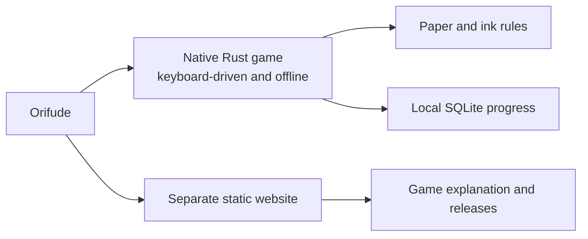
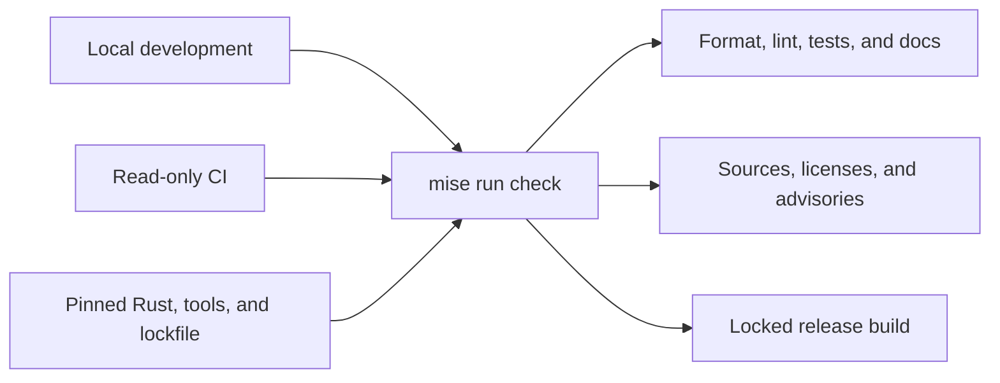
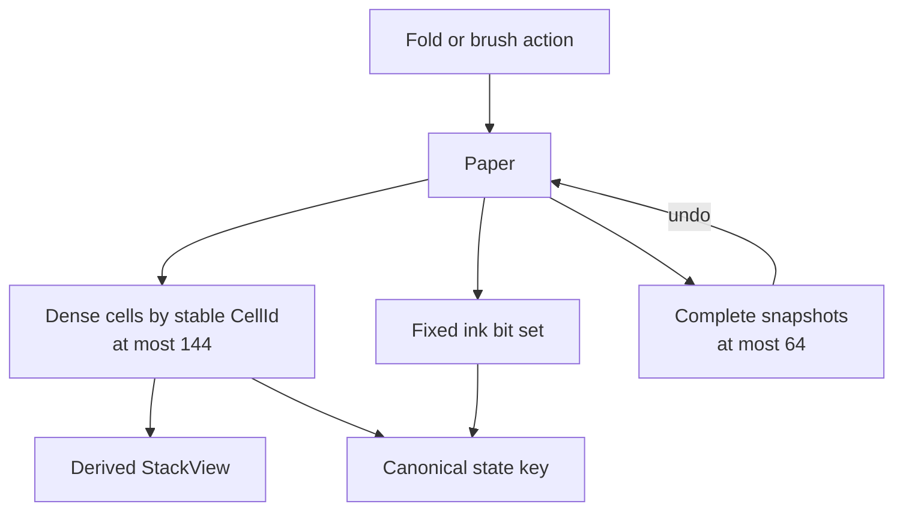
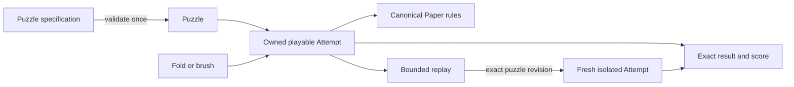
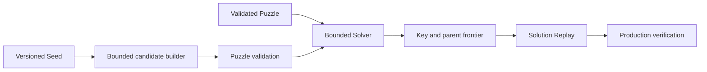
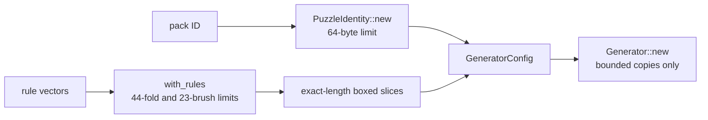
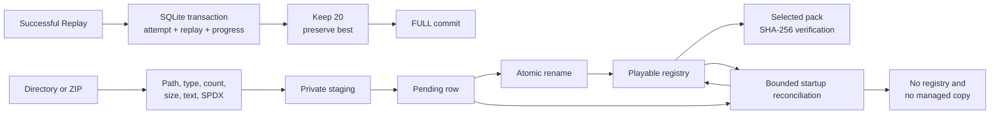
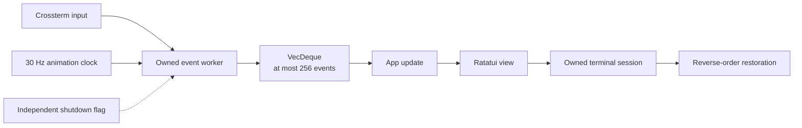

# Orifude notebook

This is the friendly technical map of Orifude. It explains what is already in
the repository, why it took this shape, how it was checked, and where to read
the real thing.

[`PROJECT.md`](PROJECT.md) still owns the product rules, limits, architecture,
and work queue. [`CHANGELOG.md`](CHANGELOG.md) is the release-facing summary.
This notebook sits between them. It keeps useful project memory without turning
into another checklist.

## How to use this notebook

- Read the linked source when a detail matters. This file is a map, not a copy
  of the code.
- Add a note when work changes behavior, a boundary, a decision, a measurement,
  or the way we verify something.
- Add the smallest useful graph when it makes ownership, flow, state changes,
  or dependencies easier to understand. A simple fact does not need one.
- Keep it honest. Record untested platforms and rejected ideas too.
- Keep it easy to read. A notebook should help, not ask for its own manual.

## The repository at a glance

| Area | Where to look |
| --- | --- |
| Product rules and current work | [`PROJECT.md`](PROJECT.md) |
| Contributor rules | [`AGENTS.md`](AGENTS.md) |
| Player and contributor introduction | [`README.md`](README.md) |
| Release-facing history | [`CHANGELOG.md`](CHANGELOG.md) |
| Toolchain | [Rust](rust-toolchain.toml), [package](Cargo.toml), [lock](Cargo.lock) |
| Local commands | [`mise.toml`](mise.toml), [`mise.lock`](mise.lock) |
| Ordinary CI | [`.github/workflows/ci.yml`](.github/workflows/ci.yml) |
| Process and command line | [entry](src/main.rs), [CLI](src/cli.rs), [errors](src/error.rs) |
| Terminal shell | [runtime](src/tui), [native smoke](tests/terminal_pty.rs) |
| Paper and game rules | [`src/domain`](src/domain) |
| Plain-text exercise | [`examples/paper.rs`](examples/paper.rs) |
| Representation measurements | [paper](examples/paper_measure.rs), [solver](examples/solver_measure.rs) |
| Bounded action fuzzing | [`examples/domain_actions_fuzz.rs`](examples/domain_actions_fuzz.rs) |
| Search and generation | [solver](src/solver), [generator](src/generator) |
| Local persistence | [`src/storage`](src/storage) |
| Community content | [`src/packs`](src/packs) |
| Behavior tests | [CLI](tests/cli.rs), [terminal](tests/terminal_pty.rs), [paper](tests/paper.rs), [engine](tests/engine.rs), [solver](tests/solver.rs), [generator](tests/generator.rs), [storage](tests/storage.rs), [storage recovery](tests/storage_recovery.rs), [packs](tests/packs.rs) |

## Product contract

Build-plan source: [product contract](PROJECT.md#phase-0-product-contract).

The project settled the rules before growing the application. That was the
right order. A late change to fold meaning would ripple through puzzles,
replays, the solver, saved progress, and the TUI.



The split is deliberate. Playing never depends on the website or a network
service.

What was decided:

- Orifude is a native Rust terminal game played with the keyboard. It works
  offline and will keep progress in local SQLite storage.
- The player folds paper, places ink through every layer under a dot or line
  brush, unfolds the paper, and tries to match the target exactly.
- Undo and reset are normal tools. There is no timer, account, telemetry,
  leaderboard, streak pressure, advertisement, or required network call.
- The native game and the static Astro website remain separate projects. The
  website explains the game and releases. It never becomes a browser game.
- Orifude is a coined name inspired by folding and brushwork. The supplied
  squirrel, paper, branch, berry, and brush artwork is the identity source.
- `shrek` is the permanent default branch. It currently accepts direct pushes,
  then ordinary CI reports whether the pushed commit passes.
- The product has explicit limits for paper size, actions, history, solver
  work, storage, packs, terminal events, and release artifacts. Raising a limit
  needs a resource estimate and tests.
- Operational failures such as bad input, I/O errors, cancellation, and full
  storage must be recoverable. Panics are reserved for broken internal
  invariants.

The detailed contracts live in the
[canonical game rules](PROJECT.md#canonical-game-rules),
[architecture](PROJECT.md#architecture),
[explicit limits](PROJECT.md#explicit-v1-bounds),
[security model](PROJECT.md#security-model),
[test strategy](PROJECT.md#test-strategy), and
[distribution contract](PROJECT.md#distribution-contract).

The puzzle-game reboot began in
[`0e3f08c`](https://github.com/nuggocto/orifude/commit/0e3f08c272eb99e28c804d265fe8b28ff745157e).
The older letter-exchange application remains in Git history, but it is a
retired product with no upgrade or data-migration path into this game.

## Rust repository foundation

Build-plan source: [repository foundation](PROJECT.md#phase-1-repository-foundation).

The repository has one small, reproducible Rust application base. It is meant
to fail clearly before domain code, storage, and terminal work make failures
more expensive.



Local work and CI enter through the same bounded check. The pinned inputs keep
that check reproducible.

What was built:

- [`rust-toolchain.toml`](rust-toolchain.toml) pins Rust 1.98.0 with the minimal
  rustup profile, Clippy, and rustfmt. [`Cargo.toml`](Cargo.toml) records Rust
  1.98 as the minimum compiler and uses edition 2024 with resolver 3.
- The crate denies unsafe code. Development, test, and release builds keep
  overflow checks enabled. Release panics unwind so the later terminal owner
  can restore terminal state during handled failures.
- [`Cargo.lock`](Cargo.lock) is committed because Orifude ships an application,
  not a reusable library. Locked builds make local work and CI resolve the same
  dependency graph.
- The foundation began without a runtime dependency. The command line remains
  small enough that a hand-written parser is easier to audit than a parser
  framework. Later storage work added only its bounded persistence and content
  dependencies.
- [`src/cli.rs`](src/cli.rs) separates an empty interactive launch from help,
  version, and invalid usage. It inspects at most two arguments and never
  reflects unknown argument bytes into terminal output.
- Exit codes are stable: success is 0, operational failure is 1, and invalid
  usage is 2. Output failures retain their I/O cause instead of becoming a
  vague top-level message.
- [`src/main.rs`](src/main.rs) prints at most eight linked error causes. That
  prevents a strange error chain from turning reporting into unbounded work.
- [`mise.toml`](mise.toml) is the one command menu for formatting, linting,
  tests, doctests, release builds, dependency policy, the paper exercise,
  measurements, and domain fuzzing.
- [`deny.toml`](deny.toml) rejects unknown dependency sources, wildcard
  dependencies, unreviewed licenses, and known advisories. Duplicate versions
  remain denied except for two exact Ratatui dependency versions whose upstream
  graph cannot unify yet.
- [Ordinary CI](.github/workflows/ci.yml) runs `mise run check` on Linux for
  pull requests and pushes to `shrek`. It has read-only repository permission,
  no publication credentials, a 15-minute timeout, pinned actions, and no
  cross-run executable cache.
- [`.gitattributes`](.gitattributes) fixes text and line-ending behavior across
  supported platforms.

Why these choices:

- One package is enough right now. A workspace would add navigation and build
  cost before there is a real ownership boundary to justify it.
- No build cache was added because the first hosted check took about 15 seconds.
  Ten seconds were tool installation and roughly 1.5 seconds were repository
  checks. Cache invalidation would cost more attention than it saves today.
- Dependency policy runs before compilation. A bad source or license should
  stop early, before the machine spends time building it.
- CI checks direct pushes after they land because that matches the live branch
  settings. The notebook records reality, not the branch policy we might wish
  we had on a sleepy afternoon.

The main foundation commits are
[`09e4291`](https://github.com/nuggocto/orifude/commit/09e4291a95efd9fef5b0e08364a62a2d367df945),
[`cdc2b22`](https://github.com/nuggocto/orifude/commit/cdc2b22f095523c1b58d26c0bec35606cec5769c),
and
[`9046529`](https://github.com/nuggocto/orifude/commit/9046529daf3277f46197c45a13e433c7d2963e5d).

## Paper model and rule exercise

Build-plan source:
[paper model and rule prototype](PROJECT.md#phase-2-paper-model-and-rule-prototype).

The paper model proves the fold algebra before a TUI tries to make it pretty.
The core idea is simple: every physical cell keeps one stable identity even
when its position, layer, face, and orientation change.



`Paper` is the only mutable source of truth. Stack views and state keys are
derived, while undo restores an earlier complete state.

What was built in [`src/domain/paper.rs`](src/domain/paper.rs):

- Boards are between 4 by 4 and 12 by 12 cells, with at most 144 physical cells.
- Small newtypes keep cell IDs, rows, columns, dimensions, layers, fold counts,
  stroke counts, and action counts inside their declared ranges.
- The canonical paper is one dense vector indexed by stable row-major
  `CellId`. Ink is a fixed three-word bit set indexed by the same ID.
- A caller-owned [`StackView`](src/domain/paper.rs) derives one bottom-to-top
  stack without keeping a second coordinate map in sync.
- Folds reflect coordinates across a cell boundary, flip the visible face,
  update orientation, and reverse every moving stack before placing it above
  stationary layers.
- A moved stack may land on an empty destination inside the original board.
  Cells may never leave that bounded working area.
- Dot ink passes through every layer at one occupied position. Target
  comparison reports missing and extra physical cells separately.
- Undo stores complete canonical snapshots. Failed actions leave the previous
  state untouched.
- Release-active assertions check cell conservation, unique identity,
  in-bounds coordinates, action-count agreement, and complete zero-based layer
  order. These are programmer-error checks, not input validation.

Why dense storage won:

- Folding, snapshotting, hashing, and future solver expansion touch most or all
  physical cells. Those are the common operations.
- The measured coordinate-to-stack `BTreeMap` made one stack lookup faster, at
  about 5 ns instead of roughly 111 ns on the recorded machine. It made a
  maximum snapshot clone about 190 times slower and clone-plus-two-fold work
  about 6 times slower. It also split one board across up to 144 small
  allocations.
- A maximum dense cell payload is 720 bytes. A snapshot's named payloads total
  779 bytes on the recorded Linux target. Sixty-four snapshot and action
  entries total 50,176 bytes before allocator bookkeeping. Complete snapshots
  fit comfortably, so action deltas would add restoration bugs without solving
  a memory problem.
- Rust does not promise the same layout on every target. The numbers guide this
  representation choice; they are not a portable ABI promise.

The checked-in measurement and rejected alternative live in
[`examples/paper_measure.rs`](examples/paper_measure.rs). The focused public-API
tests live in [`tests/paper.rs`](tests/paper.rs).

The plain-text exercise in [`examples/paper.rs`](examples/paper.rs) has six
one-fold and two-fold examples. Its model-driven walkthrough shows the crease,
bottom-to-top layer order, ink passing through a stack, and the current numeric
answer format. Menu and prediction input stop at 16 bytes, and one run stops
after 12 menu attempts. Oversized input ends the session instead of leaving a
tail that could become a later command.

The fold-destination and branch-policy clarification landed in
[`aaa348c`](https://github.com/nuggocto/orifude/commit/aaa348c3f13f8f7032d3a10e7925cf8157dc8323).
The model and measurement landed in
[`9419443`](https://github.com/nuggocto/orifude/commit/941944316dd9f5e2996d09e3b3f40a3194d8cc62).
The visual lesson landed in
[`67d0c72`](https://github.com/nuggocto/orifude/commit/67d0c727ea1f501150d9b7ee0a51bae96ef653ef).

## Deterministic game engine

Build-plan source:
[deterministic game engine](PROJECT.md#phase-3-deterministic-game-engine).

The prototype became the production domain API. The TUI, solver, generator,
authoring tools, and replay loader are expected to call this API instead of
reimplementing paper rules.



The validated puzzle stays with its attempt. Replays start from fresh paper and
must match the complete gameplay revision before any action runs.

The domain is split by behavior:

- [`paper.rs`](src/domain/paper.rs) owns physical cells, folds, brushes, ink,
  snapshots, canonical state keys, and low-level legality.
- [`puzzle.rs`](src/domain/puzzle.rs) validates identity, dimensions, target,
  allowed folds and brushes, budgets, and optional par before play starts.
- [`attempt.rs`](src/domain/attempt.rs) owns one validated puzzle and paper. It
  rejects puzzle-disallowed actions before asking the paper to apply them.
- [`score.rs`](src/domain/score.rs) reports exact success, fold and stroke
  score, undo count, hints, and whether a successful result meets par.
- [`replay.rs`](src/domain/replay.rs) records bounded actions and executes them
  against a fresh isolated attempt.

What the engine can do now:

- Apply any valid horizontal or vertical crease in all four directions,
  including consecutive folds on the same axis and nested stacks at least eight
  layers deep.
- Reject an empty moving side, an out-of-area reflection, a disallowed action,
  an empty brush position, an invalid line, or an exhausted budget without
  mutating the attempt.
- Apply a dot or a bounded inclusive horizontal or vertical line. Line endpoint
  order is canonical, so drawing the same line backward produces the same
  action.
- Compare every original physical cell and report exact, missing, and extra ink.
- Undo one successful action exactly, reset to fresh paper, and keep replayable
  actions aligned with the current state.
- Produce exact canonical state equality and a stable non-cryptographic hash
  for solver bookkeeping. Equality still resolves hash collisions.
- Score folds before strokes. Time is never part of the score.

Replay compatibility deserves its own note. Identity and format numbers were
not enough because a puzzle author could change a target, allowed action, budget,
or par while keeping the same IDs. A replay now carries an exact bounded
`PuzzleRevision` with every gameplay field. Display text is left out because a
spelling fix should not invalidate a solution. This uses exact equality instead
of a custom digest, so correctness does not depend on hoping two revisions never
collide. Replay execution validates first and then works on fresh state, which
keeps a failed replay away from the live attempt.

The engine keeps these hard bounds:

| Resource | Limit |
| --- | ---: |
| Physical cells | 144 |
| Fold actions | 12 |
| Brush actions | 8 |
| Total actions and history entries | 64 |
| Allowed fold rules in one puzzle | 44 |
| Allowed brush rules in one puzzle | 23 |
| Pack and puzzle ID length | 64 ASCII bytes each |

Verification lives in [`tests/engine.rs`](tests/engine.rs):

- 26 integration tests cover construction, all fold directions, off-center and
  nested folds, dots, lines, scoring, history, canonical keys, replay
  compatibility, and atomic failure.
- An exhaustive fold pass covers all 2,268 board, direction, and crease cases
  across supported board dimensions.
- Eight fixed seeds cover 256 direct actions and fresh replay execution.
- [`examples/domain_actions_fuzz.rs`](examples/domain_actions_fuzz.rs) accepts at
  most 256 input bytes, which decode to at most 64 operations. A 257-byte input
  exits with usage status before domain work starts.
- Debug and release runs produce the same recorded state hash and replay result.
- `mise run check`, release tests for every Cargo target, warning-denied Rust
  documentation, the locked dependency audit, the bounded fuzz run, and the
  plain-text exercise all passed on Rust 1.98.0 and x86_64 Arch Linux.
- Native macOS and Windows execution has not been tested yet. No TUI terminal
  lifecycle exists yet, so those claims wait for the native work that can
  actually prove them.

The complete engine landed in
[`5da6052`](https://github.com/nuggocto/orifude/commit/5da6052d85c5b1ea804ba9eedce1ee48bbce23cb).
Its [GitHub CI run](https://github.com/nuggocto/orifude/actions/runs/33527703571)
passed after the direct push to `shrek`.

## Bounded search and generation

Build-plan source: [solver and generator work](PROJECT.md#phase-4-solver-and-deterministic-generator).

The engine can now prove a small puzzle, explain why search stopped, and build a
repeatable puzzle from a seed. The important bit is that neither side gets to
invent paper rules. Both return to the production engine before Orifude trusts
their answer.



What was built:

- [`src/solver/mod.rs`](src/solver/mod.rs) has one deterministic priority
  search. It compares folds first and strokes second, just like the game score.
  It returns solved, unsolved, exhausted, cancelled, and invalid as different
  outcomes.
- Search keeps exact [`PaperStateKey`](src/domain/paper.rs) values in a hash
  set, plus small parent records in its frontier. It never iterates the hash
  set, so private hash-table order cannot change the chosen replay.
- A state is restored by resetting one reusable attempt and replaying at most
  20 parent actions through the real engine. Every reported solution is then
  replayed once more against the exact puzzle revision.
- The solver checks its fixed setup before allocating search collections. It
  stops independently for 250,000 visited states, 128 MiB of conservatively
  charged memory, configured depth, or cancellation.
- [`src/generator/mod.rs`](src/generator/mod.rs) owns an explicit versioned seed
  and a maximum of 512 candidate attempts. It receives a calendar date from its
  caller and never opens a clock.
- The generator builds legal bounded action sequences. Construction guarantees
  a non-empty target and enforces the action budgets through the production
  engine. It rejects repeated and trivial targets, and one solver-exhausted
  target does not prevent it from trying the remaining bounded candidates.
- The generated action sequence is already a solution witness. If the complete
  solver called that target unsolved, or if the internal puzzle validator
  rejected data built from the validated template, that would be a code defect
  rather than ordinary bad luck. Those cases are assertions instead of public
  rejection reasons.
- The first random compatibility path uses fixed-width SplitMix64 arithmetic.
  A daily seed comes from `orifude:1:YYYY-MM-DD`. The golden in
  [`tests/generator.rs`](tests/generator.rs) fixes the date, seed, target,
  actions, puzzle ID, and accepted candidate so a future algorithm change does
  not quietly rewrite old daily papers.

Why the frontier looks a little unusual:

- Cloning a complete maximum-depth attempt is quick here, around 0.34
  microseconds in the recorded release runs. It also has a 16,750-byte
  named-payload lower bound for every retained state because the puzzle, paper,
  and 20 snapshots come along for the ride.
- The selected key and parent representation is conservatively charged at
  1,312 bytes per maximum-paper state. Rebuilding a 20-action path is slower,
  around 18.73 to 18.99 microseconds, but it keeps the hard memory story simple
  and leaves one production rules engine.
- On 256 maximum-paper keys, hashed membership took about 1.50 microseconds per
  lookup. A linear vector took about 11.7 microseconds. The small extra table
  storage earns its keep once the search grows.
- The representative solver fixtures visited 2 to 35 states and took roughly
  4.6 to 184.3 microseconds at the median on the recorded AMD Linux machine. Run
  [`mise run solver-measure`](mise.toml) for the full local table. These numbers
  guide the structure; they are not promises for another computer.

The generator is deliberately not an artist or a lesson designer. Fold-free
introductions, carefully shaped pictures, story pacing, unique-solution
puzzles, line-heavy folded layouts, and rule sets that exhaust bounded search
still belong in handcrafted content. A failed seed is reported and ends. It
does not keep shaking the branch until a convenient puzzle falls out.

## Repository-wide review on 2026-09-01

The clean `shrek` commit
[`06da3c3`](https://github.com/nuggocto/orifude/commit/06da3c3bb77427238578deed928c4798d17c9a8f)
received a full source, test, configuration, documentation, security-boundary,
and local behavior review. It found one boundedness defect in
[`GeneratorConfig`](src/generator/mod.rs), which the follow-up change repaired.

The old configuration accepted rule vectors of any length. `Generator::new`
then cloned both vectors before `Puzzle::new` enforced the 44-fold and 23-brush
limits. The old configuration constructor also copied its pack ID before the
64-byte identity check. Rejection was correct, but it arrived after memory use
had already grown with invalid input.



An isolated reproduction confirmed the vector path twice. A one-rule policy
peaked near 2.5 MiB resident memory, while five million rejected fold rules
peaked near 21.7 MiB. The command line could not reach this constructor, so the
defect was not an exposed vulnerability. It was still the wrong boundary to
carry into local content parsing.

On 2026-09-02, configuration construction became fallible. It retains a pack ID
only after `PuzzleIdentity` validates it, and `with_rules` rejects either
oversized list before retaining either one. Accepted rules become `Box<[Fold]>`
and `Box<[BrushRule]>`. Generation reads and copies these collections but never
appends to them, so exact-length slices express the real ownership and discard
irrelevant spare vector capacity. Keeping growable vectors offered no useful
operation in return. The public regression in
[`tests/generator.rs`](tests/generator.rs) checks the 65-byte ID, 45th fold, and
24th brush rule and their exact typed errors. It failed against the old
infallible boundary and passes with the bounded one.

The original five-million-rule reproduction now rejects while constructing the
configuration. Its peak resident memory fell from about 21.7 MiB to 11.9 MiB
because the caller's input remains but the generator no longer clones it. A
normal one-rule policy still constructs and generates its preserved daily
golden. The generator suite passed ten consecutive debug runs. `mise run check`,
release tests for every Cargo target, and warning-denied Rust documentation all
passed after the repair. Release-binary default, help, version,
hostile-argument, paper-exercise, and fuzz-boundary checks also remained
unchanged.

The rest of the reviewed implementation had no confirmed defect. `mise run
check`, release tests for every local Cargo target, warning-denied Rust
documentation, and `git diff --check` passed on Rust 1.98.0 and x86_64 Arch
Linux. The release
binary produced the recorded default, help, version, and usage behavior. A
control-sequence argument was rejected without reflection. The paper exercise
completed its two-fold, prediction, ink, exact-comparison, undo, and quit path.
The domain fuzz entrypoint accepted 256 bytes and rejected 257 before domain
work.

The solver also matched an independent exhaustive reference for all 499 targets
reachable in a small four-direction fold-and-dot puzzle. The
[baseline hosted check](https://github.com/nuggocto/orifude/actions/runs/33548263881)
passed for the same commit. Rust 1.98.0 remains the current stable release in
the [official Rust release record](https://blog.rust-lang.org/releases/1.98.0/).
That reviewed commit had no runtime dependency, unsafe code, network path,
database, archive handling, pack parser, or TUI lifecycle. Native macOS and
Windows execution remained untested at that review point.

## Persistence and local packs

Build-plan source: [persistence and local packs](PROJECT.md#phase-5-persistence-and-local-packs).

Orifude now has one durable source for progress and one bounded path from local
authored files to playable community content. Neither path interprets paper
rules on its own: saved replays and parsed puzzles return through the domain
engine before they are trusted.



The implementation lives in [`src/storage`](src/storage) and
[`src/packs`](src/packs). The important choices are:

- [`AppPaths`](src/storage/paths.rs) uses the operating system project
  directories. Linux follows the XDG data, config, and cache variables with
  their standard home-directory fallbacks. macOS uses Application Support for
  data and config and Library/Caches for cache data. Windows uses roaming
  AppData for data and config and local AppData for cache data. Tests inject
  three isolated roots and never write into the working tree.
- [`rusqlite`](Cargo.toml) links the reviewed bundled SQLite so every native
  artifact gets the same database feature set. Semver-compatible dependency
  updates are accepted only through a reviewed `Cargo.lock` change followed by
  the complete license, source, advisory, lint, test, and release-build check.
  The allowlist records Apache-2.0, MIT, MPL-2.0, Unicode-3.0, and Zlib after
  reviewing the locked graph; it has no skip tree.
- [`Storage::open`](src/storage/mod.rs) owns one connection and one advisory
  lock. It rejects a symlinked database path, then lets the writable connection
  recover a hot rollback journal before it reads the schema version. Newer
  schemas still stop before writable pragmas or migrations can touch them. The
  connection applies the initial schema in an immediate transaction, caps
  SQLite strings, blobs, SQL, expression depth, variables, attachments,
  triggers, and worker threads, and checks the schema markers, foreign keys,
  and database image without silently replacing corrupt data.
- The schema separates metadata, rendering-independent settings, progress,
  completed attempts, bounded replay documents, generator-versioned daily
  history, installed-pack metadata, and the single pending installation.
  The pending row retains the original installation timestamp for restart
  recovery. Progress has no pack-registry foreign key, so removing content does
  not erase the history that explains an earlier completion.
- A successful replay is executed first, then its attempt, replay, best marker,
  and progress summary commit together. The connection uses 4096-byte pages,
  32,768 maximum pages, `DELETE` journaling, `FULL` synchronization, no retained
  journal, disabled cache spilling, and memory-backed SQLite temporary storage.
  The main file is capped at 128 MiB. Nonessential replay and daily-history
  writes preserve 16 MiB of free page capacity after one pruning batch. A
  completion may use that reserve for progress and its best replay. When a
  worse replay will not fit outside the reserve, its progress commits and only
  that nonessential replay is discarded. Per-puzzle history keeps 20 replays
  including the best.
- A rollback journal can hold one original page record per database page. The
  132 MiB transient-sidecar budget covers 32,768 records of 4096 data bytes and
  eight framing bytes plus SQLite's maximum sector-sized header. Disabling
  cache spilling keeps a transaction to that one header. WAL and shared memory
  files are forbidden by the selected journal mode, and actual main, journal,
  WAL, and shared-memory lengths remain available through `Storage::footprint`.
- Pack metadata and puzzles are strict versioned TOML. A target is an ASCII
  `.`/`#` grid that must exactly match the declared dimensions. Display text is
  UTF-8 with scalar limits and no control characters. IDs, filenames, rules,
  budgets, tutorial cues, authors, SPDX licenses, file declarations, and all
  resource bounds are validated before a `Puzzle` is constructed.
- ZIP is the only archive format. Only stored and deflated regular files are
  accepted. A bounded end-record preflight rejects excessive, split, and ZIP64
  entry tables before the ZIP library allocates its catalog. Directory sources
  stream entries rather than collecting an untrusted directory. Both sources
  reject traversal, absolute paths, case-folded duplicates, Windows device
  names, trailing dots or spaces, symbolic links, Unix and Windows hard links,
  devices, sockets, undeclared directories and files, excessive depth,
  excessive count, and compressed, extracted, or per-file size excess.
- Installation writes the already validated byte set into one owner-private
  staging directory under the data root, synchronizes files and directories,
  commits the pending identity, fingerprint, and timestamp, renames within that
  filesystem, then registers the pack and clears the journal in one transaction.
  Startup rejects a symlinked managed root and performs bounded reconciliation
  before terminal code. It removes a registry row whose directory is missing
  and removes unregistered managed entries without following links. This closes
  the Windows power-loss state where SQLite survives but the rename does not.
  A selected pack is reparsed and checked against its recorded SHA-256
  fingerprint; startup does not eagerly parse installed puzzle files.

The integration suites in [`tests/storage.rs`](tests/storage.rs) and
[`tests/packs.rs`](tests/packs.rs) exercise restart persistence, better-solution
replacement, 20-replay pruning, migration rollback, schema refusal, corruption,
read-only paths, lock contention, completion-transaction rollback, every
durable installation state, failed-cleanup retry, conflicts, fingerprint drift,
removal with retained progress, directory links, archive escape attempts,
portable names, resource excess, control text, SPDX parsing, replay identity
and success, the 32-error reporting ceiling, a spilled hot rollback journal,
protected reserve writes, managed-root links, missing registry directories,
unknown managed entries, recovery timestamps, and independent puzzle errors.
The four parser entrypoints are
[`examples/puzzle_parser_fuzz.rs`](examples/puzzle_parser_fuzz.rs),
[`examples/pack_metadata_fuzz.rs`](examples/pack_metadata_fuzz.rs),
[`examples/replay_parser_fuzz.rs`](examples/replay_parser_fuzz.rs), and
[`examples/archive_parser_fuzz.rs`](examples/archive_parser_fuzz.rs).

The implementation review found and corrected real boundary defects rather
than adding speculative complexity. A better score used to insert its new best
replay before clearing the old unique best marker; the order is now reversed in
the same transaction. The review also removed unbounded directory collections,
added the ZIP entry-table preflight, made idempotent installation verify the
existing managed bytes, required decoded replays to be successful and match the
requested identity, protected daily history with the free-page reserve, made
pending-row removal exact, and stopped newer schemas before writable setup.
Focused regressions cover each correction in the two integration suites.

A later report found several boundary cases that the first review missed.
Validation now caps diagnostic allocation while it collects issues and keeps
independent display, identity, target, par, and rules errors in one report.
Storage now recovers a rollback journal that has spilled pages before checking
the schema, lets protected completion state use reserved pages, keeps recovery
timestamps, rejects a symlinked managed root, and converges a missing registered
directory to the safe no-pack state. Unknown entries under the private managed
root are removed as bounded orphan cleanup instead of blocking every startup.

The security review treated pack bytes, archive metadata, paths, persisted
SQLite values, and error text as hostile. All accepted sizes have a numeric
bound before retained allocation or installation, pack content cannot select a
managed path, SQL is parameterized, stored display text is revalidated, and
errors do not reflect untrusted bytes. Packs contain no executable content and
the dependency graph adds no network client. Concurrent changes by the same
user to an explicitly selected source directory are not an isolation boundary;
the install still fingerprints and stages only the validated bytes it read.

On the recorded x86_64 Arch Linux host and its Btrfs SSD, the final five
independent release runs of 500 completion writes with `FULL` synchronization
measured 20.228 to 22.120 milliseconds at p50, 21.544 to 28.613 milliseconds at
p95, 22.602 to 29.459 milliseconds at p99, and 26.559 to 62.811 milliseconds
maximum. Every p95 is below the 50-millisecond local-SSD target. The locked
ordinary check, all 100 tests in both debug and release across local targets,
warning-denied documentation, and release build passed. Random maximum-size
input passed through all four bounded parser harnesses without a crash. The
Windows Rust target check reached the bundled SQLite C build but could not
finish because this Linux host lacks a Windows CRT; native Windows and macOS
execution remain later native QA, not claims made by this work.

## How the notebook was checked

On 2026-09-01, this notebook was checked against `PROJECT.md`, the current
source and tests, and the puzzle-game Git history beginning at `0e3f08c`.
Every relative link resolves inside the repository, every linked commit exists
in local history, and every linked `PROJECT.md` heading exists.
`git diff --check` and `mise run check` also passed. This was a
documentation-only check at that point. Search and generation later added their
own linked tests, measurement harness, and verification record.

A follow-up added four small Mermaid graphs for the product boundary, shared
check path, paper ownership, and engine flow. Their nodes and limits were
checked against the same linked contracts and source. The graphs explain
existing behavior; they do not add a new rule.

The search-and-generation review then checked every reported candidate
rejection against the actual builder. It fixed one real control-flow bug: a
solver-exhausted candidate used to stop the whole generation run. A regression
test now proves that all 32 configured attempts are considered and that repeated
targets skip duplicate solver work. Impossible rejection labels were removed
instead of manufacturing tests for states that validated construction cannot
produce. The same review removed a redundant full-state scan at the start of
in-place paper reset; the release median for resetting and replaying the fixed
20-action path was 18.73 to 18.99 microseconds across five processes. Reset
still checks the rebuilt state before returning.

On 2026-09-02, a whole-repository review reread the committed core and the
uncommitted pack and storage work together. Its initial clean verdict was wrong.
A follow-up compared three independent reports with the contract and reproduced
each surviving claim before changing code. Eight claims were confirmed: reserve
handling, spilled-journal recovery, managed-root links, Windows rename recovery,
recovery timestamps, unknown managed entries, diagnostic allocation, and lost
independent puzzle errors. Four claims were rejected because the contract or
reachable behavior contradicted them: newline rejection in notes, the independent
256-file pack limit, cache invalidation after any removal, and the deliberately
single pruning batch. The focused regressions failed against the old behavior
and pass after the corrections.

`mise run check`, all 100 tests in release mode, warning-denied documentation,
the release build, and ten repeated runs of the generator, pack, and storage
suites passed after the corrections. Release QA also exercised hostile CLI
input, the paper walkthrough, and maximum accepted input through each bounded
parser harness. One independent 500-write storage run measured 21.075
milliseconds at p50, 23.658 milliseconds at p95, 24.598 milliseconds at p99,
and 30.949 milliseconds maximum. That run is useful confirmation on this Linux
host, not a cross-platform benchmark; native Windows and macOS behavior was not
exercised by this review.

The first repeatability run exposed a test bug rather than a storage bug. The
hot-journal test forked the multithreaded storage-test process. During the short
fork-to-exec window, the child could retain another test's open lock descriptor
and make an unrelated immediate reopen report `Locked`. The recovery check now
lives alone in [`tests/storage_recovery.rs`](tests/storage_recovery.rs). The
storage and recovery binaries then passed 100 consecutive runs, followed by the
ten complete focused-suite runs recorded above.

## Terminal runtime design

The terminal shell has one main-thread renderer and one owned event worker. Its
dominant operations are appending a key, replacing a pending resize or tick,
removing the oldest event, and waking shutdown. The queue can hold at most 256
fixed-size events, so a preallocated `VecDeque` keeps those operations bounded
without another index or synchronized collection.



A design with separate key, resize, and tick stores was rejected. It makes the
total capacity and the position of coalesced events harder to inspect. The one
queue preserves key order, replaces an existing resize or tick in place, and
uses condition-variable backpressure when a new entry would exceed the limit.
Shutdown is not an event, so a full queue cannot hide it.

The terminal session records raw mode, alternate-screen entry, cursor hiding,
line wrapping, and focus reporting as separate acquired capabilities. Normal
exit and handled errors restore every capability in reverse order. Successful
steps are cleared while failed steps remain available for a bounded retry. A
process-level fallback makes the same restoration as separate best-effort
operations. The panic hook only performs that fallback on the thread that owns
the terminal, so a caught event-worker panic returns through the normal error
path instead of removing the alternate screen under the renderer. The renderer
uses a centered viewport capped at 160 by 60 cells, so a hostile or accidental
giant terminal size cannot turn into an unbounded Ratatui buffer.

[`src/tui`](src/tui) now contains the app state, event pump, lifecycle, safe
text boundary, capability profile, layouts, components, and pure view. The
shell opens the home branch, help, a rules preview, terminal settings, quit
confirmation, and readable error dialogs. Preferred, narrow, and undersized
layouts share the same state. The narrow layout keeps all choices visible, and
the undersized view keeps dialogs and focus waiting until the terminal returns.
ASCII, monochrome, reduced-motion, and instant-reveal choices are stored with
the existing settings through the schema migration in
[`src/storage/mod.rs`](src/storage/mod.rs). Primary text uses the terminal's
default foreground so it remains readable on both light and dark backgrounds.

The opening composition now keeps its shape on a large terminal instead of
inflating two bordered panels to the full render cap. [`layout.rs`](src/tui/layout.rs)
centers a 120-by-38 shell, gives the courier three fifths of the content width,
and keeps the seven-choice card at 32 by 9 cells. At 60 by 20 it switches to a
two-line mark above the complete choice list.

```text
160 by 60 render viewport
└── 120 by 38 centered shell
    ├── title
    ├── courier mark        32 by 9 branch card
    └── keyboard status
```

[`components.rs`](src/tui/components.rs) derives the Unicode mark from the
supplied monochrome artwork as a fixed Braille raster. This retains the brush
circle, side-profile squirrel, folded letter, branch, and berries. A separate
ASCII drawing carries the same composition without Unicode. The opening uses
24 fixed visual states over 1.1 seconds. Ink moves diagonally across the final
raster, any key completes it, reduced-motion and instant-reveal modes start on
the final state, and the event clock stops after the reveal. The work per frame
is bounded by 48 columns and 15 Braille rows. The full mark starts with the
artwork itself; the redundant `paper courier` label above it was removed while
the Orifude wordmark and arrival caption remain.

The view tests use Ratatui's `TestBackend` for the three layout boundaries,
ASCII-only output, and resize with an open dialog. Queue tests cover exact
capacity, key order, tick and resize coalescing, backpressure, failure priority,
and shutdown while full. Lifecycle tests inject each acquisition and
restoration failure, including a retry that touches only the capability that
still needs cleanup. [`tests/terminal_pty.rs`](tests/terminal_pty.rs) drives the
shipped binary through `script` on Linux and macOS and ConPTY on Windows, then
checks that the alternate screen, cursor, and line wrapping were restored. Its
opt-in `isolated-test-paths` build feature accepts one absolute temporary root
and is enabled only by the repository test tasks. The smoke proves that its
database was created below that root, so native tests cannot migrate or
reconcile a developer's live data. The Linux launcher passes the binary through
one quoted environment value, which also keeps paths containing spaces intact.
The test is not built on unsupported Unix targets. Pull requests and manual
workflow dispatch run the smoke through mise on Linux x86_64, macOS Apple
Silicon, and Windows x86_64. Manual dispatch supplies native gate evidence for
a direct `shrek` push without putting the matrix on every push.

A whole-repository review on 2026-09-02 confirmed and fixed seven other defects
at their owning boundaries. An unbound key now redraws the completed opening
mark. Failed settings persistence restores the app's pre-event value without
making another fallible database read. Storage checks its file budget before
settings, completion, daily-history, and pack-install mutations, so a reported
capacity rejection leaves durable state unchanged. Existing schema markers are
verified before the settings migration changes an older database. The ASCII
mark uses its actual 33-cell source width, keeping the drawing and reveal sweep
centered. The cleanup and panic ownership changes described above cover the
remaining two defects. Focused regressions reproduced each reachable failure
before the fixes and passed afterward in [`app.rs`](src/tui/app.rs),
[`terminal.rs`](src/tui/terminal.rs),
[`components.rs`](src/tui/components.rs), and
[`tests/storage.rs`](tests/storage.rs).

The same review reread every authored source, test, example, configuration, and
project document on the dirty tree based on `6001a6c`. The complete locked
check, the release all-target test suite, and 20 consecutive release PTY
restoration runs passed on x86_64 Linux. Release-binary QA also covered the 80
by 24 and 60 by 20 layouts, the 59 by 19 resize message, navigation, errors,
help and quit dialogs through resize, persisted ASCII settings, normal quit,
and Ctrl-C. Native macOS and Windows execution remains unverified locally.

Exploratory release QA on the recorded Linux host covered true color, ANSI 16,
`NO_COLOR`, ASCII, 80 by 24, the exact 60 by 20 minimum, and an undersized
terminal while an error dialog was open. A fresh database reached a usable
screen in 93.583 milliseconds including tmux startup. One navigation key was
visible through tmux in 4.906 milliseconds. After animation settled, `ps`
reported 0.0 percent CPU and 6,256 KiB resident memory. These are local
end-to-end samples, not cross-platform distributions. The unstripped,
dynamically linked release binary was 4,403,224 bytes; packaged and stripped
artifact size remains release work. The native macOS and Windows smoke jobs
still need to run on a pull request before the cross-platform exit claim is
checked.

The launch redesign was checked on the dirty tree based on `6001a6c` with the
release binary on x86_64 Arch Linux. Unicode captures at 160 by 60, 80 by 24,
and 60 by 20 kept the courier and menu centered without clipping. Separate
captures observed the early, middle, and final ink states. A navigation key
finished the reveal and still moved focus, ASCII mode used only ASCII cells,
and a persisted reduced-motion setting opened directly on the complete mark.
One settled release-process sample reported 0.0 percent CPU and 11,840 KiB
resident memory. The complete locked check, release build, and shipped-binary
terminal-restoration smoke passed. Native macOS and Windows behavior was not
rerun by this local design check.

A later hand-drawn courier variant failed owner review and was removed. The
source-derived Braille raster, matching ASCII drawing, and original ink reveal
are restored. The focused component tests and an 80 by 24 release capture
confirmed the rollback on x86_64 Arch Linux.

Dialogs now receive a host region from the active layout. Preferred layouts
place the modal over the courier column and preserve the complete branch card
beside it. Narrow layouts clear their shared content region first, so no stacked
menu row survives above or below the modal.

```text
preferred  [ modal over courier ]  [ complete Home branch ]
narrow     [       cleared modal content region          ]
```

View regressions check both behaviors. Release captures at 160 by 60, 80 by 24,
and 60 by 20 confirmed the quit text, footer, borders, and surrounding content
do not collide on x86_64 Arch Linux.

The redundant label above the full courier mark was then removed. Release
captures at 160 by 60 and 80 by 24 confirmed that the artwork, wordmark, and
arrival caption remain centered without a blank row. The 60 by 20 compact mark
was unchanged. This local visual check did not rerun native macOS or Windows.

After the review corrections, `mise run check` passed the locked format,
dependency-policy, lint, test, doctest, and release-build tasks on x86_64 Linux.
The release all-target suite passed 135 tests, including both PTY cases. The
release PTY cases then passed 20 consecutive runs. A release-binary capture sent
an unbound key during the opening wash and immediately showed the complete mark
and arrival caption. The installed Windows Rust target again reached bundled
SQLite before stopping at the host's missing MSVC `lib.exe`; native Windows and
macOS execution still belongs to the hosted smoke matrix in
[`ci.yml`](.github/workflows/ci.yml).

## What comes next

The current work and its acceptance gate stay in
[`PROJECT.md`](PROJECT.md#current-work). Once the hosted native terminal smoke
has confirmed restoration on macOS and Windows, the next implementation can
connect the existing paper engine and storage to this shell.
