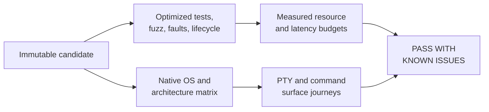

# Release-candidate QA

This record covers commit
[`89077d2`](https://github.com/nuggocto/orifude/commit/89077d2dec2a706668e793b6f14427de26627dab)
on 2026-09-04. The verdict is **PASS WITH KNOWN ISSUES**. The behavior is
recommended to ship on the supported Linux, macOS, and Windows targets and to
proceed into archive and installer work. Publication remains gated on checks of
the final packaged artifacts.

The known issues are evidence gaps, not reproduced product defects. Hosted
machines do not provide Linux 5.10, macOS 13, or Windows 10 22H2, and they do
not expose the macOS Terminal or Windows Terminal GUI. The macOS jobs build
with a 13.0 deployment target, while native execution covers current hosted
versions and every supported architecture. Final artifacts should still receive
a designated-host pass on those minimum OS versions before their support claim
is published.

## Evidence shape

The successful
[`CI` run](https://github.com/nuggocto/orifude/actions/runs/33832142361)
contains seven runnable jobs:

| Target | Native evidence |
| --- | --- |
| Linux x86_64 | Ubuntu 24.04 runner; complete optimized player journey and production command surface |
| Linux ARM64 | Ubuntu 24.04 ARM runner; complete optimized player journey and production command surface |
| macOS Intel | macOS 15 Intel runner; complete optimized player journey and production command surface, built for macOS 13.0 or newer |
| macOS Apple Silicon | macOS 15 ARM runner; complete optimized player journey and production command surface, built for macOS 13.0 or newer |
| Windows x86_64 | Windows Server 2025 runner; complete optimized ConPTY player journey and production command surface |
| Linux userlands | The x86_64 musl binary verified, installed, listed, removed, and reopened a pack in pinned Ubuntu 24.04, Debian 12, Fedora 44, and Arch 20260830.0.582275 containers |
| Repository gate | Formatting, shell analysis, dependency policy, strict all-target Clippy, tests, doctest, and production release build |

The container check uses no network after image startup, drops capabilities,
uses a read-only root, and keeps state in a 32 MiB temporary filesystem. It
establishes userland compatibility, not behavior on a distro-owned kernel.

## Measured budgets

Measurements ran on Linux 7.1.9 x86_64 with a 32-thread AMD Ryzen AI MAX+ 395,
Rust 1.98.0, tmux 3.7c, and binary SHA-256
`dfdf74b035db43ebb91ff807f31d535d02a1b18ab9b7f32693cbc8ef407d9107`.
[`release-measure.sh`](../scripts/release-measure.sh) retains the raw sample
format and rejects an exceeded budget.

| Measurement | Result | Budget |
| --- | ---: | ---: |
| Startup, 25 runs | p50 119.106 ms; p95 127.421 ms; p99 128.621 ms | p95 below 250 ms |
| Input to visible frame, 100 runs | p50 4.634 ms; p95 5.065 ms; p99 5.236 ms | p95 below 33.334 ms |
| Idle CPU, 3 seconds | 0.000% | below 1% |
| Ordinary play RSS | 7,584 KiB | below 64 MiB |
| Journey solver RSS | 9,232 KiB | below 128 MiB |
| Durable completion writes, five sets of 500 | p95 range 21.566-28.517 ms | every p95 below 50 ms |
| Largest measured solver case | 35 visited, 21 expanded, 798 checked | below 250,000 visited states |
| Linux x86_64 binary | 5,798,480 bytes | recorded, no fixed ceiling |
| Stripped binary | 4,887,288 bytes | recorded, no fixed ceiling |
| Stripped deterministic gzip | 2,203,799 bytes | recorded, no fixed ceiling |

All measured budgets passed. These timings describe this machine and build;
they are regression evidence rather than portable timing promises.

## Robustness and failure checks

- `mise run release-check` passed 226 unit, integration, terminal, and example
  tests plus the doctest in the optimized profile. The seven shipped-binary PTY
  tests include learning, solving, restart, replay, preview, undo, reset,
  malformed installed content, resize recovery, and terminal restoration.
- `mise run property-check` exhausted 2,268 fold boundary cases and replayed 32
  actions for each of eight fixed seeds. Independent solver and generated-
  content models also passed. Cases are exhaustive or fixed-seed, so the
  failing case itself is the retained reproduction and no shrinking step is
  needed.
- Five one-minute AddressSanitizer campaigns used seed 424242 and explicit
  input bounds. Domain actions completed 360,571 executions; puzzle parsing
  1,582,826; metadata 1,478,363; replay parsing 1,577,423; and archive parsing
  1,008,476. The 6,007,659 total executions produced no crash, timeout, or slow
  input. Parser limits include the first rejected byte above each accepted
  maximum. No new failing corpus needed promotion to a regression test.
- Hot-journal recovery, migration rollback, pack-install reconciliation,
  solver cancellation, opening and result reveal interruption, and shutdown
  under queue pressure each passed ten consecutive optimized runs.
- The optimized suite covers full and read-only storage, corrupt databases,
  unsupported formats, lock conflict, transaction rollback, and empty, blank,
  long, malformed, mixed-script, combining-mark, and terminal-control text.
- The direct-binary lifecycle began at commit `5b32ede`, installed a community
  pack, saved its exact best replay, upgraded to the candidate, rolled back,
  removed and reinstalled the executable, removed the pack, and uninstalled the
  executable. The database and exact replay survived every intended step, and
  explicit cleanup succeeded.
- Product and fuzz dependency policies passed against separate lockfiles. The
  local repository-content check found no high-confidence credential material
  in the working tree or reachable history.

## Terminal coverage and exclusions

The optimized binary was rendered and driven directly in Ghostty 1.3.1 and
foot 1.27.0 on Wayland, then exited through its own confirmation path. tmux
3.7c supplied the 100-by-30 PTY used for repeated startup, input, idle, and
shutdown checks. Native hosted jobs exercised the Unix PTY and Windows ConPTY
backends.

macOS Terminal and the Windows Terminal application were not available on the
headless hosted runners, so their GUI presentation was not claimed. The native
PTY results cover the same process and terminal-control protocol beneath those
applications, but a final visual pass remains appropriate on designated hosts.

All local player, lifecycle, and terminal checks used private temporary data,
config, and cache roots. The terminal images and roots were removed after
inspection; lifecycle cleanup was checked before success was reported; Docker
containers used `--rm`; and fuzz and measurement artifacts remained under the
ignored `target` directories. No ordinary player state or publication system
was changed.
