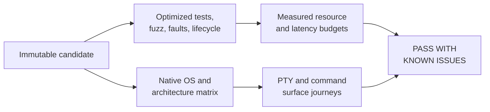

# Release-candidate QA

## Current publication decision on 2026-09-07

Release verdict: **BLOCKED**. Recommendation: **hold publication** until the
minimum-OS and terminal-app checks below and the remaining
[Cloudflare corrections](../NOTEBOOK.md#website-publication-on-2026-09-06) are
verified. The candidate passed its available checks; no product defect was
reproduced. No public puzzle-game release or package update has been created.

Signed commit
[`8b940fe`](https://github.com/nuggocto/orifude/commit/8b940fec51f60b3492ef1b83e7205f322e316d62)
passed all seven [CI jobs](https://github.com/nuggocto/orifude/actions/runs/34067331240)
and all eleven [candidate jobs](https://github.com/nuggocto/orifude/actions/runs/34067331245)
without retries. Clean hosted checkouts used locked dependencies and Rust 1.98.1.
The five native targets and pinned Linux userlands match the matrix recorded
below. Archive checks, classic installer failure cases, extracted player
journeys, and Homebrew, Scoop, and Arch package fixtures all passed.

The downloaded candidate passed local `release-verify`, `artifact-check`, and
`installer-check` again for Linux x86_64. Its archive SHA-256 values are:

| Archive target | SHA-256 |
| --- | --- |
| aarch64-apple-darwin | `53ac20742100f78b29bdd0c8734d3807b4aad8ba25c4a7f44a57c0b0c05e69d5` |
| aarch64-unknown-linux-musl | `3010a16d792c9a41e26a3954e07b9111448a5a7f71e3ae3557914384b375ddaf` |
| x86_64-apple-darwin | `1ada3cc1fdf0645ab459c0cb037dbe9898da49154639e2caf2ddee5e7ed5de12` |
| x86_64-pc-windows-msvc | `c9b273a6b3ae2dc95da36b4e67ac17265688dc5d3cbe2148acf30cda741e2fa6` |
| x86_64-unknown-linux-musl | `c2e1fe770643160369c3427dffa46afaae6e147155d2177b18ebd0ab5a4537fc` |

The complete `SHA256SUMS` file has SHA-256
`24ead0dc7a38fdf9c0e834680d519d9c4ec7dae0e1ed197b0fb99812e66680af`.
These are candidate hashes, not published release attestations. The workflow
retains its artifact for fourteen days; the downloaded set also remains locally
under ignored `target/public-ready-8b940fe`.

Fresh measurements used that candidate's static Linux executable, whose SHA-256
remains `ec57fa12e4c9d8809290b3e9578d5b52694b4a578690104caf8060ec3de12600`.
The host was Linux 7.1.9-arch1-2 x86_64, AMD Ryzen AI MAX+ 395, with tmux 3.7c,
`xterm-256color`, and a 100-by-30 terminal. No other local build or test ran beside
the measurement. The working tree contained only an uncommitted correction to
the public Scoop verifier; it does not enter the measured executable.

| Measurement | Result | Workload |
| --- | ---: | --- |
| Fresh / returning startup p95 | 131.243 / 104.438 ms | 25 starts each; 1,024 saved puzzles for returning starts |
| Help input p95 / p99 | 5.565 / 6.008 ms | 100 inputs |
| Maximum-board fold / brush p95 | 5.767 / 5.673 ms | 100 actions each |
| Durable write p95 | 21.495 to 28.501 ms | Five processes, each with 500 fresh and 500 populated writes |
| Ordinary play / journey solver RSS | 6,832 / 7,340 KiB | Packaged executable |
| Idle CPU | 0.333% | Three-second observation |
| Binary / stripped / gzip | 5,736,928 / 4,860,904 / 2,193,284 bytes | Packaged musl executable |

Every measured budget passed. Terminal timing includes tmux observation overhead
and warm filesystem state. Storage and detailed solver helpers used the local
GNU target with Rust 1.98.1. The broad solver case retained 26,327,728 accounted
bytes for 20,000 visited states. Raw samples remain under ignored
`target/release-measurement-20260906T234558Z`; reproduce with
[`mise run release-measure`](../scripts/release-measure.sh) and the extracted
candidate path. The script removed its private player roots and terminal server.

Ordinary and optimized local checks each passed 248 Rust tests and one doctest.
Property checks, dependency and license policy, and the local credential scan
passed. Five one-minute AddressSanitizer campaigns with seed 424242 completed
22,589,373 executions without a crash or timeout. Their per-target counts were
368,638 domain actions, 1,281,814 puzzle inputs, 1,172,239 metadata inputs,
1,327,298 replays, and 18,439,384 archives. Raw failure-diagnostic logs remain
under ignored `target/release-final-*` and `target/fuzz-campaign`.

The new [public-channel verifier](../examples/distribution/published.rs) checks
attested downloads and reuses the installed player's save/restart journey.
Its live network paths require the real release and package entries. Candidate
fixtures cannot substitute for those checks. Minimum-version hosts and macOS
Terminal / Windows Terminal remain unavailable, as described below.

## Earlier candidate decisions

The original record below covers commit
[`89077d2`](https://github.com/nuggocto/orifude/commit/89077d2dec2a706668e793b6f14427de26627dab)
on 2026-09-04. The verdict is **PASS WITH KNOWN ISSUES**. The behavior is
recommended to ship on the supported Linux, macOS, and Windows targets and to
proceed into archive and installer work. Publication remains gated on checks of
the final packaged artifacts.

The known issues are evidence gaps, not reproduced product defects. Hosted
machines do not provide Linux 5.10, macOS 13, or Windows 10 22H2, and they do
not expose the macOS Terminal or Windows Terminal GUI. The macOS jobs build
with a 13.0 deployment target, while native execution covers current hosted
versions and every supported architecture. Final artifacts should still receive
a designated-host pass on those minimum OS versions before their support claim
is published.

## Native distribution verification on 2026-09-06

Commit [`eebe25b`](https://github.com/nuggocto/orifude/commit/eebe25b1c49df03a26ccdda9f3c9e4431d5d6985)
passed all seven [ordinary CI jobs](https://github.com/nuggocto/orifude/actions/runs/34008975101)
and all eleven [candidate jobs](https://github.com/nuggocto/orifude/actions/runs/34008975129)
without rerunning a job. Earlier failed attempts and their corrections remain in
[the notebook](../NOTEBOOK.md#release-tooling-on-2026-09-06).

The candidate contains five native `1.0.0` archives. Each passed architecture,
archive-layout, checksum, version, help, example-pack, and extracted-player checks.
POSIX installation passed on both Linux architectures and both macOS architectures.
Windows PowerShell installation passed on x86_64. Failure cases covered tampering,
missing and partial downloads, embedded-hash mismatch, destination conflicts,
previous-binary preservation, and cleanup. POSIX also exercised unknown platforms
and an unwritable destination.

Homebrew installed, tested, upgraded, and uninstalled on Intel and Apple Silicon.
Scoop installed, checked the shim version, upgraded a package revision, and
uninstalled on Windows. The clean Arch container installed, upgraded, and removed
x86_64 `orifude-bin` and assembled the ARM package. ARM payload execution was checked
on native ARM Linux. Fixture installers use local HTTPS and package managers use
local archive URLs; their published templates retain exact GitHub HTTPS URLs.

The [publication workflow dry run](https://github.com/nuggocto/orifude/actions/runs/34009326859)
verified the exact successful candidate with read-only credentials. Its eight asset
hashes matched the local proposal. No public release or package update was created.

Self-review verdict: **PASS: No confirmed findings remain in the reviewed scope.**
The distribution QA verdict is **PASS WITH KNOWN ISSUES**, with a **ship**
recommendation for candidate behavior. The minimum-OS and terminal-GUI gaps above
remain. Public release creation, live release attestation, and public-channel
installation are separate verification requirements at publication time.

## Packaged binary measurements on 2026-09-06

The Linux x86_64 static musl binary came from the five-archive hosted set for
[`1e65b60`](https://github.com/nuggocto/orifude/commit/1e65b602ce47245d08676927bd02c2a81d747803).
Its SHA-256 is
`ec57fa12e4c9d8809290b3e9578d5b52694b4a578690104caf8060ec3de12600`.
The local machine and measurement settings match the cleanup record below.
The shipped binary uses the default features, static CRT, overflow checks, and
panic unwinding. No local build or test load ran beside the measurement.

| Measurement | Result | Workload |
| --- | ---: | --- |
| Fresh startup p95 | 127.060 ms | 25 starts |
| Returning startup p95 | 103.916 ms | 25 starts with 1,024 saved puzzles |
| Help input p95 / p99 | 5.408 / 5.863 ms | 100 inputs |
| Maximum-board fold p95 | 5.434 ms | 100 folds |
| Maximum-board brush p95 | 5.397 ms | 100 strokes |
| Idle CPU | 0.000% | Three seconds |
| Ordinary play RSS | 6,832 KiB | Packaged player process |
| Binary / stripped / gzip | 5,736,928 / 4,860,904 / 2,193,284 bytes | Hosted musl binary |

All measured budgets passed. The script also rechecked local solver and storage
examples; those helpers use the local GNU target and do not establish musl
solver or database microbenchmark results. Player timing does use the downloaded
musl binary. Raw samples remain under ignored
`target/release-measurement-20260906T025343Z`; reproduce with
`mise run release-measure -- /absolute/path/to/extracted/orifude`.
The existing minimum-OS and terminal-GUI evidence gaps still apply.

## Cleanup verification on 2026-09-05

Commit [`3e38cd7`](https://github.com/nuggocto/orifude/commit/3e38cd7c92ba734dec2e759d0f18db13d25ba564)
passed all seven [hosted CI jobs](https://github.com/nuggocto/orifude/actions/runs/33972605646)
without retries. Local ordinary and release checks each passed 236 tests plus
the doctest. Independent property checks and the direct-binary upgrade,
rollback, removal, and reinstall check passed with saved progress preserved.

The cleanup uses Rust 1.98.1 on Linux 7.1.9 x86_64, the same Ryzen AI MAX+ 395
machine with 32 logical CPUs and 62 GiB RAM. Measurements use the default
release profile, including overflow checks and unwind panics. CPU boost and
normal desktop scheduling remain enabled; this is local regression evidence.
The measured player SHA-256 is
`9e2207485e5a78978ea8f8823aae6256eaa4e7da93c053f8846a4c8d86b24ac4`.

| Measurement | Result | Observations |
| --- | ---: | --- |
| Fresh startup p95 | 121.282 ms | 25 starts |
| Returning startup p95 | 106.432 ms | 25 starts with 1,024 saved puzzles |
| Help input p95 | 4.888 ms | 100 inputs |
| Maximum-board fold p95 | 5.092 ms | 100 folds on a 12-by-12 paper |
| Maximum-board brush p95 | 5.074 ms | 100 strokes through two layers |
| Fresh durable write p95 | 21.314 to 29.415 ms | Five processes, 500 writes each |
| Populated durable write p95 | 22.429 to 28.775 ms | Five processes, 500 writes after 1,024 distinct puzzles |
| Idle CPU | 0.000% | Three seconds |
| Ordinary play RSS | 7,592 KiB | Sampled player process |
| Journey solver RSS | 9,148 KiB | Sampled solver process |
| Binary / stripped / gzip | 5,837,312 / 4,912,120 / 2,210,670 bytes | Default release artifact |

All existing budgets passed. Terminal timing includes tmux input and observation
overhead and uses a single sequential player. These are warm filesystem starts
with isolated player roots, not cold machine boots. The 1,024-puzzle fixture
exercises populated startup and writes, but does not represent a database near
its 128 MiB limit. The older 25-start p99 below is historical output; the updated
script no longer reports that estimate.

An exploratory solver comparison ran three independent processes per version
in baseline/candidate, candidate/baseline, baseline/candidate order. The baseline
uses `cc4c0654d8993f8f392d7d3c9917c61b689e31cf` production sources with the updated
`solver_measure` example copied in before building. Both versions use
`cargo build --locked --release --example solver_measure` and identical fixtures.
No build or test jobs ran alongside the comparison.

The 20,000-state solve took 2.276 to 2.382 seconds before and 1.856 to 1.908
seconds after, an 18.8% reduction between process medians. Every process exhausted
the same visited-state limit after 1,427,056 checked actions with 26,327,728
retained bytes. The two-axis fixture's batch medians fell from 176.930 to 187.106
microseconds to 122.860 to 125.223 microseconds, a 31.8% reduction between process
medians. It still visited 35 states and expanded 21; skipping exhausted action
classes reduced attempted actions from 798 to 218. Three runs show direction
and observed variability, not a formal confidence interval or a portable promise.

Reproduce the player measurements with `mise run release-measure` and the solver
workloads with `mise run solver-measure`. Raw terminal, storage, and solver output
from this run remains under ignored `target/cleanup-measurement` and
`target/cleanup-comparison`. The versioned examples retain the fixture definitions.
The baseline and candidate solver executable SHA-256 values are respectively
`ce8b1378e27b784eabe06c749cf063dc5b83f4da36042657d5386730cd009d13` and
`65c1fa75be42c0c3fe4eb12a46f30919af69797484fb8e231b118bb8e53af54f`.

## Evidence shape

The successful
[`CI` run](https://github.com/nuggocto/orifude/actions/runs/33832142361)
contains seven runnable jobs:

| Target | Native evidence |
| --- | --- |
| Linux x86_64 | Ubuntu 24.04 runner; complete optimized player journey and production command surface |
| Linux ARM64 | Ubuntu 24.04 ARM runner; complete optimized player journey and production command surface |
| macOS Intel | macOS 15 Intel runner; complete optimized player journey and production command surface, built for macOS 13.0 or newer |
| macOS Apple Silicon | macOS 15 ARM runner; complete optimized player journey and production command surface, built for macOS 13.0 or newer |
| Windows x86_64 | Windows Server 2025 runner; complete optimized ConPTY player journey and production command surface |
| Linux userlands | The x86_64 musl binary verified, installed, listed, removed, and reopened a pack in pinned Ubuntu 24.04, Debian 12, Fedora 44, and Arch 20260830.0.582275 containers |
| Repository gate | Formatting, shell analysis, dependency policy, strict all-target Clippy, tests, doctest, and production release build |

The container check uses no network after image startup, drops capabilities,
uses a read-only root, and keeps state in a 32 MiB temporary filesystem. It
establishes userland compatibility, not behavior on a distro-owned kernel.

## Measured budgets

Measurements ran on Linux 7.1.9 x86_64 with a 32-thread AMD Ryzen AI MAX+ 395,
Rust 1.98.0, tmux 3.7c, and binary SHA-256
`dfdf74b035db43ebb91ff807f31d535d02a1b18ab9b7f32693cbc8ef407d9107`.
[`release-measure.sh`](../scripts/release-measure.sh) retains the raw sample
format and rejects an exceeded budget.

| Measurement | Result | Budget |
| --- | ---: | ---: |
| Startup, 25 runs | p50 119.106 ms; p95 127.421 ms; p99 128.621 ms | p95 below 250 ms |
| Input to visible frame, 100 runs | p50 4.634 ms; p95 5.065 ms; p99 5.236 ms | p95 below 33.334 ms |
| Idle CPU, 3 seconds | 0.000% | below 1% |
| Ordinary play RSS | 7,584 KiB | below 64 MiB |
| Journey solver RSS | 9,232 KiB | below 128 MiB |
| Durable completion writes, five sets of 500 | p95 range 21.566-28.517 ms | every p95 below 50 ms |
| Largest measured solver case | 35 visited, 21 expanded, 798 checked | below 250,000 visited states |
| Linux x86_64 binary | 5,798,480 bytes | recorded, no fixed ceiling |
| Stripped binary | 4,887,288 bytes | recorded, no fixed ceiling |
| Stripped deterministic gzip | 2,203,799 bytes | recorded, no fixed ceiling |

All measured budgets passed. These timings describe this machine and build;
they are regression evidence rather than portable timing promises.

## Robustness and failure checks

- `mise run release-check` passed 226 unit, integration, terminal, and example
  tests plus the doctest in the optimized profile. The seven shipped-binary PTY
  tests include learning, solving, restart, replay, preview, undo, reset,
  malformed installed content, resize recovery, and terminal restoration.
- `mise run property-check` exhausted 2,268 fold boundary cases and replayed 32
  actions for each of eight fixed seeds. Independent solver and generated-
  content models also passed. Cases are exhaustive or fixed-seed, so the
  failing case itself is the retained reproduction and no shrinking step is
  needed.
- Five one-minute AddressSanitizer campaigns used seed 424242 and explicit
  input bounds. Domain actions completed 360,571 executions; puzzle parsing
  1,582,826; metadata 1,478,363; replay parsing 1,577,423; and archive parsing
  1,008,476. The 6,007,659 total executions produced no crash, timeout, or slow
  input. Parser limits include the first rejected byte above each accepted
  maximum. No new failing corpus needed promotion to a regression test.
- Hot-journal recovery, migration rollback, pack-install reconciliation,
  solver cancellation, opening and result reveal interruption, and shutdown
  under queue pressure each passed ten consecutive optimized runs.
- The optimized suite covers full and read-only storage, corrupt databases,
  unsupported formats, lock conflict, transaction rollback, and empty, blank,
  long, malformed, mixed-script, combining-mark, and terminal-control text.
- The direct-binary lifecycle began at commit `5b32ede`, installed a community
  pack, saved its exact best replay, upgraded to the candidate, rolled back,
  removed and reinstalled the executable, removed the pack, and uninstalled the
  executable. The database and exact replay survived every intended step, and
  explicit cleanup succeeded.
- Product and fuzz dependency policies passed against separate lockfiles. The
  local repository-content check found no high-confidence credential material
  in the working tree or reachable history.

## Terminal coverage and exclusions

The optimized binary was rendered and driven directly in Ghostty 1.3.1 and
foot 1.27.0 on Wayland, then exited through its own confirmation path. tmux
3.7c supplied the 100-by-30 PTY used for repeated startup, input, idle, and
shutdown checks. Native hosted jobs exercised the Unix PTY and Windows ConPTY
backends.

macOS Terminal and the Windows Terminal application were not available on the
headless hosted runners, so their GUI presentation was not claimed. The native
PTY results cover the same process and terminal-control protocol beneath those
applications, but a final visual pass remains appropriate on designated hosts.

All local player, lifecycle, and terminal checks used private temporary data,
config, and cache roots. The terminal images and roots were removed after
inspection; lifecycle cleanup was checked before success was reported; Docker
containers used `--rm`; and fuzz and measurement artifacts remained under the
ignored `target` directories. No ordinary player state or publication system
was changed.

## Rust distribution tooling replacement

The distribution commands now use the Rust example in
[`examples/distribution.rs`](../examples/distribution.rs). Python scripts and Ruff
have been removed from the repository and workflow setup. Earlier hosted results
above remain evidence for the previous implementation.

Local ordinary and optimized checks passed, including dependency policy and ten
release-tool tests. Linux musl packaging, the HTTPS installer fixture, the extracted
player journey, and Arch package install, revision upgrade, removal, and ARM package
assembly passed. A deliberate bypass of generated-file validation made its tamper
test fail; the restored implementation passes. The completed native verification is recorded below.

Review then reproduced and fixed duplicate ZIP catalog normalization. The new test
rejects a fourth physical record even when the footer claims only three. The real
hosted archive set passes the stricter reader. All eleven tooling tests pass in
ordinary and optimized profiles.

The first Rust candidate run required one diagnostic rerun after Apple Silicon's
preinstalled `rustup` was killed before compilation. The rerun passed. Windows's
installer fixture subsequently failed because OpenSSL read its response file in
text mode, truncating binary ZIP data; its player and Scoop journeys still passed.
The fixture now requests binary reads. The native correction is verified in the completed run below.

Intel Homebrew also received a truncated local HTTP response. The fixture now clears
inherited nonblocking mode on accepted sockets and reports request errors. Its
complete-transfer test uses a 4 MiB response. Intel's classic installer and archived
player journey passed before that package failure. Both corrections were checked again in the subsequent native candidates.

The corrected Windows fixture passed installer replacement and failure checks,
alongside the extracted player and Scoop journeys. The binary-mode option is now
limited to Windows because macOS's bundled LibreSSL does not support it and Unix
file reads do not need it. Startup stderr is retained for diagnosis. Linux checks
passed after this portability adjustment; the completed native run below verifies macOS as well.

The final implementation at
[`962d7c3`](https://github.com/nuggocto/orifude/commit/962d7c31c238da7c06c5e5064e73e143a1c5a23e)
passed all seven [ordinary jobs](https://github.com/nuggocto/orifude/actions/runs/34011618551)
and all eleven [candidate jobs](https://github.com/nuggocto/orifude/actions/runs/34011618555)
without retries. Every native installer, archived-player journey, Homebrew architecture,
Scoop journey, and Arch package check passed. Local and hosted
[publication dry runs](https://github.com/nuggocto/orifude/actions/runs/34011974392)
proposed identical asset hashes, and all three package-repository dry runs passed.

Review: PASS, no confirmed findings remain in the distribution changes. QA:
PASS WITH KNOWN ISSUES; ship the candidate. The existing minimum-OS and terminal-GUI
evidence gaps remain; live attestation and public-channel checks belong to the public
release handoff. No public release or package update was created. The final Linux
musl executable's SHA-256 matches the earlier measured binary exactly, so its
recorded startup, interaction, memory, idle CPU, and size results still apply.
