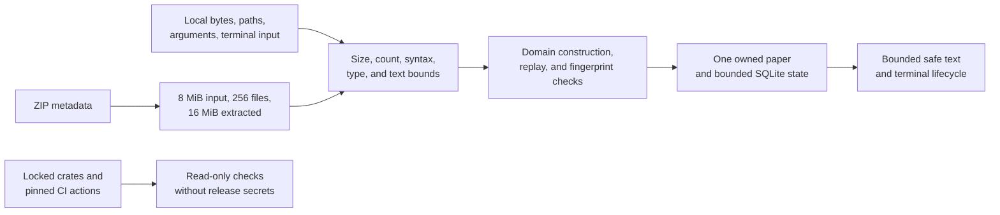

# Security review

This review covers the native game, local author commands, puzzle packs,
archives, paths, SQLite state, terminal I/O, configuration, CI, the locked
product graph, and the separate fuzz-tool graph as they stand on 2026-09-04.
It protects files outside Orifude's data root, saved progress, terminal state,
and contributor machines from malformed or malicious local input.

The static website, future release publication, installers, and package
repositories are outside this review. They do not run from this repository yet.

## Source-to-effect review

| Source | Validation before retention or effect | Effect | Evidence |
| --- | --- | --- | --- |
| Command-line arguments | [`cli`](../src/cli.rs) accepts a fixed grammar and never reflects rejected bytes. [`SafeErrorReport`](../src/main.rs) replaces controls, follows at most eight causes, and stops at 16 KiB. | Starts the TUI or one bounded author command. | [`cli`](../tests/cli.rs) covers hostile, non-UTF-8, and unsupported arguments plus bounded SQLite and archive errors. |
| Pack metadata | [`parse_metadata`](../src/packs/format.rs) checks the 32 KiB byte limit before UTF-8 and strict TOML parsing. IDs use portable ASCII. Text has scalar, nonblank, and control-character checks. Licenses are bounded SPDX expressions. Counts stop before retained allocation. | Creates immutable display metadata and the declared puzzle list. | [`packs`](../tests/packs.rs) covers empty, blank, long, malformed, mixed-script, combining, control, count, license, and undeclared-field cases. |
| Puzzle files | [`parse_puzzle`](../src/packs/format.rs) checks the 64 KiB limit, strict TOML, dimensions, grids, rules, budgets, coordinates, display text, and the 64-action solution limit. Accepted solutions execute through the production engine and must match exactly. | Creates a validated [`Puzzle`](../src/domain/puzzle.rs), optional guidance, and an optional verified replay. | [`packs`](../tests/packs.rs), [`engine`](../tests/engine.rs), and [`content`](../tests/content.rs) cover malformed structures, independent issues, action failure atomicity, replay equivalence, and every built-in paper. |
| Replay documents | [`decode_replay_bytes`](../src/storage/mod.rs) checks 64 KiB before strict TOML decoding. Every nested record rejects undeclared fields. Domain constructors check all coordinates and counts, and playback must succeed against the embedded revision before storage returns it. | Drives read-only keepsake playback or proves saved completion. | [`storage`](../tests/storage.rs) covers oversized, unsuccessful, mismatched, corrupt, and undeclared nested data. [`session`](../src/tui/session.rs) tests bounded forward and reverse playback for every built-in replay. |
| ZIP archives | [`validate_archive_bytes`](../src/packs/mod.rs) checks the 8 MiB compressed limit. The [`archive`](../src/packs/archive.rs) preflight rejects split and ZIP64 catalogs, excessive entries, paths, depth, names, types, compression methods, per-file size, and the 16 MiB extracted total before installation. | Produces the same bounded validated file map as a directory source. It never extracts attacker-selected paths. | [`packs`](../tests/packs.rs) covers traversal, absolute and device names, links, duplicates, excessive catalogs, compressed input, extracted size, and undeclared files. [`archive_parser`](../fuzz/fuzz_targets/archive_parser.rs) exercises the public byte boundary under AddressSanitizer. |
| Directory pack paths | Directory walking streams at most 256 declared regular files. It rejects symbolic and hard links, portable-name conflicts, unexpected directories, depth over four, components over 80 bytes, and relative paths over 128 bytes. | Reads validated bytes, then writes only fingerprint-named files below private staging. | [`packs`](../tests/packs.rs) and [`storage`](../tests/storage.rs) cover links, outside markers, conflicts, fingerprint drift, malicious installs, and every durable install state. |
| SQLite file and rows | [`Storage::open`](../src/storage/mod.rs) rejects a linked database or managed root, takes one advisory lock, recovers a hot journal, checks schema markers and integrity, sets SQLite runtime limits, and caps the main file at 128 MiB. Mutations use parameterized statements and transactions. Stored text and fingerprints are revalidated on read. | Stores settings, progress, best solutions, bounded history, daily identity, registry rows, and one pending install. | [`storage`](../tests/storage.rs) and [`storage_recovery`](../tests/storage_recovery.rs) cover locks, corruption, unsupported schemas, migration rollback, read-only state, capacity, transaction rollback, journal recovery, pruning, and reconciliation. |
| Settings and environment | Platform directories come from [`AppPaths`](../src/storage/paths.rs). Persisted enum and key values are parsed through closed sets; conflicting and reserved bindings fail before a write. Test path overrides exist only behind the named integration-test feature. | Selects local directories, rendering capability, motion, glyphs, and bounded input bindings. | [`storage`](../tests/storage.rs), [`style`](../src/tui/style.rs), and [`cli`](../tests/cli.rs) cover corrupt values, conflicts, migrations, environment capability ceilings, and test-root isolation. |
| Terminal input and output | The event worker owns Crossterm polling. One 256-entry queue preserves keys, coalesces ticks and resizes, and keeps shutdown and work completion independent. Rendering is capped at 160 by 60. External text and errors cannot emit terminal controls. Acquired terminal capabilities restore in reverse order on success, failure, panic fallback, and retry. | Updates one app/session owner and writes Ratatui frames to the active terminal. | [`event`](../src/tui/event.rs), [`terminal`](../src/tui/terminal.rs), [`text`](../src/tui/text.rs), and [`terminal_pty`](../tests/terminal_pty.rs) cover queue pressure, worker failure, output bounds, partial acquisition, failed restoration, normal quit, Ctrl-C, resize, and saved journeys. |
| Dependencies and CI | Product and fuzz dependencies have separate lockfiles and license policies. The fuzz-only NCSA allowance belongs only to libFuzzer tooling. CI actions use immutable revisions, repository permissions are read-only, caches are disabled, jobs have timeouts, and release credentials are absent. | Builds and tests source. Current CI cannot publish. | [`deny`](../deny.toml), [`fuzz policy`](../fuzz/deny.toml), [`CI`](../.github/workflows/ci.yml), and the local credential scanner provide the repeatable checks. |

## Confirmed correction

Required display fields rejected an empty string but accepted a string made only
of spaces. That could create a pack or paper with an effectively blank title.
The public metadata test reproduced the accepted value before
[`validate_display`](../src/packs/format.rs) was changed to reject all-whitespace
text. Mixed-script text and combining marks remain valid and are preserved.

No high- or medium-severity weakness was confirmed. The display correction is
low severity because content must already be selected locally and the result is
confusing presentation rather than code execution, path escape, or lost state.

## Residual risk

- A user who selects a directory while another process under the same account
  changes it has not gained an isolation boundary. Installation fingerprints
  and stages only the validated bytes it actually read.
- Bounds, regression tests, and sanitizer campaigns reduce parser risk but do
  not prove the absence of every defect in SQLite, TOML, ZIP, or terminal
  dependencies.
- Container checks can establish Linux distribution userland compatibility,
  not a distro-owned kernel result. Native host results remain distinct in the
  QA record.
- Publication credentials, archive checksums, installers, and package-manager
  permissions must receive their own review when that code exists.

Within this scope, the trust boundaries are explicit, bounded, and supported by
tests that reach the actual effects rather than checking configuration alone.
